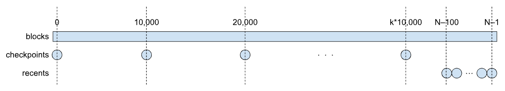

# Overview
AleoBFT is the consensus mechanism powering the Aleo blockchain, designed to ensure secure and reliable agreement among validators. It builds on concepts from Narwhal and Bullshark, optimizing for dynamic validator committees and staking participation. In AleoBFT, validators collect transactions and submit proposals, which are then endorsed by others to form cryptographic certificates. These certificates are structured into a Directed Acyclic Graph (DAG), enabling efficient ordering of transactions and preventing forks, thus ensuring a robust and scalable consensus process.

AleoBFT is run by a dynamically changing set of validators: starting with a known genesis committee (the initial set of validators), validators may join and leave the committee through bonding and unbonding transactions.

When a new validator joins, before it can actively participate in consensus, it needs to bring its internal state up to date with that of the other validators. This is the syncing aspect of AleoBFT, which this document describes.

## Persistent Validator State

When a validator joins the network for the first time, it has only knowledge of the genesis committee and of the genesis block; it must obtain the whole blockchain during syncing. A validator may leave the network and re-join it later; in this case, when it re-joins, it only needs to obtain the blocks generated while the validator was away. This is possible because validators use a database to persist the blockchain data.

## Syncing Peers

The current committee of validators is determined by the current blockchain. When a validator joins or re-joins the network, it may not have enough blocks to determine the current committee. The validator connects to a number of peers, with which it syncs, but those peers are not necessarily members of the current committee, as far as the validator can tell.

## Main Processes

Syncing in AleoBFT is realized via the following two processes:

1. Validators advertise to each other which blocks they have, via information they put into ping messages that they periodically send out. When receiving these ping messages, validators update their internal state to keep track of which validators have advertised which blocks.

2. Based on the aforementioned information advertised by other validators, validators periodically assess whether they are out of sync or not. If they are, they request blocks from the advertising validators.

These two processes are described in more detail next, along with related concepts.

## Block Locators

Validators advertise the blocks in their possession in the form of block locators. Recall that each block is uniquely identified by its height, i.e. its position in the blockchain, starting with 0 for the genesis block, up to N-1 for the latest block, if N is the number of blocks in the blockchain; also recall that each validator has its own copy of the blockchain.

A single block locator consists of a block height and a block hash; the hash is conceptually redundant, but it is used by validators to check some level of consistency among the block locators from different validators; faulty validators may send incorrect hashes. Each validator advertises its blocks via a collection of block locators, organized as two maps from block heights to block hashes: a 'checkpoint' map, and a 'recent' map, which can be illustrated as follows.

### Block Locators Structure

The rectangular bar represents the whole blockchain; each circle represents a block locator. The checkpoint map consists of block locators at 10,000-block intervals, starting from, and including, the genesis block; if N-1 is a multiple of 10,000, it is included in the checkpoint map. The recent map consists of block locators for the latest 100 blocks.

The diagram above is not to scale, but it depicts the most common situation in which the checkpoint and recent maps are disjoint; however, it is possible for the highest checkpoint map element to overlap with some element of the recent map. If there are less than 100 blocks in the blockchain, the recent map has a locator for every block, and the checkpoint map has just one locator for the genesis block.

## Block Advertisement

Periodically, each validator calculates or updates the checkpoint and recent block locator maps from its blockchain, and broadcasts them to other validators, as part of periodic ping messages. (This is not the only purpose of ping messages, but it is the only purpose relevant to syncing.)

Each validator maintains, as part of its internal state, a map from (addresses of) peers to the block locator maps received in the latest ping messages from those peers. Upon receiving a ping message, a validator checks that:
- The block locator maps have the form described earlier
- If the checkpoint and recent maps intersect, they agree on the block hash for the common block height
- Block locators from different validators have consistent hashes for overlapping heights

The validator also calculates, and caches, the largest common heights between any two pairs of validators, including itself.

## Synced Status

Each validator assesses its own synced status, i.e. whether it is sufficiently up to date with other validators. This is a boolean status: the validator is either synced or not.

The assessment is based on how behind the validator's blockchain is, compared to the advertised latest block heights of the other validators. Currently, the validator only allows itself to be one block behind, but AleoBFT is parameterized over the exact number of blocks that a validator allows itself to be behind others.

## Block Syncing

The actual syncing of blocks is realized as follows. When a validator is not synced (by its own assessment; see above), it requests missing blocks by sending block request messages to other validators who advertised block locators for those blocks. Upon receiving a block request message, a validator responds with a block response message, which contains the requested blocks, identified by their heights.

AleoBFT is parameterized over the maximum number of blocks that can be requested in a single block request message and sent in a single response message. Thus, depending on how many blocks a syncing validator is missing, it may need to send multiple block request messages.

The choice of which validators to request missing blocks from involves an internal algorithm that rotates among the advertising validators, picking random subsets of them, and possibly obtaining, and cross-checking, the same blocks from multiple validators in order to reduce the chance of obtaining the wrong blocks (for faults ranging from malfunction to malice). To this end, besides cross-checking blocks from different validators, a validator also subjects incoming blocks to a number of additional checks.

A syncing validator also keeps track of its pending block requests, as well as of its pending block responses. The latter are relevant when the validator requests the same block from multiple validators: only when the block has been obtained from all those validators, and passes all the cross-checks, the request is considered completely fulfilled.

Since there is no guarantee that a block request will eventually receive a response, a validator periodically clears pending requests that are taking too long to be fulfilled.

## DAG Syncing

When validators are synced, new blocks are generated by validators based on a DAG (Directed Acyclic Graph) of certificates, which is constructed according to the [Narwhal protocol](https://arxiv.org/pdf/2105.11827); the blocks are constructed according to the [Bullshark protocol](https://arxiv.org/abs/2201.05677). Each block is generated from a sub-DAG of the full DAG; the generated block contains, as part of its data, the sub-DAG from which the block is generated.

During syncing, the sub-DAG information contained in blocks is used by the syncing validators to reconstruct the DAG, which is necessary for these validators to participate in consensus, once they are synced with the other validators. More precisely, validators keep in memory only a portion of the DAG, consisting of the most recent certificates, where recency is defined by a parameter of AleoBFT.

When a syncing validator receives blocks from other validators, when it reaches the cutoff point for the DAG, it starts also reconstructing the DAG from the sub-DAGs of the blocks.