A **transaction** is a fundamental data structure for publishing a new program or a set of state transitions on the ledger.
On Aleo, a transaction is issued locally by a user using their Aleo private key, which corresponds to an on-chain Aleo account.
Using tools like [Leo CLI](https://github.com/ProvableHQ/leo), [Provable SDK](https://docs.explorer.provable.com/docs/sdk/92sd7hgph3ggt-overview) 
or ecosystem wallet adapters such as [Puzzle Wallet SDK](https://docs.puzzle.online/).

## Types of Transactions

### Execute Transaction
The execution transaction represents a call to an Aleo program function. Below is the structure of an execution transaction response:

|    Parameter     |  Type  |                                   Description                                    |
|:----------------:|:------:|:--------------------------------------------------------------------------------:|
|      `type`      | string |                        The type of transaction (execute)                         |
|       `id`       | string | The ID of transaction, computed via the Merkle Tree Digest of the transition IDs |
|   `execution`    | object |                          The execution transaction info                          |
|       `fee`      | object |                          The execution transaction fee                           |

#### Execution Object Info

|      Parameter      | Type  |                            Description                            |
|:-------------------:|:-----:|:-----------------------------------------------------------------:|
| `global_state_root` |  u16  |             The global state root of the merkle tree              |
|    `transitions`    | array |              The [transitions](./04_transitions.md)               |
|       `proof`       | string|                   ZK proof of the execution                       |

#### Relationship of Transaction and Transition

- A **Transaction** is the top-level unit that represents a complete operation. A **Transition** is a lower-level component that represents an individual state change within a **Transaction**.
- A **Transaction** can contain multiple **Transition** objects. An Execution, which is part of a **Transaction**, includes a collection of **Transitions**.
- A **Transaction** may contain multiple **Transitions**, especially in cases involving multiple cross-program calls.

For more information of a **Transition**, please refer to [Transitions](./04_transitions.md).

#### Building an execution transaction using Leo CLI

**Required Details:**
- Program ID (name of deployed program)
- Function name to execute
- Arguments to the function
- Network ID (`testnet` or `mainnet`)
- Private key of the caller (or specify in .env from project directory)

**Optional Parameters:**
- Broadcast flag (to send to the network or not)
- Private fees
- Priority fees

### Deploy Transaction
The deployment transaction publishes an Aleo program to the network.

|  Parameter   |  Type  |                                   Description                                    |
|:------------:|:------:|:--------------------------------------------------------------------------------:|
|    `type`    | string |                         The type of transaction (deploy)                         |
|     `id`     | string | The ID of transaction, computed via the Merkle Tree Digest of the transition IDs |
|   `owner`    | object |                         The owner address and signature                          |
| `deployment` | object |                         The deployment transaction info                          |
|    `fee`     | object |                          The deployment transaction fee                          |

#### Deployment Object Info

|      Parameter      | Type  |                            Description                            |
|:-------------------:|:-----:|:-----------------------------------------------------------------:|
| `global_state_root` |  u16  |             The global state root of the merkle tree              |
|    `transitions`    | array |              The [transitions](./04_transitions.md)               |

#### Building a deployment transaction

**Required Details:**
- Compiled Leo program in Aleo Instructions
- Network ID (`testnet` or `mainnet`)
- Private key of the deployer (or specify in .env from project directory)

**Optional Parameters:**
- Private fees
- Priority fees

### Fee Transaction
A fee transaction represents the network fee paid for processing. Rejected transactions are included in blocks as confirmed "rejected" transactions. In those cases, a new transaction ID is generated alongside a valid fee transaction to ensure the fee is charged. In normal successful execution case, the fee is recorded as a transition object within the execution or deployment transaction. 

| Parameter |  Type  |                                   Description                                    |
|:---------:|:------:|:--------------------------------------------------------------------------------:|
|  `type`   | string |                          The type of transaction (fee)                           |
|   `id`    | string | The ID of transaction, computed via the Merkle Tree Digest of the transition IDs |
|   `fee`   | object |                           The rejected transaction fee                           |

Transaction fees are calculated based on the size of the transaction and how complicated operations the validators need to do. Fees can be paid in public or private with Aleo Credits records.
For more detailed information about transaction fees, please refer to [Transaction Fees](./03A_transaction_fees.md). 

## Transaction Lifecycle

```mermaid
%%{init: {'theme':'dark', 'themeVariables': { 'fontSize': '12px'}, 'flowchart': {'nodeSpacing': 50, 'rankSpacing': 50}}}%%
flowchart TD
    subgraph LOCAL ["🖥️ LOCAL CLIENT"]
        direction TB
        START["🔑 User Initiates<br/>Private Key + Inputs"]
        START --> TYPE{"📋 Transaction Type"}
        
        %% Execute Path
        TYPE -->|Execute| B1["📥 Download Programs<br/>& SRS or use cached"]
        B1 --> C1["🔍 Add Program<br/>to VM Process"]
        C1 --> D1["✍️ Authorization<br/>Sign Function Call"]
        D1 --> CHOOSE{"🛤️ Proving & Fee Strategy"}
        
        %% Deploy Path
        TYPE -->|Deploy| B2["📝 Leo Compilation<br/>Source → Aleo Bytecode"]
        B2 --> C2["🔧 Key Synthesis<br/>Generate Verifying Keys"]
        C2 --> F2["💰 Fee Calculation<br/>Based on Program Size"]
        F2 --> D2["✍️ Authorization<br/>Sign Deployment"]
        D2 --> G2["📦 Deploy Transaction<br/>Assembly"]
        
        %% Execute Strategy 1: Local
        CHOOSE -->|Generate<br/>Locally| E1["⚙️ Local Execution<br/>Run VM & Generate Proofs"]
        E1 --> F1["💸 Generate Fee<br/>Single-Transition + Proof"]
        F1 --> G1["📦 Execute Transaction<br/>Assembly"]
        
        %% Execute Strategy 2 & 3: Delegate
        CHOOSE -->|Delegate Proving<br/>Self-Paid Fee| E2a["✍️ Sign Authorization<br/>and Fee"]
        CHOOSE -->|Delegate Proving<br/>Fee Master| E3a["🤝 Authorization Only<br/>No Fee Signature"]
        
        E2a --> EXTERNAL
        E3a --> EXTERNAL
        
        subgraph EXTERNAL ["🔐 External Prover"]
            direction TB
            EXT_START["🔐 Trustless Delegation<br/>Execution Proving"]
            EXT_START --> FEE_CHOICE{"💰 Who Pays Fee?"}
            FEE_CHOICE -->|User Pays| E2c["✅ Return Proofs<br/>User Fee Applied"]
            FEE_CHOICE -->|Prover Pays| E3c["✅ Return Proofs<br/>Prover Fee Applied"]
        end
        
        E2c --> G1
        E3c --> G1
    end
    
    %% Convergence to Network
    G1 --> BROADCAST
    G2 --> BROADCAST
    
    subgraph NETWORK ["🌐 ALEO NETWORK"]
        direction TB
        BROADCAST["📡 Broadcast to Validators"]
        BROADCAST --> MEMPOOL["⏳ Mempool<br/>Unconfirmed Transaction"]
        MEMPOOL --> DECISION{"✅❌🚫<br/>Decision"}
        
        DECISION -->|Accepted| ACCEPTED["✅ Add to Block<br/>ConfirmedTransaction::Accepted"]
        DECISION -->|Rejected| REJECTED["💸 Add Fees to Block<br/>ConfirmedTransaction::Rejected"]
        DECISION -->|Aborted| ABORTED["🚫 Transaction Aborted<br/>No Block Inclusion"]
        
        ACCEPTED --> FINALIZE["🔄 Finalize<br/>State Updates"]
        REJECTED --> FINALIZE
        FINALIZE --> CONSENSUS["🤝 Consensus Check<br/>AleoBFT"]
        CONSENSUS --> COMMIT["✅ Commit Block<br/>Once Quorum Reached"]
    end
    
    style LOCAL fill:#1a202c,stroke:#2d3748,stroke-width:2px,color:#ffffff
    style NETWORK fill:#1a202c,stroke:#2d3748,stroke-width:2px,color:#ffffff
    style EXTERNAL fill:#2d3748,stroke:#4a5568,stroke-width:2px,color:#ffffff
    style START fill:#2d3748,stroke:#4a5568,stroke-width:1px,color:#ffffff
    style TYPE fill:#374151,stroke:#4a5568,stroke-width:1px,color:#ffffff
    style CHOOSE fill:#374151,stroke:#4a5568,stroke-width:1px,color:#ffffff
    style FEE_CHOICE fill:#374151,stroke:#4a5568,stroke-width:1px,color:#ffffff
    style DECISION fill:#374151,stroke:#4a5568,stroke-width:1px,color:#ffffff
    style B1 fill:#2d3748,stroke:#4a5568,stroke-width:1px,color:#ffffff
    style B2 fill:#2d3748,stroke:#4a5568,stroke-width:1px,color:#ffffff
    style C1 fill:#2d3748,stroke:#4a5568,stroke-width:1px,color:#ffffff
    style C2 fill:#2d3748,stroke:#4a5568,stroke-width:1px,color:#ffffff
    style D1 fill:#2d3748,stroke:#4a5568,stroke-width:1px,color:#ffffff
    style D2 fill:#2d3748,stroke:#4a5568,stroke-width:1px,color:#ffffff
    style E1 fill:#2d3748,stroke:#4a5568,stroke-width:1px,color:#ffffff
    style E2a fill:#2d3748,stroke:#4a5568,stroke-width:1px,color:#ffffff
    style E3a fill:#2d3748,stroke:#4a5568,stroke-width:1px,color:#ffffff
    style EXT_START fill:#374151,stroke:#4a5568,stroke-width:1px,color:#ffffff
    style E2c fill:#374151,stroke:#4a5568,stroke-width:1px,color:#ffffff
    style E3c fill:#374151,stroke:#4a5568,stroke-width:1px,color:#ffffff
    style F1 fill:#2d3748,stroke:#4a5568,stroke-width:1px,color:#ffffff
    style F2 fill:#2d3748,stroke:#4a5568,stroke-width:1px,color:#ffffff
    style G1 fill:#2d3748,stroke:#4a5568,stroke-width:1px,color:#ffffff
    style G2 fill:#2d3748,stroke:#4a5568,stroke-width:1px,color:#ffffff
    style BROADCAST fill:#374151,stroke:#4a5568,stroke-width:1px,color:#ffffff
    style MEMPOOL fill:#374151,stroke:#4a5568,stroke-width:1px,color:#ffffff
    style ACCEPTED fill:#374151,stroke:#4a5568,stroke-width:1px,color:#ffffff
    style REJECTED fill:#374151,stroke:#4a5568,stroke-width:1px,color:#ffffff
    style ABORTED fill:#374151,stroke:#4a5568,stroke-width:1px,color:#ffffff
    style FINALIZE fill:#374151,stroke:#4a5568,stroke-width:1px,color:#ffffff
    style CONSENSUS fill:#374151,stroke:#4a5568,stroke-width:1px,color:#ffffff
    style COMMIT fill:#374151,stroke:#4a5568,stroke-width:1px,color:#ffffff
```

<div align="center">



</div>

[//]: # ()
[//]: # (#### Deploy Transaction)

[//]: # ()
[//]: # (|    Parameter     |  Type  |              Description               |)

[//]: # (|:----------------:|:------:|:--------------------------------------:|)

[//]: # (|      `type`      | string |        The type of transaction         |)

[//]: # (|       `id`       | string |         The ID of transaction          |)

[//]: # (|   `deployment`   | object |    The deployment transaction info     |)

[//]: # (| `additional_fee` | object | The additional fee for the transaction |)

[//]: # ()
[//]: # (#### Deployment Info)

[//]: # ()
[//]: # (|    Parameter     |  Type   |                             Description                              |)

[//]: # (|:----------------:|:-------:|:--------------------------------------------------------------------:|)

[//]: # (|    `edition`     |   u16   |                             The edition                              |)

[//]: # (|    `program`     | object  |                             The program                              |)

[//]: # (| `verifying_keys` | mapping | The mapping of function names to their verifying key and certificate |)

[//]: # ()
[//]: # (## Advanced Topics)

[//]: # ()
[//]: # (### Creating Transactions)

[//]: # ()
[//]: # (The steps to create a transaction are as follows:)

[//]: # ()
[//]: # (1. Generate the serial numbers of the records being spent)

[//]: # (2. Generate the new records)

[//]: # (3. Generate the program commitment)

[//]: # (4. Generate the local data commitment)

[//]: # (5. Generate the transaction signatures)

[//]: # (6. Generate the ledger digest and [ledger membership witnesses]&#40;06_glossary.md#ledger-membership-witness&#41; for the input record commitments )

[//]: # (7. Generate the inner SNARK proof)

[//]: # (8. Generate the program SNARK proofs)

[//]: # (9. Generate the transaction proof)

[//]: # (10. Compose the transaction with the attributes above)

[//]: # ()
[//]: # ()
[//]: # (### Verifying Transactions)

[//]: # ()
[//]: # (The steps to verify a transaction are as follows:)

[//]: # ()
[//]: # (1. Verify that each serial number in `old_serial_numbers` does not already exist in the ledger.)

[//]: # (2. Verify that each commitment in `new_commitments` does not already exist in the ledger.)

[//]: # (3. Verify that the memo `memorandum` does not already exist in the ledger.)

[//]: # (4. Verify that the transaction proof `transaction_proof` verifies.)

## Determining Transaction Status

Transactions processed by Aleo validators achieve one of the following states:

| Status | Description |
|:------:|:------------|
| `accepted` | The underlying deployment or execution was successful, and the associated fee was consumed. The transaction has a confirmed ID. |
| `rejected` | The deployment or execution logic failed. Validators process the fee as an independent fee transaction. The original transaction has an unconfirmed ID, while the fee transaction has a confirmed ID. |
| `aborted` | Both the deployment/execution logic and fee processing failed. The transaction is aborted. |

:::note
Transactions may not be included in any block when not selected from the mempool by validators during high network load conditions.
:::

### Method 1: Parsing Transactions from Blocks

Transaction status can be determined by processing blocks retrieved via:  

- `GET /<network>/block/{height}` - snarkOS node endpoint
- [Get block by height or hash](https://docs.explorer.provable.com/docs/api-reference/8sqnes7uvwe05-get-block-by-height-or-hash) on the Provable explorer

Transaction status can be determined from a block response as follows:

#### Accepted Transactions
- Get the list of transactions using `echo response | jq .transactions`
- The transaction JSON contains `"status": "accepted"`
- The transaction id is present in `echo transaction | jq .transaction.id`

#### Rejected Transactions
- Get the list of transactions using `echo response | jq .transactions`
- The transaction JSON contains `"status": "rejected"`
- The confirmed transaction id is present in `echo transaction | jq .transaction.id`
- The associated unconfirmed transaction id can be acquired by:
  - Calling `GET /<network>/unconfirmed/{confirmed id}` and calling `echo transaction | jq .transaction.id`
  - You can also hit `https://api.explorer.provable.com/v1/mainnet/transaction/unconfirmed/{ID}`

#### Aborted Transactions
- Get the list of aborted ids using `echo response | jq .aborted_transaction_ids`

#### SDK - getConfirmedTransaction

```javascript
import { AleoNetworkClient } from '@provablehq/sdk/mainnet.js';

const net  = new AleoNetworkClient('https://api.explorer.provable.com/v1');   
const txId = 'at14v8nt94d7xmsp3dq2glpzft6xw3x42ne753mlt8uenn8zw76dsqqc65jnf';                                

const status = await net.getConfirmedTransaction(txId);
console.log(status.status);
```

### Method 2: Directly Querying Transaction Status

An alternative way to get feedback on the status of transactions, is to call the following endpoint.

- `GET /<network>/transaction/confirmed/{transaction id}` on a fully synced snarkOS node REST endpoint
- [Get transaction by ID](https://docs.explorer.provable.com/docs/api-reference/bqly6ukna97b6-get-transaction-by-id) on the Provable explorer

If the transaction was accepted, `echo $transaction | jq .type` will say "execute"  
If the transaction was rejected, `echo $transaction | jq .type` will say "fee"
:::note
Currently no API endpoint is available to quickly check whether a transaction was aborted.
:::

Given a confirmed transaction id, you can find the block it was included in using:

- `GET /<network>/find/blockHash//{transaction id}` on a fully synced snarkOS node REST endpoint
- [Get block hash for transaction ID](https://docs.explorer.provable.com/docs/api-reference/8ka85a1oq8iau-get-block-hash-for-transaction-id) on the Provable explorer

#### SDK - fetchData and getBlockByHash

```javascript
import { AleoNetworkClient } from '@provablehq/sdk/mainnet.js';

const net  = new AleoNetworkClient('https://api.explorer.provable.com/v1');   
const txId = 'at14v8nt94d7xmsp3dq2glpzft6xw3x42ne753mlt8uenn8zw76dsqqc65jnf'; 
// Get block hash using fetchData
const res = await net.fetchData('/find/blockHash/' + txId);   
// Get block by using getBlockByHash 
const block = await net.getBlockByHash(res)
// Get block height by response json
console.log(block.header.metadata.height);
```

### Parsing the Sender Address from `transfer_public` or `transfer_public_as_signer` Executions

Note that the sender address might be an externally owned account (EOA), i.e. owned by a user, or it might be the address of an Aleo program.

The sender address of a Transaction is present as the first argument of the first output. The following will return a human readable string containing the public values of the first output.

```bash
echo $transaction | jq '.execution.transitions[0].outputs[0].value'
```

Unfortunately, the current snarkOS and explorer REST endpoints return execution outputs as a string which is not compatible with JSON. You'll still need to extract the first value from it. The sender address can be parsed for example using a regex or by parsing out the 5th line:

```bash
echo $(echo $transaction | jq '.execution.transitions[0].outputs[0].value') | sed -n '5p'
```

### Summarized Block Contents

A block contains confirmed transactions.

A confirmed transaction can either have status "accepted" or "rejected", and type "deploy" or "execute", and it contains a "transaction" and optional "rejected" object.

- A "transaction" can have type "fee", "execute" or "deploy".
- A "rejected" can have type "execution" or "deployment".

```json
{
  …,
  "transactions": [
    "status": "accepted"/"rejected"
    "type": "deploy"/"execute",
    "transaction": {
      …,
      "type": "fee"/"execute"/"deploy"
    }
 "rejected": {
      …,
      "type": "execution"/"deployment"
    } 
  ],
  "unconfirmed_transaction_ids": [...]
}
```
