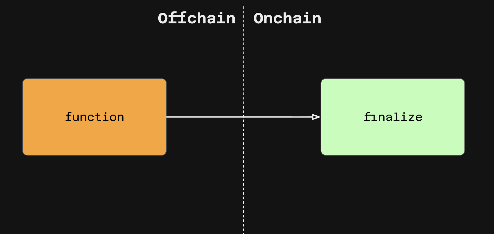

The Aleo blockchain introduces a new paradigm of hybrid **offchain/onchain execution**.  

Functions can be defined such that users execute some portion of the logic offchain, generate a zero-knowledge proof of execution, and only publish the encrypted proof onchain.  Functions can optionally have an onchain portion of the execution that is fully public.  This new programming model enables users to create applications that are both verifable and privacy-preserving.


## Transitions

**Transitions** are functions that can compute values and modify private state in the form of consuming and producing [records](./01_records.md).  Transition functions in the code are denoted as `function`, followed by the specific name of the transition.

```aleo
function transition_example:
    input r0 as privateState.record;
    cast r0.owner r0.amount into r1 as privateState.record;
    output r1 as privateState.record;
```
As mentioned, all parameters and details of the execution of transition functions will remain private/encrypted unless otherwise explicitly specified.  The only object that will be broadcast onchain will be the encrypted inputs/outputs and a zero-knowledge proof of valid execution.

## Async Transitions 
Transitions can also optionally modify public state in the form of setting or overriding [mapping](./02_mappings.md) values.  As mappings are stored onchain, the portion of the code that modifies the mapping must also be publicly executed onchain.  

When a transition contains some code to be executed onchain, it is called an **async transition**. This onchain portion of the code is listed under as a `finalize` block with the same name as the `function`. Any `finalize` blocks cannot return values or be called on their own; they must be called by their corresponding `function`.
```aleo
function async_transition_example:
    input r0 as privateState.record;
    async store_onchain r0.amount into r1;
    output r1 as test.aleo/store_onchain.future;

finalize async_transition_example:
    input r0 as u8.public;
    set r0 into publicState[r0];
```

The following diagram may help clarify:
