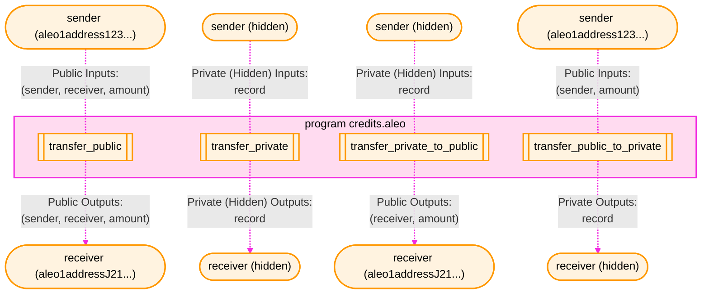
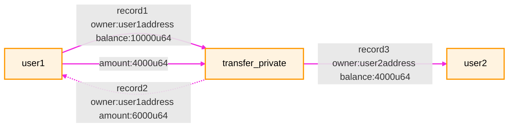
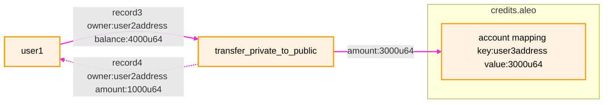
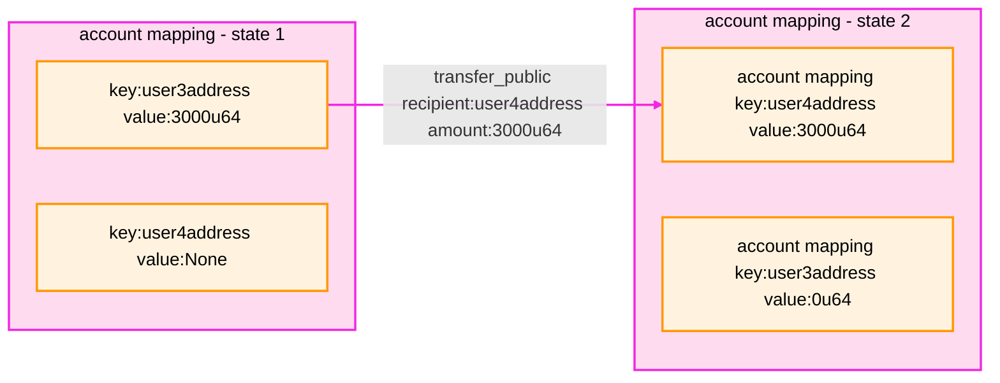
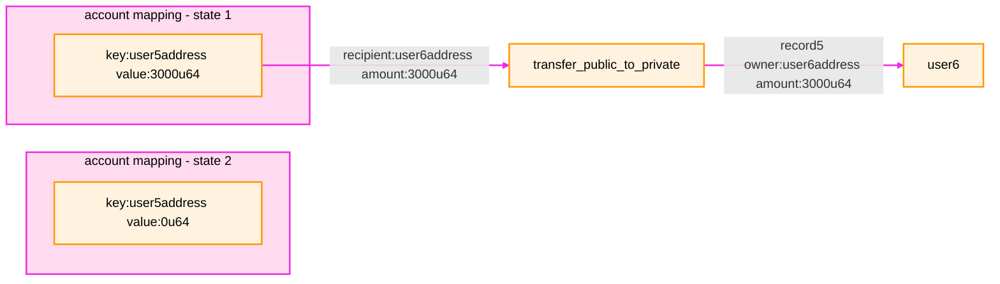

## Credits.aleo

The official currency of Aleo Network are called `Aleo Credits`. All fees paid for transactions and rewards for staking
and mining on the Aleo Network are transacted in Aleo Credits.

Unlike other popular Blockchains like Ethereum, there is no special `transfer` transaction type. Instead, a native
program called [credits.aleo](https://explorer.provable.com/program/credits.aleo) governs transfers, usage, and ownership
of Aleo Credits. All value transfers on the Aleo Network are done by calling functions in the `credits.aleo` program
via `Execute` transactions. This enables users to send Aleo Credits privately, publicly, or a mix of both as well as
initiate staking and other advanced on-chain operations with Aleo credits.

A small selection of the credit transfer functions available in credits.aleo is visualized below:



##  Aleo credits

Aleo Credits are used to pay all fees on the network. They are also used to initiate staking, to bond in new validators,
and are used as the currency to used to pay staking and mining rewards.

There are two main ways to hold Aleo credits within credits.aleo:

### 1 - Private balances via  `credits.aleo` records
The first method is owning a `credits` record which enables a participant in the Aleo
network to hold a private balance of Aleo credits.
```
record credits:
    owner as address.private;
    microcredits as u64.private;
```

A user's total private credits balance will consist of all unspent `credits` records owned by the user with a non-zero
`microcredits` value. These records are analogous to UTXOs in Bitcoin. It is generally the responsibility of a wallet
application to scan the chain for records that belong to a user and determine which are spent and unspent in order
to calculate the user's total private balance and private transaction history.

### 2 - Public balances via `credits.aleo` account mappings
The second method is by holding a `balance` in the `account` mapping in the `credits.aleo` program on the Aleo network.
This mapping is an on-chain key-value store associated with the `credits.aleo` program that is maintained and updated
by Aleo validators at each block. This public balance is visible to all participants in the network and is analogous to
the account balances in Ethereum.

```
mapping account:
    key owner as address.public;
    value microcredits as u64.public;
```

The total public credits balance of a user is the value of the account mapping at the user's address. Users can hold both private and public balances simultaneously.

## Transferring Aleo credits
The `ProgramManager` allows transfers of Aleo credits via the `transfer` method. This function executes the `credits.aleo`
program under the hood.

There are four transfer functions available.

### 1. `transfer_private`

Takes a `credits` record owned by the sender, subtracts an amount from it, and adds that amount
to a new record owned by the receiver. This function is 100% private and does not affect the `account` mapping.



### 2. `transfer_private_to_public`

Takes a `credits` record owned by the sender, subtracts an amount from it, and adds
that amount to the `account` mapping of the receiver. This function is 50% private and 50% public. It consumes a record
as a private input and generates a public balance in the `account` mapping entry belonging to the receiver.



### 3. `transfer_public`

Subtracts an amount of `credits` stored in the `account` mapping of the `credits.aleo` program, and
adds that amount to the `account` mapping of the receiver. This function is 100% public and does not consume or generate
any records.



### 4. `transfer_public_to_private`

Subtracts an amount `credits` stored in the `account` mapping of the `credits.aleo program`
and adds that amount to a new private record owned by the receiver. This function is 50% private and 50% public.
It publicly consumes a balance in the `account` mapping entry belonging to the sender and generates a private record
as a private output.



All four of these functions can be used to transfer credits between users via the `transfer` function in the
`ProgramManager` by specifying the transfer type as the third argument.

```typescript
import { Account, ProgramManager, AleoKeyProvider, NetworkRecordProvider, AleoNetworkClient } from '@provablehq/sdk';

// Create a new NetworkClient, KeyProvider, and RecordProvider
const account = Account.from_string({privateKey: "user1PrivateKey"});
const networkClient = new AleoNetworkClient("https://api.explorer.provable.com/v1");
const keyProvider = new AleoKeyProvider();
const recordProvider = new NetworkRecordProvider(account, networkClient);

// Initialize a program manager with the key provider to automatically fetch keys for executions
const myAddress = account.address();
const programManager = new ProgramManager("https://api.explorer.provable.com/v1", keyProvider, recordProvider);
programManager.setAccount(account);

// Send a private transfer to yourself
const tx_id = await programManager.transfer(1, myAddress, "transfer_private", 0.2);

// Update or initialize a public balance in your own account mapping
const tx_id_2 = await programManager.transfer(1, myAddress, "transfer_private_to_public", 0.2);

// Check the value of your public balance
let public_balance = programManager.networkClient.getMappingValue("credits.aleo", myAddress);
assert(public_balance === 0.2*1_000_000);

/// Send public transfer to another user
const USER_2_ADDRESS = "user2Address";
const tx_id_3 = await programManager.transfer(1, USER_2_ADDRESS, "transfer_public", 0.1);

// Check the value of the public balance and assert that it has been updated
public_balance = programManager.networkClient.getMappingValue("credits.aleo", myAddress);
const user2_public_balance = programManager.networkClient.getMappingValue("credits.aleo", myAddress);
assert(public_balance === 0.1*1_000_000);
assert(user2_public_balance === 0.1*1_000_000);

/// Create a private record from a public balance
const tx_id_4 = await programManager.transfer(1, myAddress, "transfer_public_to_private", 0.1);

// Check the value of the public balance and assert that it has been updated
public_balance = programManager.networkClient.getMappingValue("credits.aleo", myAddress);
assert(public_balance === 0);
```

## Public balances
The `account` mapping of `credits.aleo` contains the public balances of all addresses on the Aleo network. A public
balance of any address can be checked with `getMappingValue` function of the `NetworkClient`.

```typescript
const networkClient = new AleoNetworkClient("https://api.explorer.provable.com/v1");
const USER_1_ADDRESS = "user1Address";
const public_balance = networkClient.getMappingValue("credits.aleo", USER_1_ADDRESS);
```

## Private Balances
The private balance of an address is the sum of all unspent `credits` records owned by the address. A full article on
how to calculate the private balance of an address is available in the [finding records](./02_records.md) of
the documentation.