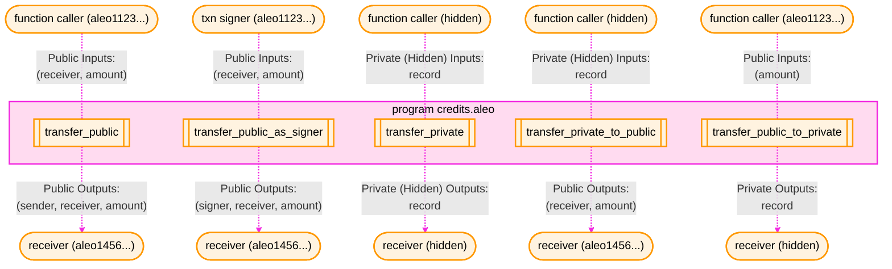
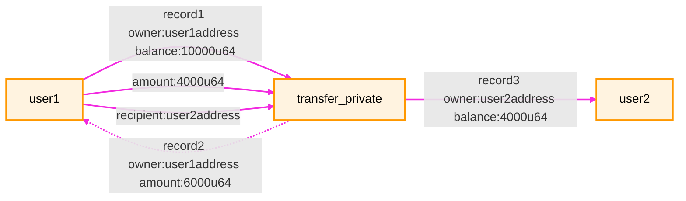
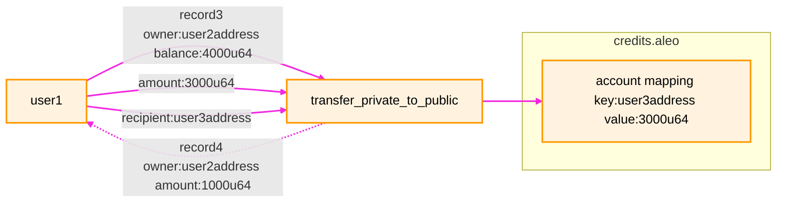
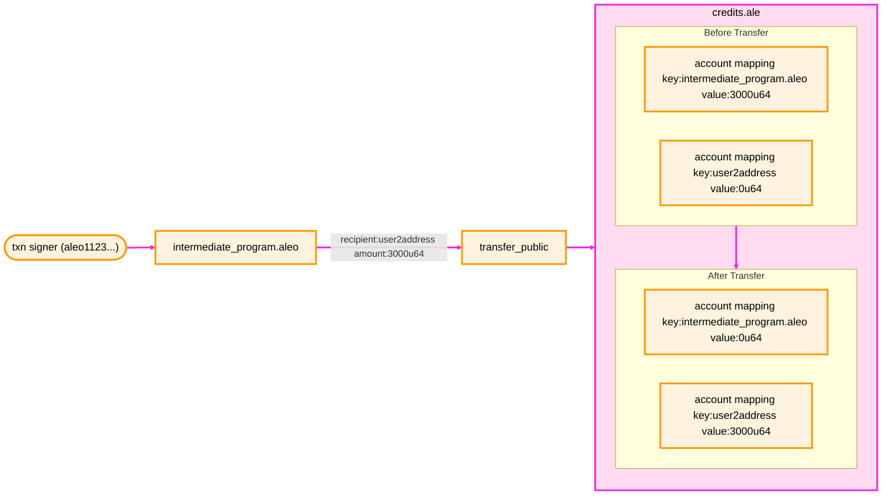
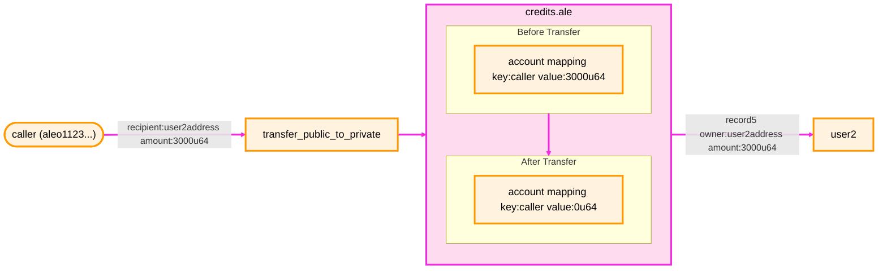
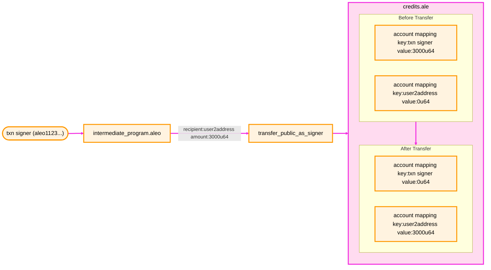

## Overview

The official currency of Aleo Network are called `Aleo Credits`. All fees paid for transactions and rewards for staking
and mining on the Aleo Network are transacted in Aleo Credits.

Unlike other popular Blockchains like Ethereum, there is no special `transfer` transaction type. Instead, a native
program called [`credits.aleo`](https://explorer.provable.com/program/credits.aleo) governs transfers, usage, and ownership
of Aleo Credits. All value transfers on the Aleo Network are done by calling functions in the `credits.aleo` program
via `Execute` transactions. This enables users to send Aleo Credits privately, publicly, or a mix of both as well as
initiate staking and other advanced on-chain operations with Aleo credits.

Aleo Credits are denominated as either `credits` or `microcredits`, where the smallest unit is 1 microcredit (equal to 0.000001 credit). The `credits.aleo` program function parameters take amounts in microcredit. There is a denomination table [here](http://localhost:3000/concepts/fundamentals/transaction_fees#aleo-credits-denomination-table) for reference.

The same `credits.aleo` program also hosts all staking-related functions and states. For more information about staking functionality, please refer to the [Staking](../network/staking.md) documentation.

A small selection of the credit transfer functions available in credits.aleo is visualized below:



:::note
**Important distinction between function caller and transaction signer:**
- **Function Caller**: The immediate function caller, which could be an intermediate program or contract that initiated the current function call
- **Transaction Signer**: The original transaction signer who initiated the entire transaction, regardless of how many intermediate programs are involved in the call chain
:::

:::warning[important]
Private transfers or any functions involving records should use a **private key controlled account address** as the recipient. This is because:

- Records are encrypted with the recipient's public key and can only be decrypted with the corresponding private key
- A program address is derived from a hash function and has no associated private key, making it incapable of decrypting any records
- **Records should never be sent to a program address** because they would become permanently inaccessible

When performing private transfers or any operations involving records, always ensure the recipient is a user account address (controlled by a private key) rather than a program address.
:::

##  Aleo credits

Aleo Credits are used to pay all fees on the network. They are also used to initiate staking, to bond in new validators,
and are used as the currency to used to pay staking and mining rewards.

There are two main ways to hold Aleo credits within credits.aleo:

### Private balances via  `credits.aleo` records
The first method is owning a `credits` record which enables a participant in the Aleo
network to hold a private balance of Aleo credits.
```aleo
record credits:
    owner as address.private;
    microcredits as u64.private;
```

A user's total private credits balance will consist of all unspent `credits` records owned by the user with a non-zero
`microcredits` value. These records are analogous to UTXOs in Bitcoin. It is generally the responsibility of a wallet
application to scan the chain for records that belong to a user and determine which are spent and unspent in order
to calculate the user's total private balance and private transaction history.

### Public balances via `credits.aleo` account mappings
The second method is by holding a `balance` in the `account` mapping in the `credits.aleo` program on the Aleo network.
This mapping is an on-chain key-value store associated with the `credits.aleo` program that is maintained and updated
by Aleo validators at each block. This public balance is visible to all participants in the network and is analogous to
the account balances in Ethereum.

```aleo
mapping account:
    key owner as address.public;
    value microcredits as u64.public;
```

The total public credits balance of a user is the value of the account mapping at the user's address. Users can hold both private and public balances simultaneously.

## Transferring Aleo credits
The `ProgramManager` allows transfers of Aleo credits via the `transfer` method. This function executes the `credits.aleo`
program under the hood.

There are four transfer functions available.

### 1. `transfer_private`

Takes a `credits` record owned by the sender, subtracts an amount from it, and adds that amount
to a new record owned by the receiver. This function is 100% private and does not affect the `account` mapping.

**Input Parameters:**
- `credits.record` - The sender's record containing the credits to transfer
- `address.private` - The receiver's address (private)
- `u64.private` - The amount of credits to transfer in u64 (private)



### 2. `transfer_private_to_public`

Takes a `credits` record owned by the sender, subtracts an amount from it, and adds
that amount to the `account` mapping of the receiver. This function is 50% private and 50% public. It consumes a record
as a private input and generates a public balance in the `account` mapping entry belonging to the receiver.

**Input Parameters:**
- `credits.record` - The sender's record containing the credits to transfer
- `address.public` - The receiver's address (public)
- `u64.public` - The amount of credits to transfer in u64 (public)



### 3. `transfer_public`

Subtracts an amount of `credits` stored in the `account` mapping of the `credits.aleo` program, and
adds that amount to the `account` mapping of the receiver. This function is 100% public and does not consume or generate
any records.

**Input Parameters:**
- `address.public` - The receiver's address (public)
- `u64.public` - The amount of credits to transfer in u64 (public)



:::note
The mapping key being modified is `intermediate_program.aleo`, which this is the "from" address in this transfer, not the transaction signer's address.
:::

### 4. `transfer_public_to_private`

Subtracts an amount `credits` stored in the `account` mapping of the `credits.aleo program`
and adds that amount to a new private record owned by the receiver. This function is 50% private and 50% public.
It publicly consumes a balance in the `account` mapping entry belonging to the sender and generates a private record
as a private output.

**Input Parameters:**
- `address.private` - The receiver's address (private)
- `u64.public` - The amount of credits to transfer in u64 (public)



:::note
The mapping key being modified is same as `transfer_public`, where the "from" address in this transfer is the immediate caller of the function. Not the signer's address, if there is an intermediate program in between.
:::

### 5. `transfer_public_as_signer`

Similar to `transfer_public`, this function subtracts an amount of `credits` stored in the `account` mapping of the `credits.aleo` program, and adds that amount to the `account` mapping of the receiver. However, this function uses the signer's address as the sender instead of the caller's address, ensures that the "from" context is always the original transaction initiator. This function is 100% public and does not consume or generate any records.

**Input Parameters:**
- `address.public` - The receiver's address (public)
- `u64.public` - The amount of credits to transfer in u64 (public)



:::note
The mapping key being modified is the transaction signer, which this is the "from" address in this transfer, not the intermediate program address.
:::

:::tip
A program can use `transfer_public_from_signer` to receive funds from a user to itself, then use `transfer_public` to transfer funds from itself back to the user.
:::

## Leo code examples

### Transfer from transaction signer

#### Transfer to current program as public balance

```leo
program example.aleo {
    async transition transfer_from_txn_signer(amount: u64) -> Future {
        let f: Future = credits.aleo/transfer_public_as_signer(THIS_PROGRAM_ADDRESS, amount);
        ... // Other logic
    }
}
```

#### Transfer to target address as public balance

```leo
program example.aleo {
    async transition transfer_from_txn_signer(receiver: address, amount: u64) -> Future {
        let f: Future = credits.aleo/transfer_public_as_signer(receiver, amount);
        ... // Other logic
    }
}
```

### Transfer from current program

#### Transfer to receiver as public balance

```leo
program example.aleo {
    async transition transfer_from_this_program(receiver: address, amount: u64) -> Future {
        let f: Future = credits.aleo/transfer_public(receiver, amount);
        ... // Other logic
    }
}
```

#### Transfer to receiver as private balance

```leo
program example.aleo {
    async transition transfer_from_this_program(receiver: address, amount: u64) -> (credits.aleo/credits, Future) {
        let (r, f): (credits.aleo/credits, Future) = credits.aleo/transfer_public_to_private(receiver, amount);
        ... // Other logic
    }
}
```

## Transferring with SDK

All five of these functions can be used to transfer credits between users via the `transfer` function in the
`ProgramManager` by specifying the transfer type as the third argument.

For more infomation regarding the SDK, please refer [here](https://docs.explorer.provable.com/docs/sdk/92sd7hgph3ggt-overview).

```typescript
import { Account, ProgramManager, AleoKeyProvider, NetworkRecordProvider, AleoNetworkClient } from '@provablehq/sdk';

// Create a new NetworkClient, KeyProvider, and RecordProvider
const account = Account.from_string({privateKey: "user1PrivateKey"});
const networkClient = new AleoNetworkClient("https://api.explorer.provable.com/v1");
const keyProvider = new AleoKeyProvider();
const recordProvider = new NetworkRecordProvider(account, networkClient);

// Initialize a program manager with the key provider to automatically fetch keys for executions
const myAddress = account.address();
const programManager = new ProgramManager("https://api.explorer.provable.com/v1", keyProvider, recordProvider);
programManager.setAccount(account);

// Send a private transfer to yourself
const tx_id = await programManager.transfer(1, myAddress, "transfer_private", 0.2);

// Update or initialize a public balance in your own account mapping
const tx_id_2 = await programManager.transfer(1, myAddress, "transfer_private_to_public", 0.2);

// Check the value of your public balance
let public_balance = programManager.networkClient.getMappingValue("credits.aleo", myAddress);
assert(public_balance === 0.2*1_000_000);

/// Send public transfer to another user
const USER_2_ADDRESS = "user2Address";
const tx_id_3 = await programManager.transfer(1, USER_2_ADDRESS, "transfer_public", 0.1);

// Check the value of the public balance and assert that it has been updated
public_balance = programManager.networkClient.getMappingValue("credits.aleo", myAddress);
const user2_public_balance = programManager.networkClient.getMappingValue("credits.aleo", USER_2_ADDRESS);
assert(public_balance === 0.1*1_000_000);
assert(user2_public_balance === 0.1*1_000_000);

/// Send public transfer as signer to another user
const tx_id_3a = await programManager.transfer(1, USER_2_ADDRESS, "transfer_public_as_signer", 0.1);

/// Create a private record from a public balance
const tx_id_4 = await programManager.transfer(1, myAddress, "transfer_public_to_private", 0.1);

// Check the value of the public balance and assert that it has been updated
public_balance = programManager.networkClient.getMappingValue("credits.aleo", myAddress);
assert(public_balance === 0);
```
