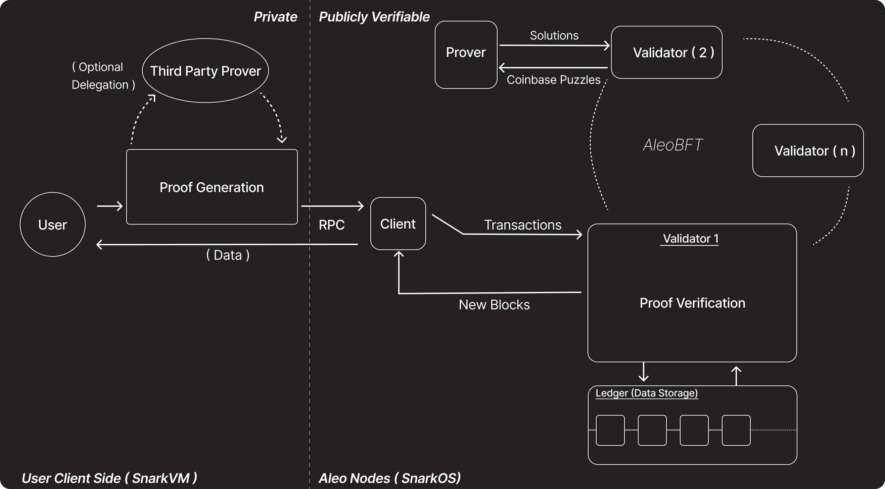

Aleo is focused on permissionless private programmability the ability for anyone to codify any logic onto the blockchain without requiring permission from any external parties. This is achieved through two key components:

1. [**snarkVM**](./snarkvm.md): The off-chain execution environment that serves as the virtual machine for Aleo. **snarkVM** is an implementation of the [AleoVM](../specifications/aleovm.md) specification, which allows for the execution of Aleo programs and generation of zero-knowledge proofs. By utilizing **snarkVM** and encryption, anyone can execute logic in a privacy-preserving manner.

2. [**snarkOS**](./snarkos.md): The blockchain node client of Aleo. **snarkOS** implements the [AleoBFT](../specifications/aleobft.md) protocol, which ensures secure and efficient consensus among network participants.

Together, these components form a complementary system where **snarkVM** handles zero-knowledge off-chain execution, while **snarkOS** serves as the network client that verifies the correctness of these off-chain computations by validating the submitted zero-knowledge proofs (zk-SNARKs).

### Ledger (Data Storage)
The **Ledger** is the blockchain's data storage layer. It stores all verified transactions and blocks, ensuring an immutable and publicly verifiable record of all activity on the network.

### Proof Generation
This is the process where the user (or a third party) computes a zero-knowledge proof for a transaction. Proof generation can be performed:
- **Locally by the user** using their own device.
- **Delegated to a Third Party Prover** (such as a wallet provider), which can handle the computational workload on behalf of the user. This delegation is optional and does not compromise the privacy of the user's data, as authorization/signing is separate from proving.

<!-- This architecture enables two key capabilities:
- **For users**: The ability to maintain data privacy while interacting with decentralized applications (programs) on Aleo through off-chain computation and zero-knowledge proofs
- **For developers**: The ability to create privacy-preserving decentralized applications using Leo programming language or Aleo instructions and deploy them to the network

For more detailed information on these components, check out [specification](../specifications.md) section in reference, which covers SnarkVM and SnarkOS in depth. -->

<!-- ## Aleo Roadmap

Aleo is consistently improving its protocol to enhance privacy, scalability, and usability. The roadmap outlines key initiatives and projects that aim to strengthen the network's infrastructure, introduce new features, and optimize performance. By following the roadmap, developers and users can stay informed about upcoming releases and participate in the evolution of the Aleo ecosystem.

For the latest updates on Aleo's development progress and future milestones, visit the official [Aleo Roadmap](https://aleo.org/roadmap/).  -->
<!-- 

## Components

### User
The **User** initiates private transactions by preparing inputs and generating zero-knowledge proofs (ZKPs) for their actions. Users can generate these proofs locally or delegate this task to a **Third Party Prover** for efficiency.

### Proof Generation
This is the process where the user (or a third party) computes a zero-knowledge proof for a transaction. Proof generation can be performed:
- **Locally by the user** using their own device.
- **Delegated to a Third Party Prover** (such as a wallet provider), which can handle the computational workload on behalf of the user. This delegation is optional and does not compromise the privacy of the user's data, as authorization/signing is separate from proving.

### Third Party Prover
A **Third Party Prover** is an external service that users can optionally delegate proof generation to. This entity receives the necessary data from the user, generates the proof, and returns it to the user for submission. This improves efficiency, especially for users with limited computational resources.

### Validators
**Validators** are responsible for verifying the correctness of submitted zero-knowledge proofs and maintaining consensus using the AleoBFT protocol. Their responsibilities include:
- **Proof Verification:** Checking the validity of the proofs attached to transactions.
- **Consensus:** Participating in AleoBFT, a Byzantine Fault Tolerant protocol, to agree on the next block.
- **Ledger Storage:** Recording verified transactions in the ledger as part of a new block.

There are multiple validators (Validator 1, Validator 2, ..., Validator n), and they coordinate to ensure the integrity and security of the network.

### Ledger (Data Storage)
The **Ledger** is the blockchain's data storage layer. It stores all verified transactions and blocks, ensuring an immutable and publicly verifiable record of all activity on the network.
 -->
