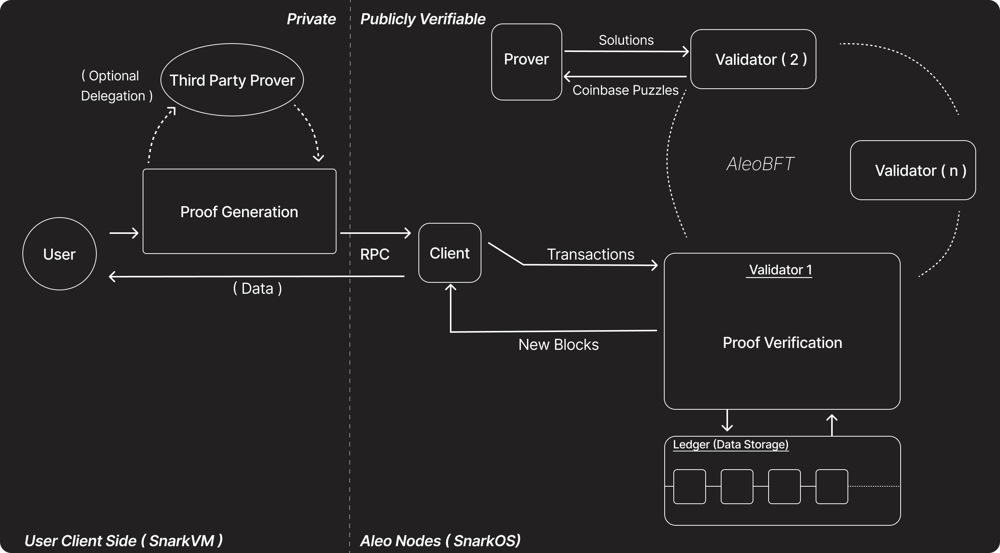

Aleo is focused on permissionless private programmability, which means the ability for anyone to codify any logic onto the Aleo blockchain without asking for anyone's permission. This is achieved through two key components:

1. [SnarkVM (AleoVM)](../zkcloud/snarkvm.md): The off-chain execution environment that serves as the virtual machine for Aleo. SnarkVM is essentially AleoVM, which allows for the execution of Aleo programs and generation of zero-knowledge proofs. By utilizing SnarkVM and encryption, anyone can execute logic in a privacy-preserving manner.

2. [SnarkOS](../zkcloud/snarkos.md): The blockchain node client of Aleo, powered by AleoBFT consensus mechanism. SnarkOS implements the AleoBFT protocol, which ensures secure and efficient consensus among network participants.

Together, these components form a complementary system where SnarkVM handles zero-knowledge off-chain execution, while SnarkOS serves as the network client that verifies the correctness of these off-chain computations by validating the submitted zero-knowledge proofs (zk-SNARKs).

This architecture enables two key capabilities:
- For users: The ability to maintain data privacy while interacting with decentralized applications (programs) on Aleo through off-chain computation and zero-knowledge proofs
- For developers: The ability to create privacy-preserving decentralized applications using Leo programming language or Aleo instructions and deploy them to the network

For more detailed information on these components, check out [specification](../../../references/03_specifications.md) section in reference, which covers SnarkVM and SnarkOS in depth.

## What makes Aleo permissionless, private and programmable ?

An overview of the Aleo network architecture will help contextualize the concepts introduced in the learn section.

All these components at play in this diagram together give rise to permissionless programmable privacy.

## Components

### User
The user can request their on chain state, public or private, from an Aleo client node. They can also post any transaction they executed locally in the form of a zero knowledge proof and the inputs and outputs to the transaction.

The user can also choose to delegate their proof generation to a third party proving provider, such as some wallet providers, to gain more efficient transaction processing times.

### Third Party Prover
This is an entitiy that runs a server that allows people to delegate an authorization request to process the zero knowledge proof. This is possible because the authorization/signing is separate from the proving process.

[More Resources on Network Participants](../network/README.md)

## User flow of executing a Private Transaction

1. User prepares inputs.

2. Fetches program from Node.

3. Executes required function from fetched program locally using snarkvm.

4. Broadcasts the output proof result along with the inputs and outputs to a client node. In the cases of private execution, the inputs and outputs are encrypted.

5. Validator verifies proof and consensus is held.

6. If transaction is verified, then it is stored in the ledger in a new block.

7. Now the transaction is fully complete.
