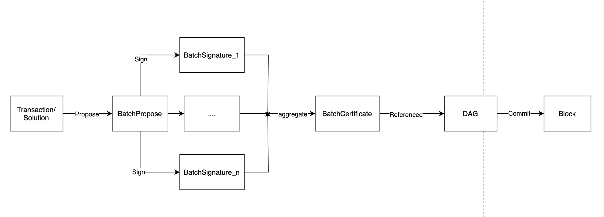
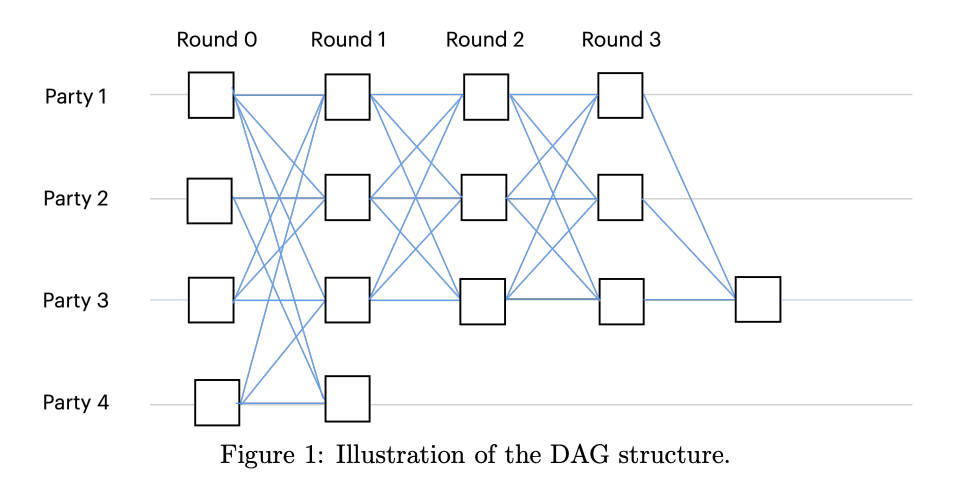

**Validators** are responsible for verifying the correctness of submitted zero-knowledge proofs and maintaining consensus using the AleoBFT protocol. Their responsibilities include:
- **Proof Verification:** Checking the validity of the proofs attached to transactions.
- **Consensus:** Participating in AleoBFT to agree on the next block.
- **Ledger Storage:** Recording verified transactions in the ledger as part of a new block.

Validator nodes in the Aleo network form a consensus network and determine block generation through the Aleo Byzantine Fault Tolerance ([AleoBFT](./consensus.md)) consensus protocol.  

Validators acquire voting power by staking Aleo Credits, with the node's voting power directly proportional to the amount staked.  To become a validator node, one needs to stake a minimum of 10,000,000 credits
## TODO: Slashing

To incentivize validator staking, each block produced includes a corresponding reward for validator nodes. The amount of the reward that a validator node receives is proportional to the number of credits they have staked.

The design of AleoBFT ensures that if a malicious node attempts to attack the network, it would need to acquire at least 1/3 of the voting power to prevent the production of new blocks.  Validators acquire voting power by staking Aleo Credits, with the node's voting power directly proportional to the amount staked.  This implies that the more Aleo Credits are staked in the network, the more secure the consensus network becomes. 

Due to the fact that validator nodes in the network communicate with each other to obtain status information, the more validator nodes there are, the greater the magnitude of network communication required. The increase in communication complexity leads to longer block generation times. As such, the maximum number of validator nodes on Aleo is limited to 200 to balance decentralization and network efficiency.

<!-- ### Delegated Staking

When one possesses only a small amount of `AleoCredits`, although unable to become an independent validator node, they can participate in staking through delegation.

Delegated staking allows users to stake `AleoCredits` on a specific validator node through a Program (Aleo's smart contract). The voting power gained from staking `AleoCredits` is also delegated to the respective validator node. Users receive `BlockReward` incentives in proportion to their stake, while validators may charge a certain percentage of fees set within the `Program`. Various wallets and browsers provide users with the functionality to delegate stake. Users can view fee percentages of various validators on their UI interface, facilitating the staking process.

Users can cancel their stake at any time. After cancellation, users can withdraw the `AleoCredits` refunded from the cancellation to their balance after 360 blocks. -->

<!-- ### Validator Confirmation Process

The process by which validator nodes confirm Transactions and Solutions involves the following steps:

- Transactions/Solutions enter the validator nodes' mempool via the P2P network or RPC.
- Validator nodes select some Transactions/Solutions from the mempool and include them in a `BatchPropose` (in addition to Transactions and Solutions, `BatchPropose` needs to contain `2f + 1` `BatchCertificates` from the previous round) and broadcast it to other validator nodes.
- Upon receiving `BatchPropose`, other validator nodes validate its legitimacy, sign the `BatchPropose` to generate `BatchSignature`, and return the `BatchSignature` to the originating validator node.
- When the originating validator node receives more than `2f + 1` `BatchSignatures`, it aggregates them into a `BatchCertificate` and broadcasts it to other validator nodes.
- All nodes execute and repeat this process, resulting in a DAG formed by the `BatchCertificates`. When the DAG is committed, a new block is produced, and Transactions and Solutions are included in the new block.

 -->
