## Deployment Transaction
|  Parameter   |  Type  |                                   Description                                    |
|:------------:|:------:|:--------------------------------------------------------------------------------:|
|    `type`    | string |                         The type of transaction (deploy)                         |
|     `id`     | string | The ID of transaction, computed via the Merkle Tree Digest of the transition IDs |
|   `owner`    | object |                         The owner address and signature                          |
| `deployment` | object |                         The [deployment transaction info ](#deployment-transaction-info)                       |
|    `fee`     | object |                          The deployment transaction fee                          |

### Deployment Transaction Info

|      Parameter      | Type  |                            Description                            |
|:-------------------:|:-----:|:-----------------------------------------------------------------:|
| `global_state_root` |  u16  |             The global state root of the merkle tree              |
|    `transitions`    | array\<`Transitions`\> |              The [transitions](./04_transitions.md)               |

## Execution Transactions
|    Parameter     |  Type  |                                   Description                                    |
|:----------------:|:------:|:--------------------------------------------------------------------------------:|
|      `type`      | string |                        The type of transaction (execute)                         |
|       `id`       | string | The ID of transaction, computed via the Merkle Tree Digest of the transition IDs |
|   `execution`    | object |                          The [execution transaction info](#execution-transaction-info)                          |
|       `fee`      | object |                          The execution transaction fee                           |

### Execution Transaction Info

|      Parameter      | Type  |                            Description                            |
|:-------------------:|:-----:|:-----------------------------------------------------------------:|
| `global_state_root` |  u16  |             The global state root of the merkle tree              |
|    `transitions`    | array |              The [transitions](./04_transitions.md)               |
|       `proof`       | string|                   ZK proof of the execution                       |

## Fee Transactions

| Parameter |  Type  |                                   Description                                    |
|:---------:|:------:|:--------------------------------------------------------------------------------:|
|  `type`   | string |                          The type of transaction (fee)                           |
|   `id`    | string | The ID of transaction, computed via the Merkle Tree Digest of the transition IDs |
|   `fee`   | object |                           The rejected transaction fee                           |

## Transaction Lifecycle

```mermaid
%%{init: {'theme':'dark', 'themeVariables': { 'fontSize': '12px'}, 'flowchart': {'nodeSpacing': 25, 'rankSpacing': 40}}}%%
flowchart TD
    subgraph LOCAL ["🖥️ LOCAL CLIENT"]
        direction TB
        SPACER1[" "]
        A["🔑 User Initiates<br/>Private Key + Inputs"] 
        A --> TYPE{"📋 Transaction Type"}
        
        %% Execution Path
        TYPE -->|Execute| B1["📥 Download Programs<br/>& SRS (or use cached)"]
        B1 --> C1["🔍 Add Program<br/>to VM Process"]
        C1 --> D1["✍️ Authorization<br/>Sign Function Call"]
        D1 --> |Delegate| D1b
        subgraph EXTERNAL ["🔐 External Prover"]
            D1b["Delegate Transaction<br/>to Prover"]
        end
        D1 --> |Run Locally| E1["⚙️ Local Execution<br/>Run VM & Generate Proofs"]
        D1b --> F1
        E1 --> F1["💰 Fee Calculation<br/>Based on Execution Cost"]
        F1 --> G1["📦 Transaction Assembly<br/>Execution + Fee + Proofs"]
        
        %% Deployment Path
        TYPE -->|Deploy| B2["📝 Leo Compilation<br/>Source → Aleo Bytecode"]
        B2 --> C2["🔧 Key Synthesis<br/>Generate Verifying Keys"]
        C2 --> D2["✍️ Authorization<br/>Sign Deployment"]
        D2 --> F2["💰 Fee Calculation<br/>Based on Program Size"]
        F2 --> G2["📦 Transaction Assembly<br/>Deployment + Fee + Keys"]
        
        SPACER2[" "]
    end
    
    G1 --> H
    G2 --> H
    
    subgraph NETWORK ["🌐 ALEO NETWORK"]
        direction TB
        SPACER3[" "]
        H["📡 Broadcast<br/>to Validators"] 
        H --> I["⏳ Mempool<br/>Unconfirmed Transaction"]
        I --> J["🤝 Consensus<br/>AleoBFT"]
        J --> K{"✅❌🚫<br/>Decision"}
        K -->|Accepted| L["✅ Add to proposed Block<br/>as ConfirmedTransaction::Accepted"]
        K -->|Rejected| M["💸 Add Fees to proposed Block<br/>and reject original Transaction<br/>as ConfirmedTransaction::Rejected"]
        K -->|Aborted| P["🚫 Transaction Aborted<br/>No Block Inclusion"]
        L --> N["🔄 Finalization<br/>State Updates"]
        M --> N
        N --> O["🌐 Sync<br/>Network Update"]
        SPACER4[" "]
    end
    
    O -.->|"📊 Query Status"| A
    
    style LOCAL fill:#1a202c,stroke:#2d3748,stroke-width:2px,color:#ffffff
    style NETWORK fill:#1a202c,stroke:#2d3748,stroke-width:2px,color:#ffffff
    style EXTERNAL fill:#2d3748,stroke:#4a5568,stroke-width:2px,color:#ffffff
    style TYPE fill:#374151,stroke:#4a5568,stroke-width:1px,color:#ffffff
    style A fill:#2d3748,stroke:#4a5568,stroke-width:1px,color:#ffffff
    style B1 fill:#2d3748,stroke:#4a5568,stroke-width:1px,color:#ffffff
    style B2 fill:#2d3748,stroke:#4a5568,stroke-width:1px,color:#ffffff
    style C1 fill:#2d3748,stroke:#4a5568,stroke-width:1px,color:#ffffff
    style C2 fill:#2d3748,stroke:#4a5568,stroke-width:1px,color:#ffffff
    style D1 fill:#2d3748,stroke:#4a5568,stroke-width:1px,color:#ffffff
    style D1b fill:#374151,stroke:#4a5568,stroke-width:1px,color:#ffffff
    style D2 fill:#2d3748,stroke:#4a5568,stroke-width:1px,color:#ffffff
    style E1 fill:#2d3748,stroke:#4a5568,stroke-width:1px,color:#ffffff
    style F1 fill:#2d3748,stroke:#4a5568,stroke-width:1px,color:#ffffff
    style F2 fill:#2d3748,stroke:#4a5568,stroke-width:1px,color:#ffffff
    style G1 fill:#2d3748,stroke:#4a5568,stroke-width:1px,color:#ffffff
    style G2 fill:#2d3748,stroke:#4a5568,stroke-width:1px,color:#ffffff
    style H fill:#374151,stroke:#4a5568,stroke-width:1px,color:#ffffff
    style I fill:#374151,stroke:#4a5568,stroke-width:1px,color:#ffffff
    style J fill:#374151,stroke:#4a5568,stroke-width:1px,color:#ffffff
    style K fill:#374151,stroke:#4a5568,stroke-width:1px,color:#ffffff
    style L fill:#374151,stroke:#4a5568,stroke-width:1px,color:#ffffff
    style M fill:#374151,stroke:#4a5568,stroke-width:1px,color:#ffffff
    style N fill:#374151,stroke:#4a5568,stroke-width:1px,color:#ffffff
    style O fill:#374151,stroke:#4a5568,stroke-width:1px,color:#ffffff
    style P fill:#374151,stroke:#4a5568,stroke-width:1px,color:#ffffff
    style SPACER1 fill:transparent,stroke:none
    style SPACER2 fill:transparent,stroke:none
    style SPACER3 fill:transparent,stroke:none
    style SPACER4 fill:transparent,stroke:none
```

[//]: # ()
[//]: # (#### Deploy Transaction)

[//]: # ()
[//]: # (|    Parameter     |  Type  |              Description               |)

[//]: # (|:----------------:|:------:|:--------------------------------------:|)

[//]: # (|      `type`      | string |        The type of transaction         |)

[//]: # (|       `id`       | string |         The ID of transaction          |)

[//]: # (|   `deployment`   | object |    The deployment transaction info     |)

[//]: # (| `additional_fee` | object | The additional fee for the transaction |)

[//]: # ()
[//]: # (#### Deployment Info)

[//]: # ()
[//]: # (|    Parameter     |  Type   |                             Description                              |)

[//]: # (|:----------------:|:-------:|:--------------------------------------------------------------------:|)

[//]: # (|    `edition`     |   u16   |                             The edition                              |)

[//]: # (|    `program`     | object  |                             The program                              |)

[//]: # (| `verifying_keys` | mapping | The mapping of function names to their verifying key and certificate |)

[//]: # ()
[//]: # (## Advanced Topics)

[//]: # ()
[//]: # (### Creating Transactions)

[//]: # ()
[//]: # (The steps to create a transaction are as follows:)

[//]: # ()
[//]: # (1. Generate the serial numbers of the records being spent)

[//]: # (2. Generate the new records)

[//]: # (3. Generate the program commitment)

[//]: # (4. Generate the local data commitment)

[//]: # (5. Generate the transaction signatures)

[//]: # (6. Generate the ledger digest and [ledger membership witnesses]&#40;06_glossary.md#ledger-membership-witness&#41; for the input record commitments )

[//]: # (7. Generate the inner SNARK proof)

[//]: # (8. Generate the program SNARK proofs)

[//]: # (9. Generate the transaction proof)

[//]: # (10. Compose the transaction with the attributes above)

[//]: # ()
[//]: # ()
[//]: # (### Verifying Transactions)

[//]: # ()
[//]: # (The steps to verify a transaction are as follows:)

[//]: # ()
[//]: # (1. Verify that each serial number in `old_serial_numbers` does not already exist in the ledger.)

[//]: # (2. Verify that each commitment in `new_commitments` does not already exist in the ledger.)

[//]: # (3. Verify that the memo `memorandum` does not already exist in the ledger.)

[//]: # (4. Verify that the transaction proof `transaction_proof` verifies.)
