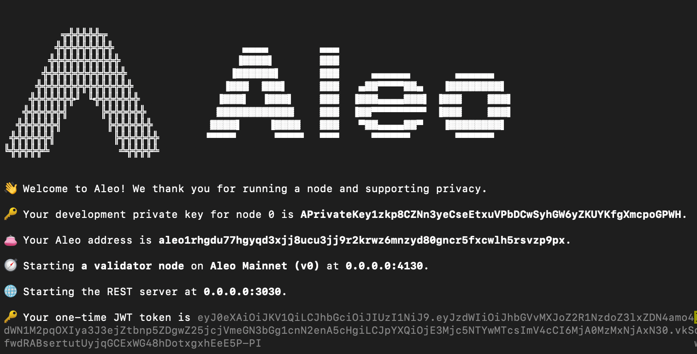

Depending on how thoroughly and quickly developers want to test the Leo programs, there are currently three different options in running tests.  

## Local Testing without Network
To test Leo programs locally without network, simply run command `leo run <FUNCTION_ID> <FUNCTION_ARGUMENTS>` at the root of the project directory. The caller of the function is automatically set according to the `PRIVATE_KEY` in the `.env` file.  

This approach helps testing the logic within transition scope but does not cover anything in asynchronous function scope, as there is no active network to execute and store states for async functions. It is a lot faster and can effectively test the creation and consumption of records. However, it cannot test states stored with mappings and verify double spending of records, since there is no network to enforce such checks.  

## Local Testing with Network
To test with the network, developers need to set up a local development network (devnet), which provides an isolated environment to deploy programs and execute transactions that modify program states. With this local network running, developers can validate state transitions within their programs, ensuring that record creation and consumption are correctly verified according to program logic, thereby preventing issues such as double spending.  

Here are the steps to start running a local devnet:
1. Install tmux
   - MacOS - run `brew install tmux`
   - Ubuntu - run `sudo apt update` then `sudo apt install tmux`
   - Windows - First, install Windows Subsystem for Linux. Then run the same commands as Ubuntu
2. Clone snarkOS repository to your local machine.
3. Run `./devnet.sh` from the snarkOS repository that you just cloned.
4. When asked for the total number of validators and clients, press enter to use default values.
5. Pick a network ID or press enter to use the default network.
6. When asked to run build the binary, enter `y` if this is the first time running, or `n` to skip if this is not the first time and nothing has changed in the snarkOS repo.
7. When asked to clear the existing ledger history, enter `y` if you want to restart a clean environment, or `n` to continue running the last network environment.
8. Once the nodes are started, you can navigate tmux with `Ctrl+b n` to switch to the next node or `Ctrl+b p` to the previous node.
9. To enable scrolling in tmux, press `Ctrl+b [`.
10. Look for the validator node 0 and take note of its private key that is shown during startup of the node. It should look something like below:

11. The private key will always stay the same for every node that runs with devnet.sh script so it only needs to remember once.
12. The reason for taking note of validator node 0’s private key is because it is automatically funded with test Aleo Tokens (AT) with both public mapping balance and private records.
13. To interact with the local devnet, just replace all API calls URL to `http://localhost:3030`.
Refer here for all the default available REST API endpoints from a validator node.

Once you have a local devnet running in the background, you can start deploying a program to the devnet using `leo deploy` and execute transactions using `leo execute` to start testing any logic in the async functions and correctness of the state transitions of your programs.

## Testing with Aleo Testnet
The Aleo Testnet closely mimics the environment of the mainnet, providing a realistic testing scenario for developers. One important note to keep in mind is that since the Testnet is continuously running and the network identifies each program with its unique ID, developers cannot redeploy a program with the exact same ID once it has been deployed to the Testnet.  

To start testing with the Aleo Testnet, simply make a REST API request to either the public endpoint at https://api.explorer.provable.com/v1/testnet or use a private endpoint provided by infrastructure providers. For further information, refer to the [default REST API endpoints](../testnet/public_endpoints/00_latest_height.md) available from a validator node.