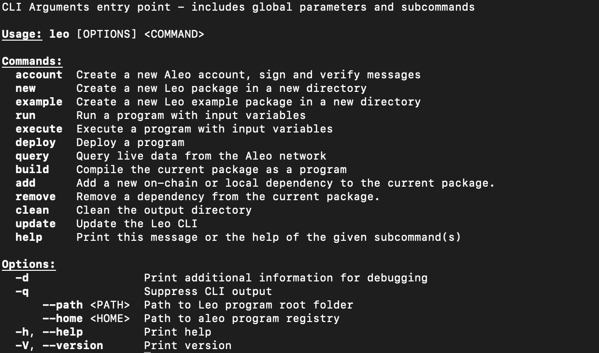
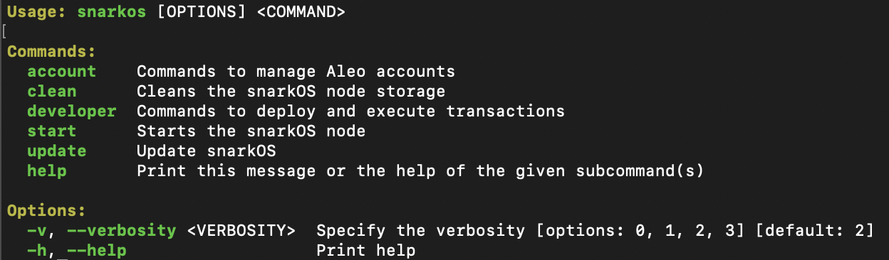

To get started with developing on Aleo, there are a few prerequisites you'll need to install. The two main components are **Leo**, Aleo's domain-specific language for writing zero-knowledge applications, and **snarkOS**, the decentralized operating system for zero-knowledge applications.  

**Leo** allows you to write and compile programs, while **snarkOS** enables you to interact with the Aleo network, deploy programs, and execute transactions. Installing these tools will provide you with the necessary foundation to begin building privacy-preserving applications on the Aleo platform.  

Optionally, you may also want to install **snarkVM**. If you wish to write more optimized code, **snarkVM** provides a lower-level representation in Aleo Instructions (AI) for that purpose. It's worth noting that Leo programs are compiled into AI as well.

In the following sections, we'll guide you through the installation process for these essential tools.


## 1. Installing Leo 🦁 

### 1.1 Install Git

**[bit.ly/start-git](https://bit.ly/start-git)**

### 1.2 Install Rust

**[bit.ly/start-rust](https://bit.ly/start-rust)**

### 1.3 Install Leo

Installing Leo by building from the source code as follows:
```bash
# Download the source code and initialize the submodules
git clone --recurse-submodules https://github.com/ProvableHQ/leo
cd leo

# Install 'leo'
cargo install --path .
```

### 1.4 Verify Installation

To verify if you have Leo, open your terminal and type `leo`. You should be able to see the following:



### 1.5 Check Version and Update Leo

To check the version of leo, in your terminal, run:
```bash
leo --version
```

You can update Leo to the latest version using the following command:
```bash
leo update
```

### 1.6 Optional: IDE Syntax Highlighting

Aleo maintains syntax highlighting implementations for various popular code editors. This can significantly enhance your development experience by providing visual cues and making your Leo code more readable. Here's a brief overview of the supported editors:

1. Visual Studio Code
2. Sublime Text
3. Intellij

For detailed instructions on how to set up syntax highlighting for these editors, please refer to the [Tooling for Leo](https://docs.leo-lang.org/leo/tooling) guide.

## 2. Installing snarkOS 

### 2.1 Prerequisites

Before beginning, please ensure your machine has Rust v1.79+ installed. Instructions to install Rust can be found [here](https://www.rust-lang.org/tools/install).

### 2.2 Clone the snarkOS repository

```bash
git clone --branch mainnet --single-branch https://github.com/AleoNet/snarkOS.git
```

**[For Ubuntu users]** A helper script to install dependencies is available. From the snarkOS directory, run:
```bash
./build_ubuntu.sh
```

### 2.3 Install snarkOS

```bash
cd snarkOS
cargo install --locked --path .
```

### 2.4 Verify Installation

To verify if you have snarkOS, open your terminal and type `snarkos`. You should be able to see the following:



## 3. Next Steps

Once you have successfully completed the installation of both Leo and snarkOS, you are ready to begin your journey with Aleo.  

To get started quickly and see Aleo in action, we recommend proceeding to the [Quick Start Guide](./quick_start). This guide will walk you through creating your first Aleo application, deploying it to the network, and executing it. This hands-on experience will give you a practical understanding of the Aleo platform's core features and workflow.


