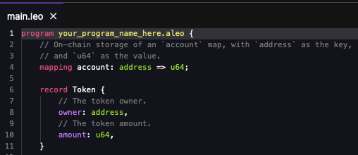
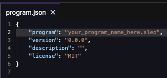
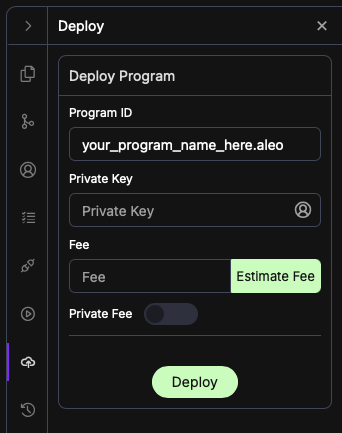
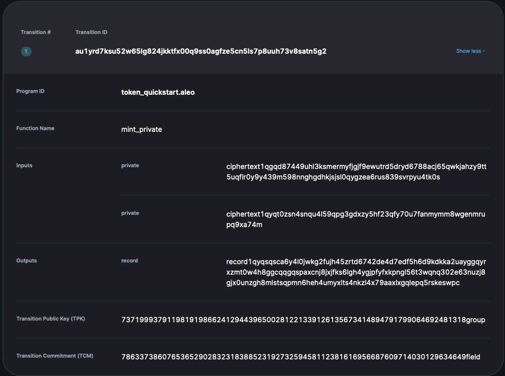
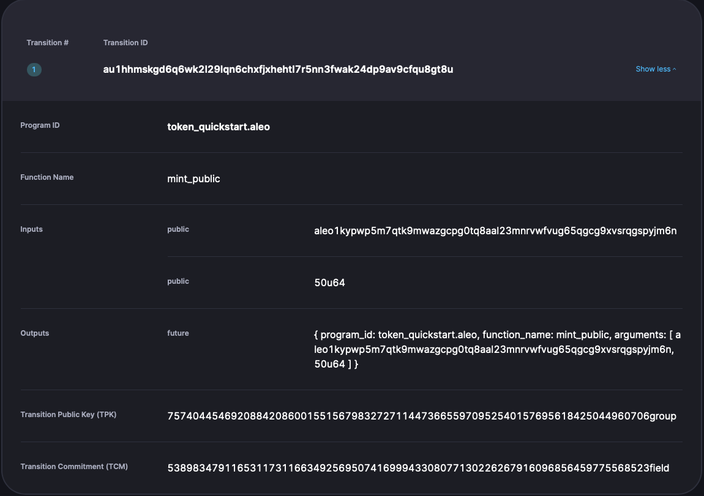

Deploy a token program on the Aleo Testnet directly from the [Leo Playground](https://play.leo-lang.org)

## 1.  The Token program

* In the Leo Playgorund, select `Token` from the `Examples` dropdown menu.

:::info
This programs enables a user to mint and transfer   private and public tokens.  Prviate tokens are represented in data structures called Records and public tokens are recorded in public ledgers called mappings.  Data within a Record is only visibile to the Record owner while data contained in mappings is publically visible.
:::

## 2. Generate a new Aleo account

### 2.1 Using the Leo Playground widget

* Click on the Account Widget to generate a new Aleo Account.


### 2.2 Using the Ecosystem Wallets

* [Leo Wallet](https://www.leo.app/)
* [Puzzle Wallet](https://puzzle.online/)
* [Soter Wallet](https://sotertech.io/)

:::note
Save your **Address**, **View Key**, and **Private Key** in a safe place, you'll need them later.
:::

* Update your `.env` with your private key and ensure that the endpoint uses the Provable Explorer endpoint:
```
NETWORK=testnet
PRIVATE_KEY=APrivateKey1...
ENDPOINT=https://api.explorer.provable.com/v1
```

## 3. Seeding your wallet with credits

To seed your wallet, you'll need to request credits from faucet provided by the ecosystem wallets at:
* [Leo Wallet Discord](https://www.leo.app/) (Scroll to bottom of the landing page to find Discord invite)
* [Puzzle Wallet Faucet](https://dev.puzzle.online/faucet)
* [Soter Wallet Faucet](https://faucetbeta.sotertech.io/)

The credits received from faucet will be public credits, which means they are publicly visible on the Aleo network.

You can check to see if your account received testnet credits using any of the following block explorers:
<!-- markdown-link-check-disable -->
- [Provable Explorer](https://testnet.explorer.provable.com/)
- [Aleoscan](https://testnet.aleoscan.io/)
- [Aleo123](https://testnet.aleo123.io/)
- [Aleo.Info](https://testnet.aleo.info/)
<!-- markdown-link-check-enable -->

:::tip
While waiting for the credits to be sent to your wallet, you can proceed to the next step of creating a Leo application.
:::

## 3. Deploy a token program from the Leo Playground

Change the name of the program in line 1 of `src/main.leo` to use a unique identifier and then update the `program` field in the `program.json` file to match the new name. 





:::tip
The length of the application name should be at least 10 characters to optimize deployment costs. Deployment fees increase exponentially (base^10) for each character fewer than 10, so shorter names lead to significantly higher costs. Using a name with 10 or more characters helps keep deployment costs reasonable.
:::

:::info
The reason for using a random application name is that the Aleo network identifies each program with its unique Program ID, and no two programs can have the same ID in the program registry. By generating a random name, we ensure that our application's Program ID will be unique when deployed.
:::

You are now ready to deploy your first Aleo program to the Testnet!

## 4. Deploy your token application

:::tip Make sure that your account is funded with sufficient Testnet credits to deploy to the network.  
:::

* Deploy your Leo application to Aleo Testnet

Click on the deploy widget to bring up the deployment window.



Enter your program name in the `Program ID` field and then enter your Private Key.

You can view an estimate for the deployment cost by clicking `Estimate Fee`.  Once your ready to deploy, click `Deploy`.

You should have seen a confirmation that your Aleo application was deployed in the form of a pop-up with an ID that looks like the following `at1ucnyh3rjewyudk484jz4qey5nknfhrs7lnwwzl2h28vdvdryf5ys2wsxh0`. 


Copy your transaction ID to view the details of your deployment transaction on the Aleo block explorers:

<!-- markdown-link-check-disable -->
- [Provable Explorer](https://testnet.explorer.provable.com/)
- [Aleoscan](https://testnet.aleoscan.io/)
- [Aleo123](https://testnet.aleo123.io/)
- [Aleo.Info](https://testnet.aleo.info/)
<!-- markdown-link-check-enable -->

:::info
Depending on the size of your program, you may not have sufficient credits to deploy your program if you are using an account funded with only one faucet transaction.  If that's the case, you can still interact with a program already deployed to the testnet.
:::

## 5. Execute a transaction

You can now use your deployed token program!  

:::tip
If you did not have enough funds to deploy a program, you can use the `token_quickstart.aleo` program to test the execution of the token program methods.
:::

When you call a method from your program, the logic is executed locally and is accompanied with a zero-knowledge proof that attests to the correctness of the program execution and its corresponding outputs.  This proof does not reveal any information about the input values.  If the proof is verified by the validators, then the blockchain state is updated.  

* Minting a private token

Minting a private token entails creating a Record.  Records are data structures that are stored on-chain as ciphertexts and can only be decrypted using the View Key, which is derived from the Record owner's Private Key.  This ensures that only the owner of a Record has the ability to decrypt it.  

To mint a private token, navigate to the Execute widget in the Leo Playground and enter the name of your program in the Program ID tab.  Alternatively, you can use the deployed token program 'token_quickstart.aleo`.  Click the magnifying glass icon to confirm that the Program ID corresponds to a deployed program.


Next, enter your Private Key and select the `mint_private` method from the Function drop-down menu.  In the Inputs tab, enter your Account Address and a `u64` integer.

```
["ALEO_ADDRESS_HERE", "50u64"]
```
Click Estimate Fee followed by Execute.  As before with the deploy transaction, you can copy and past your transaction ID in a block explorer.  You should see something resembling the following:



:::info
The output of the transaction is a Record.  In order to decrypt the Record, you need to copy and past the ciphertext, navigate to the Records widget in the Leo Playground, enter the Record ciphertext along with the View Key that corresponds to your Account's Private Key, and click Decrypt.  The decrypted Record should resemble the following:
```{
  owner: aleo1kypwp5m7qtk9mwazgcpg0tq8aal23mnrvwfvug65qgcg9xvsrqgspyjm6n.private,
  amount: 50u64.private,
  _nonce: 3175255370513411091535466147458245312227668453916963245036391157478647265587group.public
}
```
To learn more about Records, click [here](../../concepts/fundamentals/02_records.md)
:::

* Mint a public token

Public tokens are stored in mappings.  Unlike Records, which are encrypted on-chain, mappings will always contain public data.  

Navigate back to the Execute widget and repeat the steps in the previous section for minting a public token.  The transaction summary from the block explorer should resemble the following:



Notice that this transaction produces a Future instead of a Record.  A Future encapsulates a set of instructions for validators to execute on-chain, such as updating the values in a mapping.  

:::info
Awesome! You have successfully deployed a Leo program and executed transactions on the Testnet 🎉
:::

To get started with local development, navigative to the [installation guide](./02_installation.md) to install the necessary tools to test your Leo programs in a local instance of the Aleo blockchain.
