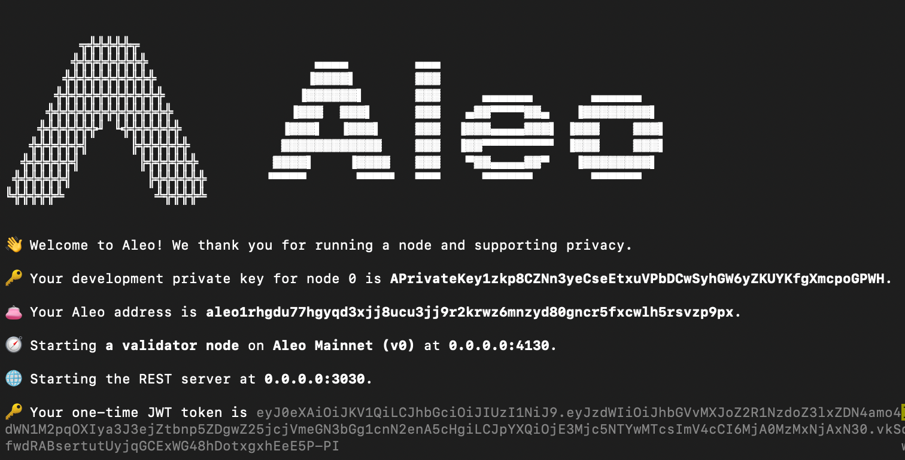

Depending on how thoroughly and quickly developers want to test the Leo programs, there are currently three different options in running tests.  

## Local Testing without Network
To test Leo programs locally without network, simply run command `leo run <FUNCTION_ID> <FUNCTION_ARGUMENTS>` at the root of the project directory. The caller of the function is automatically set according to the `PRIVATE_KEY` in the `.env` file.  

This approach helps testing the logic within transition scope but does not cover anything in asynchronous function scope, as there is no active network to execute and store states for async functions. It is a lot faster and can effectively test the creation and consumption of records. However, it cannot test states stored with mappings and verify double spending of records, since there is no network to enforce such checks.  

### Leo Testing

Leo's native testing framework allows developers to validate their program logic by writing unit and integration tests. These tests are written in Leo and are located in a `tests/` subdirectory of the main Leo project directory. Each test file is a Leo program that imports the program in `main.leo`. Test functions are annotated with `@test` above the function declaration.

For example, a transition function in `example_program.leo` might look like this:

```leo
transition simple_addition(public a: u32, b: u32) -> u32 {
    let c: u32 = a + b;
    return c;
}
```

And a corresponding test in `test_example_program.leo` would be:

```leo
@test
transition test_simple_addition() {
    let result: u32 = example_program.aleo/simple_addition(2u32, 3u32);
    assert_eq(result, 5u32);
}
```

Tests expected to fail can be annotated with `@should_fail`.

Additionally, `script` can be used to simulate on-chain state, allowing developers to test async functions and mapping operations directly without the need to start a local devnet or access the testnet/mainnet.

More details can be found in the [Leo Testing Framework documentation](https://docs.leo-lang.org/testing/test_framework).

### Leo Debugging

Leo also includes an interactive debugger that allows developers to step through their programs. This debugger is expression and statement-oriented, providing commands to evaluate expressions, set breakpoints, and inspect values.

For instance, you can set a breakpoint with:

```
#break program_name line_number
```

And print the value of a register during execution:

```
#print 2
```

The debugger also supports entering Leo expressions directly to evaluate them, making it a powerful tool for inspecting and debugging Leo programs. For more information, refer to the [Leo Debugging documentation](https://docs.leo-lang.org/testing/debugging).

## Local Testing with Network
To test with the network, developers need to set up a local development network (devnet), which provides an isolated environment to deploy programs and execute transactions that modify program states. With this local network running, developers can validate state transitions within their programs, ensuring that record creation and consumption are correctly verified according to program logic, thereby preventing issues such as double spending.  

Here are the steps to start running a local devnet:
1. To run a local devnet with the script, start by installing `tmux`.

<details>
<summary>macOS</summary>

To install `tmux` on macOS, you can use the `Homebrew` package manager.
If you haven't installed `Homebrew` yet, you can find instructions at [their website](https://brew.sh/).
```bash
# Once Homebrew is installed, run:
brew install tmux
```
</details>

<details>
<summary>Ubuntu</summary>

On Ubuntu and other Debian-based systems, you can use the `apt` package manager:
```bash
sudo apt update
sudo apt install tmux
```

</details>

<details>
<summary>Windows</summary>

There are a couple of ways to use `tmux` on Windows:

#### Using Windows Subsystem for Linux (WSL)

1. First, install [Windows Subsystem for Linux](https://docs.microsoft.com/en-us/windows/wsl/install).
2. Once WSL is set up and you have a Linux distribution installed (e.g., Ubuntu), open your WSL terminal and install `tmux` as you would on a native Linux system:
```bash
sudo apt update
sudo apt install tmux
```

</details>

2. Clone [snarkOS repository](https://github.com/AleoNet/snarkOS) to your local machine if you haven't done so.  
3. Run `./devnet.sh` from the snarkOS repository that you just cloned.  

<!-- markdown-link-check-disable -->
:::tip
As an alternative to `./devnet.sh`, you can also use the drop-in replacement [`amareleo-chain`](https://github.com/kaxxa123/amareleo-chain/blob/main/docs/00_introduction.md) which provides similar functionality but lighter and faster for setting up a local devnet. Built by the Aleo community.
:::
<!-- markdown-link-check-enable -->

4. When asked for the total number of validators and clients, press enter to use default values.  
5. Pick a network ID or press enter to use the default network.  
6. When asked to run build the binary, enter `y` if this is the first time running, or `n` to skip if this is not the first time and nothing has changed in the snarkOS repo.  
7. When asked to clear the existing ledger history, enter `y` if you want to restart a clean environment, or `n` to continue running the last network environment.  
8. Once the nodes are started, you can to switch to the next node in `tmux` with:
```
Ctrl+b n
```
or to the previous node with:
```
Ctrl+b p
```

9. To enable scrolling in tmux, run:  
```
Ctrl+b [
```  
:::tip
Press `q` to quit scrolling mode.

To kill session, press `Ctrl+b` and type `:kill-session`.
:::

10. Look for the validator node 0 and take note of its private key that is shown during startup of the node. It should look something like below:

11. The private key will always stay the same for every node that runs with devnet.sh script so it only needs to remember once.  
12. The reason for taking note of validator node 0's private key is because it is automatically funded with test Aleo Credits (ACs) with both public mapping balance and private records.  
13. To interact with the local devnet:
    - Replace all API calls URL with `http://localhost:3030`.
    - When using Leo CLI commands, you can set the endpoint in two ways:  
      a. Use the `--endpoint` flag for each command. For example:
         ```
         leo deploy --endpoint http://localhost:3030 --broadcast
         leo execute --endpoint http://localhost:3030 --broadcast
         ```
      b. Set the endpoint in the `.env` file at the root of your project:
         ```
         ENDPOINT=http://localhost:3030
         ```
         This way, you don't need to specify the endpoint for each command.

Refer [here](../../references/apis/01_latest_height.md) for all the default available REST API endpoints from a validator node.  

Once you have a local devnet running in the background, you can start deploying a program to the devnet using `leo deploy --broadcast` and execute transactions using `leo execute --broadcast` to start testing any logic in the async functions and correctness of the state transitions of your programs. If you haven't set the endpoint in the `.env` file, remember to include the `--endpoint http://localhost:3030 --broadcast` flags when interacting with your local devnet.  

The `--broadcast` flag is crucial as it instructs the Leo CLI to send the deployment or execution transaction to the network, ensuring that your actions are actually performed on the devnet rather than just simulated locally, allowing you to test the full lifecycle of your program in a realistic environment.

## Querying the Local Devnet

Once your local devnet is running, you can use various `leo query` commands to interact with and retrieve information from the network. To query the local devnet, ensure you're using the correct endpoint by either including the `--endpoint http://localhost:3030` flag with your commands or setting `ENDPOINT=http://localhost:3030` in your `.env` file.  

The `leo query` command supports querying different types of data from your local network, including block information, transaction details, program data, and mapping values. These queries allow you to inspect the current state of your local network, verify transactions, and debug your Aleo programs effectively, providing valuable insights into the behavior and performance of your applications on the devnet.

## Testing with Aleo Testnet
The Aleo Testnet closely mimics the environment of the mainnet, providing a realistic testing scenario for developers. One important note to keep in mind is that since the Testnet is continuously running and the network identifies each program with its unique ID, developers cannot redeploy a program with the exact same ID once it has been deployed to the Testnet.  

<!-- markdown-link-check-disable -->
To start testing with the Aleo Testnet, simply make a REST API request to either the public endpoint at https://api.explorer.provable.com/v1/testnet or use a private endpoint provided by infrastructure providers. For further information, refer to the [default REST API endpoints](../../references/apis/01_latest_height.md) available from a validator node.
<!-- markdown-link-check-enable -->