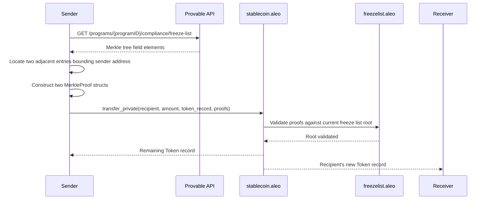

## Overview

The Private Stablecoin Program is a standard for issuing and managing privacy-preserving stablecoins on the Aleo blockchain. Two stablecoins are live on mainnet using this implementation:

### USDCx (`usdcx_stablecoin.aleo`)


[`usdcx_stablecoin.aleo`](https://explorer.provable.com/program/usdcx_stablecoin.aleo) is the first private stablecoin on Aleo, developed by Aleo in partnership with [Circle](https://www.circle.com/blog/usdcx-on-aleo-testnet-via-circle-xreserve). USDCx is backed **1:1 by native USDC** locked in Circle xReserve smart contracts on Ethereum. When a user deposits USDC into xReserve, an equivalent amount of USDCx is minted on Aleo. More details at [aleo.org/usdcx](https://aleo.org/usdcx/).

**Circle xReserve** is a non-custodial smart contract and interoperability infrastructure that provides deposit and minting attestations for USDCx on Aleo. It works alongside two complementary Circle services:

- **Circle Gateway** — enables unified USDC balance functionality
- **Circle CCTP** (Cross-Chain Transfer Protocol) — facilitates cross-blockchain asset transfers

Together, these make USDCx interoperable with USDC across supported blockchains without reliance on third-party bridges. Privacy features apply exclusively to USDCx while it remains on Aleo, bridging back to other blockchains removes these protections.

### USAD (`usad_stablecoin.aleo`)


[`usad_stablecoin.aleo`](https://explorer.provable.com/program/usad_stablecoin.aleo) is a privacy-preserving stablecoin developed jointly by the [Aleo Network Foundation (ANF) and Paxos Labs](https://aleo.org/post/paxos-labs-and-ANF-launch-USAD-Private-Stablecoin/). USAD is backed by **USDG (Global Dollar)**, a regulated, institutional-grade digital dollar issued through Paxos Labs' issuance framework. It is the first U.S. dollar stablecoin issued on a Layer 1 blockchain that combines smart contract capabilities with enhanced privacy. USAD is designed to keep sensitive information, including participant identities and transaction amounts, confidential, while remaining transparent to regulatory oversight. More details at [aleo.org/usad](https://aleo.org/usad/).

---

Both programs share the same on-chain implementation and are designed to meet regulatory compliance requirements while leveraging Aleo's unique zero-knowledge privacy features. The program integrates three supporting components:

- A **multisig core** program for admin operations requiring multi-signature approval
- A **freeze list** program to enforce compliance controls on token holders
- A **Merkle tree** program for efficient, privacy-preserving membership proofs

The key design goal of this stablecoin architecture is to allow fully private transfers while still enabling compliant freezing of addresses. Private senders prove they are not on the freeze list by submitting a Merkle proof of non-membership, without revealing their address on-chain.

## Compliance and Privacy Design

### Freeze List

The freeze list is managed by a companion program (`usdcx_freezelist.aleo` / `usad_freezelist.aleo`). Addresses on the freeze list are blocked from all public transfers. Private transfers enforce the same restriction without revealing the sender's address: the sender must supply a Merkle non-membership proof demonstrating their address is not a leaf in the freeze list tree.

### ComplianceRecord

Every operation that crosses the public/private boundary (mint private, burn private, and public-to-private conversions) emits a `ComplianceRecord` to a designated compliance officer address. This allows the issuer to maintain an audit trail for regulatory purposes without exposing information publicly on-chain.

### Multisig Administration

Admin operations are protected by `usdcx_multisig_core.aleo` (or `usad_multisig_core.aleo`), which requires multiple signers, identified by both Aleo addresses and ECDSA keys to authorize sensitive changes such as role updates and program initialization.

The underlying pattern — an Aleo smart contract wallet authorized by ECDSA signatures — is demonstrated in the [`virtual_wallet` Leo example](https://github.com/ProvableHQ/leo-examples/tree/main/virtual_wallet). This example is particularly useful for **custodians** who need to manage on-chain assets using existing ECDSA key infrastructure (e.g. HSMs or existing Ethereum signing keys) without exposing a native Aleo private key as the authority. It shows how to deploy a program that accepts secp256k1 ECDSA signatures as its authorization mechanism, using an ephemeral Aleo key for transaction signing while ECDSA keys retain actual spending authority.

## Key Features

- Public and private token balances
- Role-based access control (admin, minter, burner)
- Compliance via a freeze list with Merkle proof-based enforcement
- Credential-gated private transfers: senders must prove they are not frozen
- Compliance records emitted for every mint, burn, and public-to-private transfer
- Pause mechanism for emergency halts
- Multisig-protected administrative operations

## How to Use the Private Stablecoin Program

Addresses with the `MINTER_ROLE` or `ADMIN_ROLE` can mint tokens publicly via `mint_public` or privately via `mint_private`. Addresses with `BURNER_ROLE` or `ADMIN_ROLE` can burn tokens via `burn_public` or `burn_private`.

Token holders can transfer publicly using `transfer_public` or privately using `transfer_private`. Private transfers require the sender to fetch the current freeze list Merkle tree via the Provable API, compute two adjacent `MerkleProof` structs that lexicographically bound their address (proving non-membership), and pass those proofs directly to `transfer_private`.

Public balances can be converted to private token records via `transfer_public_to_private`, and private records can be converted back via `transfer_private_to_public`. An allowance mechanism (`approve_public`, `unapprove_public`, `transfer_from_public`, `transfer_from_public_to_private`) allows third parties to spend tokens on behalf of owners.

### Private Transfer Flow

Private transfers enforce freeze list compliance without revealing the sender's address on-chain. The sender must prove non-membership in the freeze list by supplying a pair of adjacent Merkle tree entries that lexicographically bound their address.



#### Freeze List API

To obtain the Merkle tree data needed for a private transfer, query the Provable Explorer API:

```
GET https://api.explorer.provable.com/v2/programs/{programID}/compliance/freeze-list
```

| Parameter | Type | Description |
|-----------|------|-------------|
| `programID` | path (string) | The stablecoin program ID, e.g. `usdcx_stablecoin.aleo` |

**Response:** An array of Merkle tree field elements representing the current freeze list. Use these to compute the two adjacent `MerkleProof` structs required by `transfer_private`.

Full API reference: [Provable Explorer API v2 — Compliance Freeze List](https://docs.explorer.provable.com/docs/api/v2/get-program-program-id-compliance-freeze-list)

## Data Structures

### Token Record

```leo
record Token {
    owner: address,
    amount: u128,
}
```

#### Token Record Fields

- `owner`: The private address of the token holder.
- `amount`: The private token balance held in this record.

### ComplianceRecord Record

```leo
record ComplianceRecord {
    owner: address,
    amount: u128,
    sender: address,
    recipient: address,
}
```

#### ComplianceRecord Fields

- `owner`: The compliance officer address that receives this record.
- `amount`: The amount involved in the operation.
- `sender`: The address that initiated the operation.
- `recipient`: The address that received tokens.

A `ComplianceRecord` is emitted on every `mint_private`, `burn_private`, `transfer_public_to_private`, and `transfer_from_public_to_private` call, providing an audit trail for the compliance officer without revealing data publicly on-chain.

### Credentials Record

```leo
record Credentials {
    owner: address,
    freeze_list_root: field,
}
```

#### Credentials Fields

- `owner`: The address for which non-membership in the freeze list was proven.
- `freeze_list_root`: The Merkle root of the freeze list at the time of proof.

A `Credentials` record must be obtained via `get_credentials` before calling `transfer_private`. It certifies that the holder is not on the freeze list at a specific root.

### TokenInfo Struct

```leo
struct TokenInfo {
    name: u128,
    symbol: u128,
    decimals: u8,
    supply: u128,
    max_supply: u128,
}
```

#### TokenInfo Fields

- `name`: The name of the token encoded as ASCII bits in a u128.
- `symbol`: The symbol of the token encoded as ASCII bits in a u128.
- `decimals`: The number of decimal places for the token.
- `supply`: The current total supply.
- `max_supply`: The maximum allowed total supply.

### TokenAllowance Struct

```leo
struct TokenAllowance {
    account: address,
    spender: address,
}
```

#### TokenAllowance Fields

- `account`: The token owner granting the allowance.
- `spender`: The address authorized to spend on behalf of the owner.

### MerkleProof Struct

```leo
struct MerkleProof {
    siblings: [field; 16],
    leaf_index: u32,
}
```

#### MerkleProof Fields

- `siblings`: The sibling hashes along the path from the leaf to the root (depth-16 tree).
- `leaf_index`: The index of the leaf in the Merkle tree.

Used in `get_credentials` and `transfer_private` to prove non-membership (or membership) in the freeze list.

### ChecksumEdition Struct

```leo
struct ChecksumEdition {
    checksum: [u8; 32],
    edition: u16,
}
```

#### ChecksumEdition Fields

- `checksum`: A 32-byte hash identifying a specific program deployment.
- `edition`: The deployment edition number.

### AdminOp Struct

```leo
struct AdminOp {
    op: u8,
    threshold: u8,
    aleo_signer: address,
    ecdsa_signer: [u8; 20],
}
```

#### AdminOp Fields

- `op`: The operation code for the admin action.
- `threshold`: The multisig threshold required to execute the operation.
- `aleo_signer`: The Aleo address participating in the multisig.
- `ecdsa_signer`: The ECDSA public key (20-byte Ethereum-style address) of the signer.

## Mappings

`mapping token_info: boolean => TokenInfo;`  
Stores the token metadata at key `true`. There is exactly one entry.

`mapping balances: address => u128;`  
Maps each address to its public token balance.

`mapping allowances: field => u128;`  
Maps the BHP256 hash of a `TokenAllowance` struct to the approved spending amount.

`mapping address_to_role: address => u16;`  
Maps each address to its role bitmask.

`mapping pause: boolean => boolean;`  
Stores the paused state at key `true`. When `true`, all minting, burning, and transfers are blocked.

## Role Constants

Roles are stored as a bitmask in `address_to_role`. An address may hold multiple roles simultaneously.

| Role | Bitmask | Description |
|------|---------|-------------|
| `MINTER_ROLE` | `1u16` | Can call `mint_public` and `mint_private` |
| `BURNER_ROLE` | `2u16` | Can call `burn_public` and `burn_private` |
| `ADMIN_ROLE` | `8u16` | Can call all privileged functions including `update_role` |

An address with `ADMIN_ROLE` can assign or revoke roles for other addresses. An admin cannot remove their own `ADMIN_ROLE`.

## Functions

### `initialize()`
#### Description
Initializes the stablecoin program with its token metadata and sets the initial admin address. Can only be called once and only by the deployer address.

#### Parameters
- `public name: u128`: The token name encoded as ASCII.
- `public symbol: u128`: The token symbol encoded as ASCII.
- `public decimals: u8`: The number of decimal places.
- `public max_supply: u128`: The maximum allowed supply.
- `public admin: address`: The initial admin address.

#### Returns
- `Future`: A Future to finalize the initialization.

---

### `update_role()`
#### Description
Assigns a new role bitmask to a target address. The caller must have `ADMIN_ROLE`. An admin cannot remove their own `ADMIN_ROLE`.

#### Parameters
- `public account: address`: The address to update.
- `private role: u16`: The new role bitmask to assign.

#### Returns
- `Future`: A Future to finalize the role update.

---

### `get_credentials()`
#### Description
Proves that the transaction signer is not on the freeze list by verifying two Merkle proofs against the current freeze list root. If valid, returns a `Credentials` record to the signer. This record is required to call `transfer_private`.

The function verifies that the signer's address falls lexicographically between the two consecutive leaf entries provided, confirming non-membership in the freeze list.

#### Parameters
- `private proofs: [MerkleProof; 2]`: Two adjacent Merkle proofs bounding the signer's address in the freeze list tree.

#### Returns
- `Credentials`: A private record certifying the signer is not frozen at the proven Merkle root.
- `Future`: A Future to validate the root against the freeze list program.

---

### `get_signing_op_id_for_deploy()`
#### Description
A utility function that computes the signing operation ID for a program deployment, used in multisig admin flows.

#### Parameters
- `private checksum: [u8; 32]`: The deployment checksum.
- `private edition: u16`: The deployment edition.

#### Returns
- `field`: The BHP256 hash of the `ChecksumEdition` struct, used as the signing operation identifier.

---

### `mint_public()`
#### Description
Mints tokens to a public recipient address. The caller must have `MINTER_ROLE` or `ADMIN_ROLE`. The program must not be paused and the new supply must not exceed `max_supply`.

#### Parameters
- `public recipient: address`: The address to receive the minted tokens.
- `public amount: u128`: The number of tokens to mint.

#### Returns
- `Future`: A Future to finalize the mint.

---

### `mint_private()`
#### Description
Mints tokens as a private `Token` record. The caller must have `MINTER_ROLE` or `ADMIN_ROLE`. The program must not be paused and the new supply must not exceed `max_supply`. Emits a `ComplianceRecord` to the compliance officer.

#### Parameters
- `private recipient: address`: The private recipient address (not visible on-chain).
- `public amount: u128`: The number of tokens to mint.

#### Returns
- `ComplianceRecord`: A compliance record emitted to the compliance officer.
- `Token`: The minted token record for the recipient.
- `Future`: A Future to finalize the mint.

---

### `burn_public()`
#### Description
Burns tokens from a public address. The caller must have `BURNER_ROLE` or `ADMIN_ROLE`. The program must not be paused.

#### Parameters
- `public owner: address`: The address whose tokens will be burned.
- `public amount: u128`: The number of tokens to burn.

#### Returns
- `Future`: A Future to finalize the burn.

---

### `burn_private()`
#### Description
Burns tokens from a private `Token` record. The caller must have `BURNER_ROLE` or `ADMIN_ROLE`. The program must not be paused. Emits a `ComplianceRecord` to the compliance officer.

#### Parameters
- `input_record: Token`: The token record to burn from.
- `public amount: u128`: The number of tokens to burn.

#### Returns
- `ComplianceRecord`: A compliance record emitted to the compliance officer.
- `Token`: The remaining token record with the reduced balance.
- `Future`: A Future to finalize the burn.

---

### `transfer_public()`
#### Description
Transfers tokens between two public addresses. Both sender and recipient must not be on the freeze list. The program must not be paused.

#### Parameters
- `public recipient: address`: The recipient address.
- `public amount: u128`: The amount to transfer.

#### Returns
- `Future`: A Future to finalize the transfer.

---

### `transfer_public_as_signer()`
#### Description
Transfers tokens publicly using `self.signer` as the sender rather than `self.caller`. This allows the transfer to be initiated from within another program while attributing the debit to the original transaction signer.

#### Parameters
- `public recipient: address`: The recipient address.
- `public amount: u128`: The amount to transfer.

#### Returns
- `Future`: A Future to finalize the transfer.

---

### `approve_public()`
#### Description
Grants a spender the ability to transfer tokens on behalf of the caller, increasing the allowance by the specified amount.

#### Parameters
- `public spender: address`: The address to authorize.
- `public amount: u128`: The amount to add to the allowance.

#### Returns
- `Future`: A Future to finalize the approval.

---

### `unapprove_public()`
#### Description
Reduces or revokes a spender's allowance.

#### Parameters
- `public spender: address`: The address whose allowance to reduce.
- `public amount: u128`: The amount to subtract from the allowance.

#### Returns
- `Future`: A Future to finalize the unapproval.

---

### `transfer_from_public()`
#### Description
Transfers tokens from an owner to a recipient using a pre-approved allowance. Both owner and recipient must not be on the freeze list. The program must not be paused.

#### Parameters
- `public owner: address`: The address to debit.
- `public recipient: address`: The address to credit.
- `public amount: u128`: The amount to transfer.

#### Returns
- `Future`: A Future to finalize the transfer.

---

### `transfer_public_to_private()`
#### Description
Converts a public balance to a private `Token` record. The sender must not be on the freeze list. The program must not be paused. Emits a `ComplianceRecord` to the compliance officer.

#### Parameters
- `private recipient: address`: The private recipient address (not visible on-chain).
- `public amount: u128`: The amount to convert.

#### Returns
- `ComplianceRecord`: A compliance record emitted to the compliance officer.
- `Token`: The resulting private token record.
- `Future`: A Future to finalize the transfer.

---

### `transfer_from_public_to_private()`
#### Description
Converts a public balance to a private `Token` record on behalf of an owner, using a pre-approved allowance. The owner must not be on the freeze list. The program must not be paused. Emits a `ComplianceRecord` to the compliance officer.

#### Parameters
- `public owner: address`: The address to debit publicly.
- `private recipient: address`: The private recipient address (not visible on-chain).
- `public amount: u128`: The amount to convert.

#### Returns
- `ComplianceRecord`: A compliance record emitted to the compliance officer.
- `Token`: The resulting private token record.
- `Future`: A Future to finalize the transfer.

---

### `transfer_private()`
#### Description
Transfers tokens between two private `Token` records. The sender must provide a valid `Credentials` record obtained from `get_credentials`, proving they are not on the current freeze list. The program must not be paused.

#### Parameters
- `private recipient: address`: The private recipient address (not visible on-chain).
- `private amount: u128`: The private amount to transfer (not visible on-chain).
- `input_record: Token`: The sender's token record.
- `private proofs: [MerkleProof; 2]`: The Merkle proofs certifying the sender is not on the freeze list.

#### Returns
- `Token`: The sender's remaining token record.
- `Token`: The recipient's new token record.
- `Future`: A Future to validate the freeze list proofs on-chain.

---

### `transfer_private_to_public()`
#### Description
Converts a private `Token` record to a public balance. The program must not be paused.

#### Parameters
- `public recipient: address`: The public recipient address.
- `public amount: u128`: The amount to convert.
- `input_record: Token`: The sender's private token record.

#### Returns
- `Token`: The sender's remaining token record.
- `Future`: A Future to finalize the transfer.