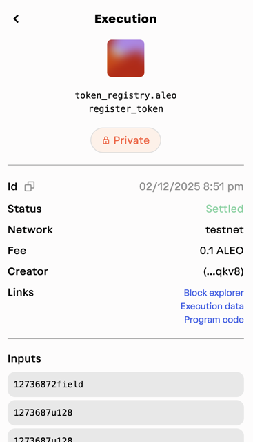

## Overview

This guide demonstrates how to use the [Universal Wallet Adapter](./00_universal_wallet_adapter.md) with `create-leo-app` and interact with the Token Registry Program.

## Setup

Create a new application using `create-leo-app`:

```bash
npm create leo-app@latest
```

More information about `create-leo-app` can be found in the [here](../sdk/create-leo-app/00_app_installation.md) and [here](../sdk/create-leo-app/01_create_leo_app.md).

### Installation

Install the Universal Wallet Adapter in your project:

```bash
npm install --save \
    @demox-labs/aleo-wallet-adapter-base \
    @demox-labs/aleo-wallet-adapter-react \
    @demox-labs/aleo-wallet-adapter-reactui \
    aleo-adapters
```

### Wallet Provider

Go to `src/main.tsx` and wrap your app with the `WalletProvider` and `WalletModalProvider` components.  
Here is an example of the `main.tsx` file on how to configure the wallets you want to use:

```tsx
import React from "react";
import ReactDOM from "react-dom/client";
import App from "./App";
import "./index.css";

import { WalletModalProvider } from "@demox-labs/aleo-wallet-adapter-reactui";
import { WalletProvider } from "@demox-labs/aleo-wallet-adapter-react";
import { DecryptPermission, WalletAdapterNetwork } from "@demox-labs/aleo-wallet-adapter-base";
import { useMemo } from "react";
import { 
  PuzzleWalletAdapter, 
  LeoWalletAdapter, 
  FoxWalletAdapter,
  SoterWalletAdapter 
} from 'aleo-adapters';

const Root = () => {
  const wallets = useMemo(
    () => [
      new LeoWalletAdapter({
        appName: 'Aleo app',
      }),
      new PuzzleWalletAdapter({
        programIdPermissions: {
          [WalletAdapterNetwork.TestnetBeta]: ['token_registry.aleo']
        },
        appName: 'Aleo app',
        appDescription: 'A privacy-focused DeFi app',
        appIconUrl: ''
      }),
      new FoxWalletAdapter({
        appName: 'Aleo app',
      }),
      new SoterWalletAdapter({
        appName: 'Aleo app',
      })
    ],
    []
  );

  return (
    <React.StrictMode>
      <WalletProvider
        wallets={wallets}
        network={WalletAdapterNetwork.TestnetBeta}
        decryptPermission={DecryptPermission.UponRequest}
        autoConnect
      >
        <WalletModalProvider>
          <App />
        </WalletModalProvider>
      </WalletProvider>
    </React.StrictMode>
  );
};

ReactDOM.createRoot(document.getElementById("root") as HTMLElement).render(
  <Root />
);
```

### Wallet Button

Go to `src/App.tsx` and add the pre-built `WalletMultiButton` component by importing it from `@demox-labs/aleo-wallet-adapter-reactui` and its css file. Example:

```tsx
import { WalletMultiButton } from "@demox-labs/aleo-wallet-adapter-reactui";
import "@demox-labs/aleo-wallet-adapter-reactui/dist/styles.css";

// ... existing code ...

return (
    <>
      <div style={{ position: 'absolute', top: '20px', right: '20px' }}>
        <WalletMultiButton />
      </div>
      {/* ... existing code ... */}
    </>
);
```

### Request Transaction

Go to `src/App.tsx` and add the `useWallet` hook by importing it from `@demox-labs/aleo-wallet-adapter-react`:

```tsx
import { useWallet } from "@demox-labs/aleo-wallet-adapter-react";

// ... existing code ...

const { requestTransaction } = useWallet();

```

Then try to execute and broadcast a transaction by calling the `requestTransaction` function, below is an example of a transaction that registers a new token:

```tsx
const result = await requestTransaction(
      {
        address: publicKey || "",
        chainId: "testnetbeta",
        transitions: [{
          program: "token_registry.aleo",
          functionName: "register_token",
          inputs: [
              "12736872field", // token_name
              "1273687u128", // token_symbol
              "1273687u128", // token_decimals
              "6u8", // token_type
              "1000000000u128", // token_supply
              "false", // external_authorization_required
              "aleo1qqqqqqqqqqqqqqqqqqqqqqqqqqqqqqqqqqqqqqqqqqqqqqqqqqqq3ljyzc" // external_authorization_party
            ]
        }],
        fee: 100000, // fees in microcredits
        feePrivate: false,
      }
    );
```

The returned `result` string varies based on which wallet that user used to send the transaction.  

User will then able to check the transaction status in the wallet after sending the transaction. It will look something like this on Puzzle Wallet:



Next, we can apply the same logic to mint a private token record from the token registry program.

```tsx
const result = await requestTransaction(
      {
        address: publicKey || "",
        chainId: "testnetbeta",
        transitions: [{
          program: "token_registry.aleo",
          functionName: "mint_private",
          inputs: [
              "12736872field", // token_name
              receivingAddress, // receiving_address
              "1000000u128", // token_amount
              "false", // external_authorization_required
              "0u32" // authorized_until / doesn't matter if external_authorization_required is false
            ]
        }],
        fee: 100000, // fees in microcredits
        feePrivate: false,
      }
    );
```

Once transaction is finalized on chain, a helper function can be created with `requestRecordPlaintexts` from `useWallet` hook to request every record from the specific program ID and display only unspent records to users in plaintext:

```tsx
const { requestRecordPlaintexts } = useWallet();
// ... existing code ...
async function requestRecord() {
    if (!requestRecordPlaintexts) {
      alert("No wallet connected");
      return;
    }
    const records = await requestRecordPlaintexts('token_registry.aleo');
    const unspentRecords = records.filter(record => !record.spent);

    if (unspentRecords.length > 0) {
      console.log("Unspent Records:");
      unspentRecords.forEach((record, index) => {
        console.log(`Record ${index + 1}:`, record.plaintext);
      });
    } else {
      console.log("No unspent records found");
    }
  }
```

This guide demonstrates how to integrate the Universal Wallet Adapter with the token_registry.aleo program to perform common token operations. We covered:

- Setting up the wallet adapter providers and configuration
- Connecting a supported wallet (Leo Wallet, Puzzle Wallet, Fox Wallet, or Soter Wallet)
- Registering a new token using the `register_token` function
- Minting private tokens to a specified address with `mint_private`
- Querying and displaying unspent token records using `requestRecordPlaintexts`

The Universal Wallet Adapter provides a consistent interface for interacting with Aleo wallets, making it easy to add wallet functionality to your dApp. The adapter handles all the complexities of wallet connections, transaction signing, and record management, allowing developers to focus on building their application logic.

For detailed API documentation, check out the [Universal Wallet Adapter documentation](https://github.com/demox-labs/aleo-wallet-adapter).

