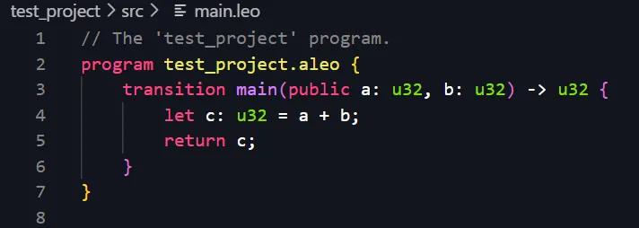
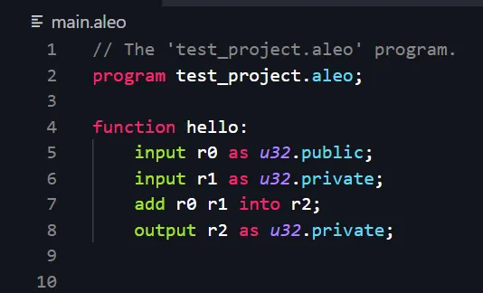

---
id: faqs
title: FAQs
sidebar_label: FAQs
--- 
## Do applications in Aleo function similarly to ZK rollups?  

Differences between Aleo applications and ZK rollups:

| Aspect | ZK Rollup | Aleo Application |
|--------|-----------|-------------------|
| Information visibility | All **information is public** | Can make some inputs private, using the **zero-knowledge** property of **zk**SNARK |
| Proof generation | Rollup coordinator generates the proof and submits it in the rollup-transaction | Users generate the proof themselves and submit it as part of the transaction |
| Batching | Batches multiple transactions | Can batch multiple transitions into the same **transaction** |
| zkSNARK usage | Uses the **succinct** property to prove correct execution of a batch of transactions | Can use rollup-like architecture with added privacy features |

Similar to batching multiple transactions in a zk-rollup, Aleo has a way to batch multiple **transitions** into the same **transaction**.

## How does the network of provers work, including their incentives and the consensus mechanism?

Aleo is SNARK-based and uses the Marlin-proving algorithm to generate program proofs. The cryptography and proof generation are handled by SnarkVM. Aleo program proofs can currently be generated locally by the user or delegated to a third-party prover. These involve tradeoffs between performance and privacy:  

Local proof generating is the most trust-minimized solution since it doesn’t require sharing private inputs with anyone else. However, the performance is limited to your hardware.  

For more complex proofs - users can/may delegate to third-party provers with specialized hardware. While outsourcing proof generation leads to better performance, it sacrifices privacy as users need to share some data used in the computation to enable the prover to compute the zero-knowledge proof.  

In the Aleo Network, provers use specialized hardware to generate proofs and solve puzzles that help secure the Network. They generate proofs for a given block and earn pro rata portions of the coinbase reward (a subset of the total block reward) based on how many above-target proofs they submit. Talking about the network and reward share among the provers:  

> Proof difficulties are set by a version of the algorithm created by the Bitcoin Cash team called ASERT. When a proof exceeds the current difficulty limit, a coinbase reward is shared among all provers who contributed. The computational work done by provers includes Multi-Scalar multiplication and fast-Fourier transforms.

## How do Aleo Credits work?

Aleo Credits are used in two main ways:

1. Secure the network:  Validators stake Aleo Credits to propose blocks and secure the network, and receive Aleo Credits as a reward for validation. This is standard for PoS blockchains.
2. Purchase zero-knowledge compute: Applications that need zkSNARK-proving use Aleo credits to pay provers to generate the proofs.

## How does Proof of Succint Work (PoSW) operate for provers in Aleo?
Proof of Succinct Work (PoSW) in Aleo is an incentive mechanism designed to drive hardware acceleration for zero‐knowledge proof (ZKP) generation. At its core, PoSW challenges provers with a cryptographic puzzle—known as the Coinbase puzzle—which directs them to execute critical computations (such as multi‐scalar multiplications and fast Fourier transforms) that underpin zkSNARK operations. Provers DO NOT produce blocks, but they do earn a portion of the coinbase reward from each block. The coinbase reward is not winner-take-all; all the provers who contribute solutions for a given block above the minimum difficulty target receive a pro-rata portion of the reward.

As the Coinbase puzzle gradually becomes more difficult over time, provers must continuously upgrade their hardware and refine their proving techniques in order to solve increasingly tougher puzzles. This evolving difficulty not only promotes ongoing innovation but also ensures that all participating provers, regardless of whether they are the fastest, receive proportionate rewards per block. In essence, PoSW transforms the proving process into a decentralized, competitive ecosystem akin to a mining pool, where the collective effort drives both performance improvements and cost reductions.

By linking rewards to useful work that directly contributes to the efficiency of ZKP generation, PoSW encourages broad participation and investment in specialized hardware (like ASICs). This alignment of incentives helps maintain a decentralized prover network that is robust, censorship-resistant, and continuously improving—a key factor in Aleo’s mission to deliver privacy-first blockchain technology.

## How is the record model in Aleo designed, and how does it compare to the account and UTXO models?
Aleo supports both the UTXO like model with Records and account like-models with mapping. In the record model, a decentralized ledger tracks every record via a global state.  

We still have users with addresses but instead of running a transaction in an application on a bunch of inputs, we actually execute the transaction locally on a bunch of records and provide these transitions within the transaction with the proof that I have actually executed these records correctly. And in this manner when the network updates the program is no longer a global store of encrypted states, it’s now an abstraction over records. Essentially splitting up the state in a more proficient manner.  

Record model is very similar to the UTXO model (of Bitcoin). The addition on top of the UTXO model is that the content of the UTXO can be as per the program needs and not baked into the protocol level and **all the content is encrypted by default.**

## From the blockchain dilemma triangle perspective, which aspect, if any, did Aleo compromise on?

Aleo doesn’t compromise on the trilemma and in fact addresses it in totality. This is possible because of Aleo’s consensus algorithm and ZK Snarks.  

Aleo enables Account privacy: The decentralized ledger indexes the global state based on program IDs.  

Efficient state updates: Record abstraction: helps you segment/compartmentalize your information from others. Predicates essentially only consume program records being updated.  

Concurrency: Simultaneous updates to the program states are achieved through records and the ledger ensures that the program records are not double spent. If we look at the records, we have a Merkle tree of all these leaves, leaves are usually entries. How’s concurrency achieved? Because we can have the network effectively take all these record updates, and then in one go, update a Merkle tree with everybody's deltas, everybody's diffs, and then subsequently linearize that and patch up to a Merkle group and put that into the block header. And so this fundamentally gives us the ability to get back the feature that we had in the previous account model now in this record model, but with concurrency.   

## How does Aleo prevent double spending, and what are the implications for transaction finality and fees?

Since Aleo supports both the UTXO-model with records and account model with mappings, the double-spending is prevented in different ways:

**For UTXO model:**  

Each record has a serial number and a corresponding commitment. When spending the record, you publicly create an inclusion proof verifying that the record is in a tree of commitments and the serial number is used to verify that the same record has not been used previously. If we try to spend the same record it fails.  

*Commitments are a cryptographic way to ensure that the information provided is valid and hasn't been tampered with. They allow protecting sensitive information while still enabling verification and trust. Commitments are also essential for implementing smart contracts on Aleo, as they enable the verification of contract conditions and ensure that the contract's execution adheres to the specified rules without exposing the underlying data*

Generating a transaction involves creating commitments to new records as well as computing the unique serial number for consumed records. Commitments are part of proof generation at both the transition and transaction level.  

**For account models:**  

The account is updated globally in a mapping. So everytime the transfers happen, the amount is subtracted from the sender’s account and added to the receiver’s account (similar to Ethereum and other public chains). Since the information is global, you cannot make transfers of the amount that you do not have in your account. For transactions that update the mapping, one still requires the proofs (unlike the signatures for authorization of transfer) and the proof is based on a stateRoot. If there has been an update in the mapping by some prev transaction, the stateRoot changes and the proof will fail. 

## What is the purpose and functionality of Aleo instructions?

Aleo instructions is the intermediate representation of Aleo programs. All Leo programs compile to Aleo instructions which compile to bytecode. Aleo instructions are compiled into AVM opcodes that can be executed by the Aleo Virtual Machine.  

To generate the zero-knowledge proof, arithmetic circuits are used. Developers on the EVM ecosystem write these circuits using Circom, Zokrates which are later used to generate the proving and verifying keys to generate the proofs. Aleo instructions are the way to write these circuits.  

If we have a leo program to add two u32 variables:  

The Aleo instructions would look something like this (very similar to assembly language):  

## Why was Leo created, and how does it differ from other smart contract languages like Solidity?
To generate the zero-knowledge proof, arithmetic circuits are used. Developers on the EVM ecosystem write these circuits using Circom, Zokrates which are later used to generate the proving and verifying keys to generate the proofs. Writing circuits can be a bit daunting.  

So Leo abstracts that away and makes it easier for developers to write their logic in higher level language called Leo (files with .leo extension) instead of Aleo (files with .aleo extension) circuits.

## How does Aleo's approach to off-chain computation differ from other solutions like ZK-Coprocessor, and what are the privacy implications of outsourcing proving tasks?

The approach is very similar. Each transition on Aleo can have an additional finalize block. The logic of the transition block is verified with the ZK-proof and the logic in the finalized block is re-executed by all the nodes on the network to update the state stored in the mapping.   

In this sense the logic inside transition acts like the computations sent to the ZK-processor which requires a fixed transaction cost (no matter the size of the logic) and the logic inside the finalize block is similar to the on-chain execution of other public blockchains like Ethereum.  

Right now, on Aleo, you have the option to delegate proof generation to a remote server. This will speed up proof generation but disclose the transaction details to a trusted server. For some applications and users, this makes sense but for some applications where privacy is of utmost importance, users still have the option to generate the proof themselves.   

Private proof delegation would be the holy grail but we aren’t there (yet).  

Learn more about the state of outsourcing proving tasks [here](https://www.youtube.com/watch?v=bulEa85cptc).

## How does Aleo compare to Bitcoin and Ethereum in terms of its core design and functionality?

From the above slide from The Aleo advantage perfectly answers the question.  

Bitcoin is public money. It is not programmable and all of the user’s transactions are public.  
Ethereum introduced programmability but still didn’t offer privacy.  
Some projects like ZCast offered privacy but didn’t provide programmability.  
Aleo provides both privacy and programmability.  

## Where can I watch talks and videos?
* Coinbase BUIDL - [**Learning LEO | Coding Private Application with ZK Cryptography**](https://youtu.be/LJXjtthDl6I)
* DEVCON - [**Aleo Developer Workshop: Leo Coding & Examples**](https://youtu.be/ABPCr2TwrgE)
* DEVCON - [**What are ZK Proofs Good For? Applications to Anonymous Identity, Sybil Prevention and Moderation**](https://youtu.be/d2n0Al0P2Jc)
* DEVCON - [**Efficient Private Delegation of zkSNARK Provers**](https://youtu.be/mFzwp8gGn-E)
* ICC - [**Web 3.0 for developers in TLV Howard Wu Aleo**](https://youtu.be/-FrrylHITvg)
* ZK8 - [**Demystifying Zero-Knowledge Programming – Howard Wu - Aleo**](https://youtu.be/e-1mPNEINRI)
* ETHCC - [**The Hitchhiker's Guide to ZK: An Aleo Developer Workshop**](https://youtu.be/fjfj5kFcQe4)
* CoinGecko - [**Importance of Zero-knowledge Proofs w/ Alex Pruden**](https://youtu.be/NvYddvVBjXY)
* Thinking Crypto - [**Alex Pruden Interview - Aleo's Privacy Solutions - Zero Knowledge Proofs - a16z - Bitcoin & Crypto**](https://youtu.be/1y4jvyy8Nsk)
* The Interop - [**Zero-Knowledge Smart Contracts with Alex Pruden of Aleo**](https://youtu.be/6BwefrwgN3w)
* Axelar - [**Tech Talks with Aleo**](https://youtu.be/P7G2DKWZbVM)

## What are the Aleo's social accounts?

[//]: # (disabling markdown checks for twitter links)

<!-- markdown-link-check-disable -->

👾 | Discord ~ **https://discord.gg/aleo**

🐦 | X (Twitter) ~ @AleoHQ ~ **https://twitter.com/AleoHQ**

🤝 | Community X (Twitter) ~ @aleocommunity ~ **https://twitter.com/aleocommunity**

<!-- markdown-link-check-enable -->

🐙 | GitHub ~ **https://github.com/AleoNet**

✍️ | Community Blog ~ **https://medium.com/@aleohq**

## Are there more useful resources?

🏎️ | A curated list of Aleo & Leo code and resources ~ **https://github.com/howardwu/awesome-aleo**

📜 | A starter guide to build applications on Aleo ~ **https://github.com/AleoNet/workshop**