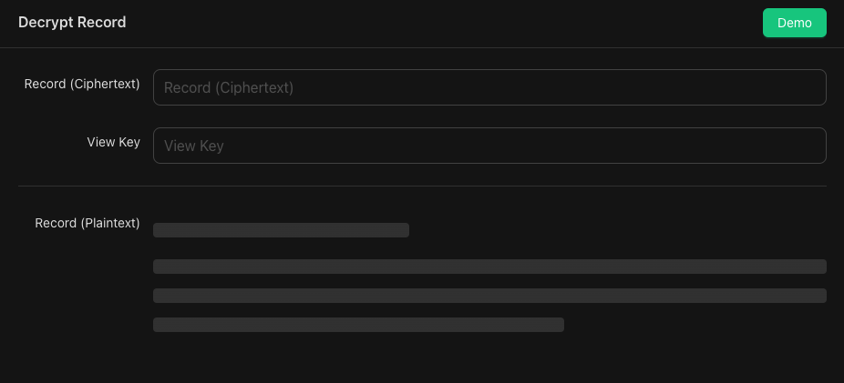
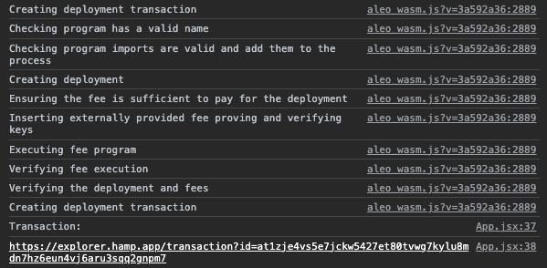

<a href="https://www.npmjs.com/package/create-leo-app"> </a>


## 1. Installation

Please see [the installation page](00_app_installation.md) to setup the React + Javascript + Leo template.

## 2. Navigation

Navigate to the project you just installed. 

```bash
cd aleo-project
npm install
npm run install-leo
npm run dev
```
<!-- markdown-link-check-disable -->

This installs all the required modules and also Leo, our statically-typed programming language built for writing private applications. Lastly, we've initialized a local instance of your React application at http://localhost:5173.

`src/App.jsx` contains the main body of your React application.

The `helloworld` folder is your Leo program. This is where you’ll use Leo.

`src/workers/worker.js` is the WebAssembly (WASM) module that we'll be initializing for deployment and execution of Leo programs.

## 3. Execute `helloworld.aleo`

Navigate to http://localhost:5173 and open up the developer console in your browser

<!-- markdown-link-check-enable -->

Hit “execute helloworld.aleo”. 

Execution should happen locally and you should see an output pop up.


## 4. Deploying your Program

Let’s deploy the `helloworld` program. Deployment requires an account with Aleo credits.

### Account Generation

```bash
leo account new 
```

Write down your private key, view key, and public address in a safe place. Treat your private and view keys as keys you should never share with anyone else. 

### Faucet

Once you have your account, use our faucet to get some Aleo credits! We have a faucet by text and one via Discord.
<!-- markdown-link-check-disable -->
Head to our [faucet page](https://faucet.aleo.org/) and follow the instructions there. 
<!-- markdown-link-check-enable -->

After the credits have been disbursed to your address, note your transaction ID down.

You can also join our [Discord server](https://discord.gg/aleo) and use the `#faucet` channel if texting isn't working. You can send only one request every 20 minutes and can only request 50 credits per hour. Once you send a faucet request, Discord will start a thread under the faucet channel with your request.

Format:

```bash
/sendcredits aleo1address amt
```

Example:
```bash
/sendcredits aleo1k53lck74r93q70ftjvpkmnl5h9uwcna5wqyt80ggmz5w7lck8syskpxj46 20
```

Note down your transaction ID in the back of the URL from the faucet. The success message in the Discord thread should look like this:

```bash
have fun https://explorer.aleo.org/transaction/...
```

### Leo & `helloworld`

If we try to deploy right now, deployment will fail because `helloworld` has already been deployed before. It's as simple as changing the program name, but let's use Leo to create and build an entirely new program.

```bash
leo new helloworld_[randomsuffix]
cd helloworld_[randomsuffix]
```

After you've generated your new `helloworld` project, you can delete the original `helloworld` folder.

You'll notice the React App now errors out. Navigate to the home directory of your React application and open `App.jsx`. Change the folder name on line 5 from `helloworld` to the name of your new Leo project to get rid of the error:

```bash
import helloworld_program from "../helloworld_[randomsuffix]/build/main.aleo?raw";
```

Let's dig in a little more. Navigate back to your Leo project and Add your private key to the `.env` in your new Aleo project. Replace the example private key with the one you saved above.

```bash
NETWORK=testnet
PRIVATE_KEY=APrivateKey1zkp2FCZZ7ucNVx5hoofizpq18mvCZNKTpqKMTt1wTahmxSf
```

Once you've done this, within the root of your new Leo project, you can locally execute your Leo program while developing it:

```bash
leo run  ## compiles leo to aleo instructions and executes program functions with input variables

leo execute  ## compiles leo to aleo instructions, executes a program with input variables, synthesizes the program circuit, and generates proving and verifying keys

leo help  ## you know what this does
```

You can try it yourself and observe the outputs in the terminal.

```bash
leo run main 1u32 2u32
leo execute main 1u32 2u32
```

Let's get back to deploying!

When you deploy a program, the record that you requested from the faucet is the one that will be used in order to pay for deployment. Looking in `App.jsx`, the web worker is called in order to start the deployment. Following that to `src/workers/worker.js` we see that the WASM is initalized, which allows for computation to run efficiently in the browser, and that the program manager contains methods for authoring, deploying, and interacting with Aleo programs. 

Thing is, we can hit deploy right now, but it’ll take some time to scan for transactions on the blockchain, so let’s provide the *exact* record that we’ll be pulling the fee from. This significantly quickens the deployment process, and you’ll learn about decrypting records in the process.

### Decrypting Records

When you requested credits from the faucet, you are now an owner of a private by default record with credits. Let’s find that record within the transaction.

Take your transaction ID from the Discord URL earlier:

```bash
at12u62xwfew2rq32xee8nwhtlxghfjz7mm3528yj240nuezue625fqy4lhlp
``` 
<!-- markdown-link-check-disable -->
Go to “Get Transaction” at [provable.tools/rest](https://provable.tools/rest) and insert your transaction ID to look at the JSON object. You can similarly use https://api.explorer.aleo.org/v1/testnet/transaction/[insert-your-transaction-id] to get the same output in your browser. 
<!-- markdown-link-check-enable-->


Look at `object.execution.transitions[0].outputs[0].value` and copy the ciphertext stored there. It should look something like this:

```bash
record1qyqspk3emhy5wzu4zg59ynhwtcpwg6ez6k4cl9d690hhqcd36pqh3vcpqyxx66trwfhkxun9v35hguerqqpqzqrtc3d8s5qrlufglkk3gkvgj3w2xdul2kl0pxhvt7f85qfxm0dcpt4g5gf6u356sgte9cyzqhj940l6qsdk5uf7u2xcwfv4zrvmeqdpzjrt848
```

Navigate to [provable.tools/record](https://provable.tools/record) and insert the record value along with your view key that you saved earlier. You are the owner of the record, and therefore, you have the view key in order to decrypt it to show the plaintext.



Once decrypted, copy the plaintext record and paste it into line 67 of `src/workers/worker.js`. We can comment out line 64 since we don’t want the scanning function active, and instead, we want the optional manual option.

The final result in `worker.js` should look something like this:

```javascript
// // Deploy the program to the Aleo network
// const tx_id = await programManager.deploy(program, fee);

// Optional: Pass in fee record manually to avoid long scan times
const feeRecord = "{owner: aleo1qpjvun06n87jne3jwkml4jwdjqalw7n2qms03mcamenzczrj0uysp85fit.private, microcredits: 50000000u64.private, _nonce: 7736650979063383113375091219637426887776503149825722849440478642541635263210group.public}";
const tx_id = await programManager.deploy(program, fee, undefined, feeRecord);
```

Now you can hit the deploy button! 




Success, you’ve deployed an Aleo program and can how create a decentralized, private application!

### Pushing your Leo Application to Github

1. Let's get to your project's directory, initialize, and commit your application.

```bash
cd aleo-project
git init -b main
git add .
git commit -m "first commit, new aleo app"
```

2. Create a new repository on your [github.com](https://github.com/new) account by hitting "new repository" in the top right. Set the repo to public, and don't worry about adding a README, license, or .gitignore files. You can add these files after your project has been pushed to GitHub. 

3. At the top of the page your new repository, click to copy the remote repository URL and go back to your terminal to link your local project to this repository.


```bash
git remote add origin <REMOTE_URL>
git remote -v
git push -u origin main
```

## Recap & Additional Resources

1. We packaged a React template for you with Leo.

2. You also installed [Leo](https://developer.aleo.org/leo/), our statically-typed programming language built for writing private applications. Using Leo, you can write, build, compile, and execute Leo programs locally.

3. We provided the `helloworld` Leo program already pre-compiled into Aleo instructions and then executed it locally using WASM + web workers, which was an abstraction on snarkVM’s capabilities. [snarkVM](https://developer.aleo.org/aleo/) is the data execution layer. It is used to compile Leo programs and execute them locally off-chain. All Leo programs eventually become Aleo instructions via Aleo’s compiler during the execution phase of snarkVM. 

4. Similarly, we deployed the `helloworld` program, again using the WASM + web workers abstraction layer but you can also deploy programs on-chain using [snarkOS](https://developer.aleo.org/testnet/getting_started/deploy_execute/#deploy), the data availability layer or blockchain / distributed ledger.

5. During the tutorial you navigated to [provable.tools](https://provable.tools), which is the graphical interface to our SDK, which serves as an abstraction layer of snarkOS and snarkVM. You’ll find you can perform similar actions (compiling, executing, deploying) on provable.tools. 


6. The entire React template along with the WASM and web workers can also be considered an abstraction layer of snarkOS and snarkVM.
