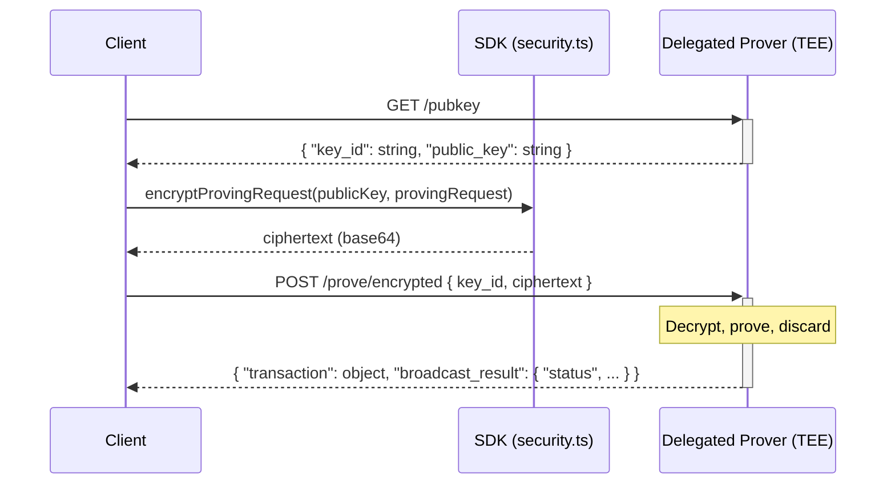

# Delegated Proving Service (DPS)

This guide explains how to use the **Delegated Proving Service (DPS)** to generate proofs for Aleo programs via Provable's infrastructure. For discovering and querying records that belong to your account, see the [Record Scanning](../record-scanning/00_record_scanning.md) guide.

# Contents

- [Overview](#overview)
- [Credentials and authentication](#credentials-and-authentication)
- [Delegated Proving Service (DPS)](#delegated-proving-service-dps)
- [Quick reference](#quick-reference)
- [Best practices](#best-practices)

---

# Overview

The Aleo blockchain allows users to execute programs on-chain while preserving the privacy of the inputs and outputs to 
those functions. This enables applications like private value transfers, private identity verification, private swaps 
and more.

Building these proofs completely privately is traditionally done on a local device; however, this process often takes
a significant amount of time.

Delegated proving allows users to delegate generation of proofs to an external service which can produce proofs quickly
and privately within a Trusted Execution Environment that ensures no one but the caller knows the content of the proof.

Generally this works in the following way:
1. **Build** a *proving request* (program, function, inputs, fee settings, broadcast flag).
2. **Submit** it to the delegated prover in **encrypted** form, which is only decrypted within a TEE.
3. The proving service submits the **transaction** to the blockchain.

---

# Usage Guide

This guide shows how to access the delegated proving service with JS/TS either using the Provable SDK or
custom TS/JS code.

## Credentials and authentication

The Delegated Proving Service (DPS) is hosted behind the Provable API at https://api.provable.com/v2.

To authenticate you need:

- **API key** and **consumer ID** — Obtain these by registering a consumer (e.g. `POST {baseUrl}/consumers`). See [Provable API documentation](https://docs.provable.com/docs/api/services/get-auth-register) for details.
- **JWT** — Used for authenticated endpoints. The SDK refreshes the JWT by calling `POST https://api.provable.com/jwts/{consumerId}` with header `X-Provable-API-Key: <apiKey>`. You can also obtain and cache the JWT yourself and pass it in when using the SDK or your own client.

The **Delegated prover** endpoints typically require a JWT in the `Authorization` header; the SDK handles JWT refresh 
when both `apiKey` and `consumerId` are configured.

### Base URLs

The **network client** uses the host you provide (e.g. `https://api.provable.com/v2`) for general API access. The **prover** (DPS) base URL is `https://api.provable.com/prove/{network}` (e.g. `https://api.provable.com/prove/mainnet` or `https://api.provable.com/prove/testnet`). The paths `/pubkey` and `/prove/encrypted` are relative to the prover base. You can override the prover base with the `url` option when calling `submitProvingRequest` (e.g. `url: "https://api.provable.com/prove/testnet"`), or set `proverUri` when constructing the `AleoNetworkClient`.

## Delegated Proving Service (DPS)

When using the delegated proving service, users must obtain a Provable API key. They are then able to submit Proving
requests in encrypted form to the delegated proving service.

### Flow (encrypted proving)

0. Client must obtain an API key or JWT from the provable API.
1. Client requests an ephemeral X25519 public key from the prover: `GET {proverBase}/pubkey`.
2. Client builds a *proving request* (authorization, optional fee authorization, broadcast flag), encrypts it via a libsodium cryptobox (e.g. with [encryptProvingRequest](https://github.com/ProvableHQ/sdk/blob/mainnet/sdk/src/security.ts#L26)), and sends it to: `POST {proverBase}/prove/encrypted` with `{ "key_id": string, "ciphertext": string }`.
3. Prover decrypts in a secure environment, runs the proof, and returns a **transaction** and **broadcast_result** (if the request asked for broadcast). The client may submit the transaction themselves or use the broadcast result.



### Routes

All paths are relative to the prover base URL (e.g. `https://api.provable.com/prove/mainnet` or `https://api.provable.com/prove/testnet`).

| Path | Method | Purpose | Request body | Response |
|------|--------|----------|--------------|----------|
| `/pubkey` | GET | Ephemeral public key for encrypted proving | — | `{ "key_id": string, "public_key": string }` |
| `/prove/encrypted` | POST | Submit proving request (encrypted) | `{ "key_id": string, "ciphertext": string }` | Same as `/prove` on success |

Authentication (e.g. JWT in `Authorization`, cookies for session) is required for Provable’s API. In Node, you may need 
to forward the `set-cookie` header from the `/pubkey` response to the `/prove/encrypted` request so the prover can 
associate the two calls.

---

### Building a proving request

A **proving request** consists of:

- An **authorization** for the program function (and inputs) the user wants to run.
- An optional **fee authorization** (e.g. `credits.aleo` fee_public / fee_private) to pay for the execution—or **none** 
- when using a fee master (`useFeeMaster: true`).
- A **broadcast** flag indicating whether the prover should submit the resulting transaction to the network.

The SDK builds this in two stages:

1. **Authorize** the main function (program, function name, inputs, private key, optional edition). The base fee is estimated from this authorization.
2. **Optionally authorize the fee** (execution ID, base fee, priority fee, fee record)—unless the program is a fee-related `credits.aleo` function or `useFeeMaster` is true, in which case no fee authorization is attached.

So when you call `programManager.provingRequest(options)`, the SDK resolves the program (and imports, edition) if needed, 
resolves the fee record when not using the fee master, then calls the WASM layer to build the authorization and optional 
fee authorization and wraps them in a `ProvingRequest`. You can then submit that object (or its string form) to the prover.

---

### Using the SDK

1. Build a proving request with `ProgramManager.provingRequest(options)`. Options include `programName`, `functionName`, `inputs`, `privateFee`, `priorityFee`, `broadcast`, `useFeeMaster`, `privateKey`, `programSource`, `programImports`, `edition`, etc. The SDK fetches the program and edition from the network if not provided.
2. Submit with the **network client**:
   - **`submitProvingRequest(options)`** — Resolves with the proving response on success; **throws** on HTTP 400, 500, 503 (and retries on 500/503).
   - **`submitProvingRequestSafe(options)`** — Returns a result object `{ ok, data }` or `{ ok: false, status, error }` so you can handle errors without try/catch.

Options for submit include `provingRequest` (the built request or its string), `url` (prover URL), `apiKey`, `consumerId`, `jwtData`, and **`dpsPrivacy: true`** to use the encrypted flow (GET `/pubkey`, encrypt, POST `/prove/encrypted`). When using the Provable API, pass `apiKey` and `consumerId` in the submit options (or pass `jwtData`) so the SDK can refresh the JWT.

**Example: build and submit with the SDK (encrypted)**

```ts
import {
  Account,
  AleoKeyProvider,
  ProgramManager,
  NetworkRecordProvider,
  AleoNetworkClient,
} from "@provablehq/sdk/mainnet.js";

const host = "https://api.provable.com/v2";
const account = new Account({ privateKey: process.env.PRIVATE_KEY });
const networkClient = new AleoNetworkClient(host);
const keyProvider = new AleoKeyProvider();
const recordProvider = new NetworkRecordProvider(account, networkClient);
keyProvider.useCache(true);

const programManager = new ProgramManager(host, keyProvider, recordProvider);
programManager.setAccount(account);

// Build the proving request (fee is estimated; optional useFeeMaster)
const provingRequest = await programManager.provingRequest({
  programName: "credits.aleo",
  functionName: "transfer_public",
  priorityFee: 0,
  privateFee: false,
  inputs: [
    "aleo1vwls2ete8dk8uu2kmkmzumd7q38fvshrht8hlc0a5362uq8ftgyqnm3w08",
    "10000000u64",
  ],
  broadcast: false,
});

// Submit with encryption (DPS privacy); pass apiKey and consumerId in options
const networkClient = programManager.networkClient;
const response = await networkClient.submitProvingRequest({
  provingRequest,
  dpsPrivacy: true,
  apiKey: process.env.PROVABLE_API_KEY,
  consumerId: process.env.PROVABLE_CONSUMER_ID,
});

console.log("Transaction ID:", response.transaction?.id);
console.log("Broadcast status:", response.broadcast_result?.status);
```

**Example: handle errors without throwing**

```ts
const result = await networkClient.submitProvingRequestSafe({
  provingRequest,
  dpsPrivacy: true,
  apiKey: process.env.PROVABLE_API_KEY,
  consumerId: process.env.PROVABLE_CONSUMER_ID,
});

if (result.ok) {
  const { transaction, broadcast_result } = result.data;
  // use transaction, broadcast_result
} else {
  console.error(result.status, result.error.message);
}
```

---

### Using custom JavaScript

You can build the proving request with the SDK (or another tool) and then submit it with your own HTTP client, using the SDK only for encryption.

**Step 1: Get ephemeral public key**

Use the same credentials you will use for the proving POST (e.g. JWT). In Node, capture the `set-cookie` header from the response so you can send it with the next request if the prover uses session cookies.

```ts
const proverBase = "https://api.provable.com/prove/mainnet"; // or .../prove/testnet
const headers: Record<string, string> = {
  "Content-Type": "application/json",
  "Authorization": jwt,
};

const pubkeyRes = await fetch(`${proverBase}/pubkey`, {
  method: "GET",
  headers,
  credentials: "include",
});
if (!pubkeyRes.ok) throw new Error(`Pubkey failed: ${await pubkeyRes.text()}`);

const pubkey = await pubkeyRes.json();
const cookie = typeof process !== "undefined" && process.versions?.node
  ? pubkeyRes.headers.get("set-cookie")
  : undefined;
```

**Step 2: Build and encrypt the proving request**

Build the request with the SDK (e.g. `programManager.provingRequest(...)`) or from a serialized string. Then encrypt it.

```ts
import { encryptProvingRequest } from "@provablehq/sdk/mainnet.js";
import { ProvingRequest } from "@provablehq/sdk/mainnet.js";

const provingRequest = await programManager.provingRequest({ ... });
const ciphertext = encryptProvingRequest(pubkey.public_key, provingRequest);
```

If you already have the request as a string: `ProvingRequest.fromString(provingRequestString)` before encrypting.

**Step 3: POST encrypted proving request**

```ts
const res = await fetch(`${proverBase}/prove/encrypted`, {
  method: "POST",
  headers: {
    "Content-Type": "application/json",
    "Authorization": jwt,
    ...(cookie ? { Cookie: cookie } : {}),
  },
  credentials: "include",
  body: JSON.stringify({ key_id: pubkey.key_id, ciphertext }),
});

const text = await res.text();
let body: unknown;
try {
  body = JSON.parse(text);
} catch {
  body = { message: text || `${res.status} error` };
}

if (res.ok) {
  const { transaction, broadcast_result } = body as { transaction: any; broadcast_result: any };
  return { ok: true, data: body };
}
const message = typeof (body as any)?.message === "string" ? (body as any).message : text;
return { ok: false, status: res.status, error: { message } };
```

**Full custom example: encrypted delegated proving**

```ts
import { encryptProvingRequest } from "@provablehq/sdk/mainnet.js";
import { ProvingRequest } from "@provablehq/sdk/mainnet.js";

const isNode =
  typeof process !== "undefined" && process.versions != null && process.versions.node != null;

async function submitProvingRequestEncrypted(
  proverBase: string,
  provingRequest: ProvingRequest,
  jwt: string
): Promise<
  | { ok: true; data: { transaction: any; broadcast_result: any } }
  | { ok: false; status: number; error: { message: string } }
> {
  const headers: Record<string, string> = {
    "Content-Type": "application/json",
    "Authorization": jwt,
  };

  const pubkeyRes = await fetch(`${proverBase}/pubkey`, {
    method: "GET",
    headers,
    credentials: "include",
  });
  if (!pubkeyRes.ok) {
    return {
      ok: false,
      status: pubkeyRes.status,
      error: { message: await pubkeyRes.text() },
    };
  }
  const pubkey = await pubkeyRes.json();
  const cookie = isNode ? pubkeyRes.headers.get("set-cookie") : undefined;

  const ciphertext = encryptProvingRequest(pubkey.public_key, provingRequest);

  const res = await fetch(`${proverBase}/prove/encrypted`, {
    method: "POST",
    headers: {
      ...headers,
      ...(cookie ? { Cookie: cookie } : {}),
    },
    body: JSON.stringify({ key_id: pubkey.key_id, ciphertext }),
    credentials: "include",
  });

  const text = await res.text();
  let body: any;
  try {
    body = JSON.parse(text);
  } catch {
    body = { message: text || `${res.status} error` };
  }

  if (res.ok) return { ok: true, data: body };
  return {
    ok: false,
    status: res.status,
    error: { message: body?.message ?? text },
  };
}
```

You can add retries for 500/503 and JWT refresh when the token is expired.

---

## Quick reference

| Step | GET | POST | Encrypt (SDK) |
|------|-----|------|----------------|
| Prove (encrypted) | `/pubkey` | `/prove/encrypted` with `{ key_id, ciphertext }` | `encryptProvingRequest(publicKey, provingRequest)` |
| Prove (unencrypted) | — | `/prove` with ProvingRequest string | — |

- **One key per request:** Use the `key_id` from the same GET response in the corresponding POST. For retries, fetch a new key from `/pubkey`.
- **Encryption:** Use the SDK’s `encryptProvingRequest` (from `@provablehq/sdk`); ciphertext is base64. The same wire format can be implemented with libsodium if you do not use the SDK.

---

## Best practices

1. **Prefer encrypted flow** for production so proving requests are only decrypted inside the service’s secure environment.
2. **Handle prover errors explicitly:** Use `submitProvingRequestSafe` when you want to branch on status (400 vs 500/503) without try/catch; use `submitProvingRequest` when you want the SDK to throw after retries.
3. **JWT and cookies:** For DPS with the Provable API, supply `apiKey` and `consumerId` (or a valid `jwtData`) so the SDK can refresh the JWT. In Node, forward the `/pubkey` response cookie to `/prove/encrypted` when the prover uses session cookies.
4. **Fee master:** When the prover or your deployment supports a fee master, set `useFeeMaster: true` in proving request options so no fee authorization is built; the prover pays the fee on your behalf.
5. **Record scanner with ProgramManager:** You can pass a [Record Scanner](../record-scanning/00_record_scanning.md) (or any `RecordProvider`) into `ProgramManager`. The manager will then use it to resolve fee records (and inputs) when building executions or proving requests, so you do not have to fetch fee records manually.
