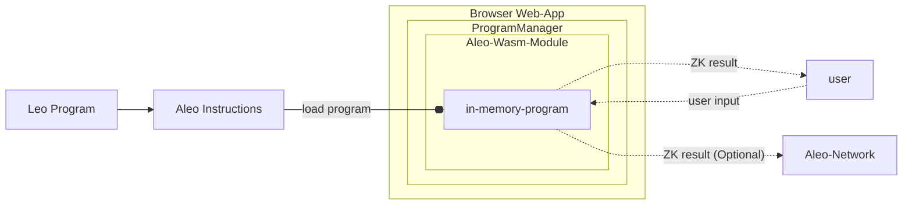

import Tabs from '@theme/Tabs';
import TabItem from '@theme/TabItem';

## Aleo Programs

Aleo programs provide the ability for users to make any input or output of a program private and prove that the program
was run correctly. Keeping program inputs and outputs private allows developers to build privacy into their applications.

Zero-knowledge programs are written in one of two languages:
1. [Leo](https://docs.leo-lang.org): A high level, developer friendly language for developing
   zero knowledge programs.
2. [Aleo Instructions](../../guides/aleo/00_aleo_overview.md): A low level language that provides developers fine
   grained control over the execution flow of zero knowledge programs. Leo programs are compiled into Aleo Instructions
   under the hood.


<Tabs defaultValue="leo"
values={[
  { label: 'Leo', value: 'leo' },
  { label: 'Aleo Instructions', value: 'aleo_instructions' },
]}>
<TabItem value="leo">
```leo
// A simple program adding two numbers together
program helloworld.aleo {
  transition hello(public a: u32, b: u32) -> u32 {
      let c: u32 = a + b;
      return c;
  }
}
```
</TabItem>
<TabItem value="aleo_instructions">
```aleo
program helloworld.aleo;

// The Leo code compiles to the following Aleo instructions
function hello:
    input r0 as u32.public;
    input r1 as u32.private;
    add r0 r1 into r2;
    output r2 as u32.private;
```
</TabItem>
</Tabs>


## Program Execution Model

The SDK provides the ability to execute Aleo Instructions programs entirely client-side within the browser.

The `ProgramManager` object encapsulates the functionality for executing programs and making zero knowledge proofs about
them. Under the hood it uses cryptographic code compiled from [snarkVM](../../guides/aleo/00_aleo_overview.md) into WebAssembly.
JavaScript bindings to this WebAssembly code allows execution of programs in zero knowledge fully within the browser
without requiring any external communication with the internet. Users interested in lower level details on how this is
achieved can visit the [aleo-wasm](https://github.com/ProvableHQ/sdk/tree/mainnet/wasm) crate.

The basic execution flow of a program is as follows:
1. A web app is loaded with an instance of the `ProgramManager` object
2. An Aleo program in `Aleo Instructions` format is loaded into the `ProgramManager` as a wasm object
3. The web app provides a user input form for the program
4. The user submits the inputs and the zero knowledge execution is performed client-side within WebAssembly
5. The result is returned to the user
6. (Optional) A fully encrypted zero knowledge transcript of the execution is optionally sent to the Aleo network

A diagrammatic representation of the program execution flow is shown below.


## Executing Programs
:::note
If you haven't already, check out the [Getting Started](./01_getting_started.md) guide.  Specifically, you'll need to import the correct version of the SDK (Mainnet vs. Testnet) for the your desired network and initialize WebAssembly.
:::

There are two main methods for building general execution transactions: `execute` and `buildExecutionTransaction`. Calling `execute` will build and submit the transaction to the Aleo network, while `buildExecutionTransaction` will only build the transaction and return it to the caller within Javascript.

Let's walk through an example:  

### Imports and WebAssembly

As mentioned earlier, you'll first need to import the necessary classes from the correct Provable SDK package and initialize Webassembly.

```typescript
import { Account, AleoNetworkClient, initThreadPool, NetworkRecordProvider, ProgramManager, AleoKeyProvider } from '@provablehq/sdk/mainnet.js';

// If the threadpool has not been initialized, do so (this step can be skipped if it's been initialized elsewhere). 
await initThreadPool();
```

You'll also need to initialize an `Account` object with the desired private key:
```typescript
const account = new Account({ privateKey: 'APrivateKey1...'});
```

### `AleoNetworkClient`

Next, you'll need to initialize `AleoNetworkClient:
```typescript
// Create a network client to connect to the Aleo network.
const networkClient = new AleoNetworkClient("https://api.explorer.provable.com/v1");
```
`AleoNetworkClient` is a library that encapsulates REST calls to publicly exposed endpoints of Aleo nodes. The methods provided in this allow users to query public information from the Aleo blockchain and submit transactions to the network. `


### `AleoKeyProvider`
You'll also need to initialize `AleoKeyProvider`:
```typescript
// Create a key provider that will be used to find public proving & verifying keys for Aleo programs.
const keyProvider = new AleoKeyProvider();
keyProvider.useCache = true;
```
Since each function in a program has a proof associated with it, each function in a program has something called a proving key and verifying key. These keys are cryptographic material that uniquely identifies the structure of the function and are required to build the proof and verify the proof respectively. The SDK provides an interface called the `KeyProvider` to enable developers to define easy ways to retrieve these keys.  If an execution in the SDK does not have the keys, it will generate them. However, generating them is a computationally expensive process, and significantly slows down the execution process if they need. It is wise for developers to store/cache them for re-use when possible. 

The default implementation of the `KeyProvider` interface is the `AleoKeyProvider`. This implementation allows users to specify an optional HTTP url where the keys may be found and an in-memory cache for proving and verifying keys. However, developers can implement their own `KeyProvider` to store keys in places such as CDNs, databases, local file systems, etc.

### `ProgramManager`
Using the `AleoNetworkClient` and `AleoKeyProvider` objects, we can initialize the `ProgramManager` object and set the account that transactions will be signed by:

```typescript
// Initialize a program manager to talk to the Aleo network with the configured key and record providers.
const programManager = new ProgramManager(networkClient, keyProvider);

// Set the account for the program manager.
programManager.setAccount(account);
```

### Build the Transaction
Finally, we can use the build and submit the transaction, and await the results:
```typescript
// Provide a key search parameter to find the correct key for the program if they are stored in a memory cache
const keySearchParams = { cacheKey: "betastaking.aleo:stake_public" };

// Execute the program using the options provided inline and get the transaction.
const tx = await programManager.buildExecutionTransaction({
    programName: "betastaking.aleo",
    functionName: "stake_public",
    fee: 0.10,
    privateFee: false, // Assuming a value for privateFee
    inputs: ["aleo17x23al8k9scqe0qqdppzcehlu8vm0ap0j5mukskdq56lsa25lv8qz5cz3g", "50000000u64"], // Example inputs matching the function definition
    keySearchParams: keySearchParams,
});

// Submit the program to the network.
const transaction_id = await programManager.networkClient.submitTransaction(tx);

// Generally the transaction will need 1-3 blocks (3-9 seconds) to be confirmed on the network. When that time has 
// elapsed the following function can be used to get the transaction details.
const transaction = await programManager.networkClient.getTransaction(transaction_id);
```

Alternatively, we can just call the `execute` method to build and broadcast the transaction in one call:

```typescript
const transaction_id = await programManager.execute(
    programName: "betastaking.aleo",
    functionName: "stake_public",
    fee: 0.10,
    privateFee: false, // Assuming a value for privateFee
    inputs: ["aleo17x23al8k9scqe0qqdppzcehlu8vm0ap0j5mukskdq56lsa25lv8qz5cz3g", "50000000u64"], // Example inputs matching the function definition
    keySearchParams: keySearchParams,
);

const transaction = await programManager.networkClient.getTransaction(transaction_id);
```


## Local Program Execution

It is also possible to simply execute a program locally without sending a transaction to the Aleo network. This can be useful if a developer wants to use the SDK to use Aleo's zkSNARKs outside of the blockchain network or run a test execution of a program while developing. For this purpose the `ProgramManager` class has a method called `run()` that can be used to execute a program locally.

### Running Locally WITHOUT A Proof
When the developer simply wants see the output of a function without the computationally expensive operation of generating a proof, the `run()` method of `ProgramManager` can be used. It simply needs the program, the function name, and the inputs to the function.

When run in this fashion, the program will execute and return the outputs of the function without generating a proof. This can be useful for testing a function in development.

```typescript
import { Account, ProgramManager } from '@provablehq/sdk/mainnet.js';

/// Create the source for the "hello world" program
const program = "program helloworld.aleo;\n\nfunction hello:\n    input r0 as u32.public;\n    input r1 as u32.private;\n    add r0 r1 into r2;\n    output r2 as u32.private;\n";
const programManager = new ProgramManager();

/// Create a temporary account for the execution of the program
const account = new Account();
programManager.setAccount(account);

/// Get the response and ensure that the program executed correctly
const executionResponse = await programManager.run(program, "hello", ["5u32", "5u32"]);
const result = executionResponse.getOutputs();
assert.deepStrictEqual(result, ['10u32']);
```


### Running Locally WITH A Proof
If the developer wants to generate a proof for a program execution without sending it to the Aleo network, the `run()` method can be used with the `proveExecution` parameter set to true. This will generate an `ExecutionResponse` object that includes the proof of the execution which can be verified offchain by the `verifyExecution()` method by anyone who has the function's proving and verifying keys.

:::note
This approach is will not work for any function that has an async future defined within it.
:::

```typescript
import { Account, AleoKeyProvider, ProgramManager, ProvingKey, VerifyingKey } from '@provablehq/sdk/mainnet.js';

/// Initialize the key provider and network client.
const networkClient = new AleoNetworkClient("https://api.explorer.provable.com/v1");
const keyProvider = new AleoKeyProvider();
keyProvider.useCache = true;

/// Define the program.
const program = "program helloworld.aleo;\n\nfunction hello:\n    input r0 as u32.public;\n    input r1 as u32.private;\n    add r0 r1 into r2;\n    output r2 as u32.private;\n";

/// Create the proving and verifying keys for the program and store them in the key provider.
const provingKey = ProvingKey.fromString("...");
const verifyingKey = VerifyingKey.fromString("...");
keyProvider.cacheKeys("helloworld.aleo:main", [provingKey, verifyingKey]);

/// Create a program manager with the key provider.
const programManager = new ProgramManager(networkProvider, KeyProvider);

/// Create a temporary account for the execution of the program
const account = new Account();
programManager.setAccount(account);

/// Get the response and ensure that the program executed correctly
const executionResponse = await programManager.run(
  program: program, 
  function_name: "hello", 
  inputs: ["5u32", "5u32"], 
  proveExecution :true, 
  keySearchParams: {"cacheKey":"helloworld.aleo:main"},
  
);

/// Verify the proof of the execution
const proofIsValid = await programManager.verifyExecution(executionResponse);
```


