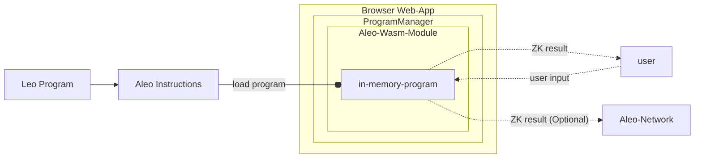

## Aleo Programs

Aleo programs provide the ability for users to make any input or output of a program private and prove that the program
was run correctly. Keeping program inputs and outputs private allows developers to build privacy into their applications.

Zero-Knowledge programs are written in one of two languages:
1. [Leo](https://docs.leo-lang.org): A high level, developer friendly language for developing
   zero knowledge programs.
2. [Aleo Instructions](../../guides/aleo/00_aleo_overview.md): A low level language that provides developers fine
   grained control over the execution flow of zero knowledge programs. Leo programs are compiled into Aleo Instructions
   under the hood.

Documentation for both languages can be found at [developer.aleo.org](https://developer.aleo.org).

### Leo
```leo
// A simple program adding two numbers together
program helloworld.aleo {
  transition hello(public a: u32, b: u32) -> u32 {
      let c: u32 = a + b;
      return c;
  }
}
```

### Aleo Instructions
```aleo
program helloworld.aleo;

// The Leo code above compiles to the following Aleo instructions
function hello:
    input r0 as u32.public;
    input r1 as u32.private;
    add r0 r1 into r2;
    output r2 as u32.private;
```

## Program Execution Model

The SDK provides the ability to execute Aleo Instructions programs entirely client-side within the browser.

The `ProgramManager` object encapsulates the functionality for executing programs and making zero knowledge proofs about
them. Under the hood it uses cryptographic code compiled from [snarkVM](../../guides/aleo/00_aleo_overview.md) into WebAssembly.
JavaScript bindings to this WebAssembly code allows execution of programs in zero knowledge fully within the browser
without requiring any external communication with the internet. Users interested in lower level details on how this is
achieved can visit the [aleo-wasm](https://github.com/provablehq/sdk/tree/testnet3/wasm) crate.

The basic execution flow of a program is as follows:
1. A web app is loaded with an instance of the `ProgramManager` object
2. An Aleo program in `Aleo Instructions` format is loaded into the `ProgramManager` as a wasm object
3. The web app provides a user input form for the program
4. The user submits the inputs and the zero knowledge execution is performed client-side within WebAssembly
5. The result is returned to the user
6. (Optional) A fully encrypted zero knowledge transcript of the execution is optionally sent to the Aleo network

A diagrammatic representation of the program execution flow is shown below.


## WebAssembly Initialization

:::note
WebAssembly must be initialized before calling any SDK functions. The current Provable SDK manages the `wasm` initialization, so the workers must be defined properly.
:::

Aleo programs are made zero knowledge through the usage of zkSNARKs. The Rust code behind Aleo programs and the zkSNARKs
that make them zero knowledge are hosted in the [snarkVM Repository](https://github.com/AleoNet/snarkVM). The Provable SDK
compiles this code to WebAssembly and creates JavaScript bindings, enabling Aleo programs to run directly in the browser.

Before any logic within the SDK is run within the browser however, the WebAssembly module the SDK contains must be
initialized before any SDK functions can be executed. This is done simply by calling the `initializeWasm` function at a
point in your code before any other SDK functions are called:
```typescript
import { Account, initializeWasm } from '@provablehq/sdk';

// Assuming top-level await is enabled. This can also be initialized within a promise.
await initializeWasm();

/// Create a new Aleo account
const account = new Account();
```

An example of how to initialize WebAssembly in a React app is shown in [Section 2.8](#28-react-example)

## Local Program Execution
A simple example of running the hello world program within the web browser is shown below:
```typescript
import { Account, Program } from '@provablehq/sdk';

/// Create the source for the "hello world" program
const program = "program helloworld.aleo;\n\nfunction hello:\n    input r0 as u32.public;\n    input r1 as u32.private;\n    add r0 r1 into r2;\n    output r2 as u32.private;\n";
const programManager = new ProgramManager();

/// Create a temporary account for the execution of the program
const account = new Account();
programManager.setAccount(account);

/// Get the response and ensure that the program executed correctly
const executionResponse = await programManager.executeOffline(program, "hello", ["5u32", "5u32"]);
const result = executionResponse.getOutputs();
assert(result === ["10u32"]);
```

## Program Execution on the Aleo Network
The SDK also provides the ability to execute programs and record an encrypted transcript of the execution on the Aleo
network that anyone can trustlessly verify.

This process can be thought of being executed in three steps:
1. A program is run locally
2. A proof that the program was executed correctly and that the outputs follow from the inputs is generated
3. A transcript of the proof is generated client-side containing encrypted proof data (see [Section 4](#4-managing-program-data-and-private-state))
   and any public outputs or state the user of the program wishes to reveal
4. The proof transcript is posted to the Aleo network and verified by the Aleo validator nodes in a trustless manner
5. If the proof is valid, it is stored and anyone can later verify the proof and read the outputs the author of the
   program has chosen to make public. Private inputs will remain encrypted, but the author of the proof can also choose to
   retrieve this encrypted state at any point and decrypt it locally for their own use.

This process of posting the execution to the Aleo Network serves as a globally trustless and verifiable record of
program execution. It also provides a global record of any state changes made to either records or data stored on the Aleo network.

A simple example of running the hello world program on the Aleo network is shown below:
```typescript
import { Account, AleoNetworkClient, NetworkRecordProvider, ProgramManager, KeySearchParams} from '@provablehq/sdk';

// Create a key provider that will be used to find public proving & verifying keys for Aleo programs
const keyProvider = new AleoKeyProvider();
keyProvider.useCache = true;

// Define an account which will execute the transaction on-chain
const account = new Account({ privateKey: private_key });
const privateKeyObject = PrivateKey.from_string(private_key);

// Create a record provider that will be used to find records and transaction data for Aleo programs
const networkClient = new AleoNetworkClient("https://api.explorer.provable.com/v1");
const recordProvider = new NetworkRecordProvider(account, networkClient);

// Initialize a program manager to talk to the Aleo network with the configured key and record providers
const programName = "hello_hello.aleo";
const programManager = new ProgramManager("https://api.explorer.provable.com/v1", keyProvider, recordProvider);
programManager.setHost("https://api.explorer.provable.com/v1")
programManager.setAccount(account);

// For example: "cacheKey": "hello_hello:hello"
const cacheKey = `${programId}:${aleoFunction}`;
const keySearchParams = new AleoKeyProviderParams({ "cacheKey": cacheKey });

// Execute the program function
const executionResponse = await programManager.execute(
        programId,
        aleoFunction,
        fee,
        false,
        inputs,
        undefined,
        keyParams,
        undefined,
        undefined,
        undefined,
        privateKeyObject
    );

const transaction = await programManager.networkClient.getTransaction(executionResponse);
```

A reader of the above example may notice the `RecordProvider` and `KeyProvider` classes that were not present in the local
execution example. The `KeyProvider` class helps users of the SDK find `Proving Keys` for programs. `Proving Keys`
allow zero knowledge proofs that the programs were executed correctly to be created. The `RecordProvider` class helps
find `Records` which are private data associated with programs that can be changed and updated throughout time.
These two concepts are explained in more detail below.

## Program Proving Keys & Program Records

Executing Aleo programs in zero knowledge requires two additional pieces of information.

1. **Function Proving & Verifying Keys:** Proving and Verifying keys are cryptographic keys that are generated when a
   program function is executed. These keys are public and unique for each function in a program. The proving key allows any party to
   execute the program and generate a proof that the program was executed correctly. The verifying keys allow any party
   to verify that the proof was generated correctly and the execution is correct. These keys are required to create the
   zero knowledge property of program execution.
2. **Program Records:** Records are private state generated by a program belonging to a unique private keyholder. Records
   are generated by a program's functions and can be changed and updated by when a user runs various functions of the
   program. These records are private by default and are used to manage updatable private state. One of the most clear
   usages of records is to the `credits` record in the `credits.aleo`. Credits records are one of two official ways of
   representing Aleo credits on the Aleo Network and are used to pay all transaction fees on the network. More information
   on Records can be found in the [Records](#41-private-state-data-records) section below.

For this reason, all programs will need proving and verifying keys to operate and many functions in Aleo programs will
require records as inputs. To simplify the process of managing keys and records, the Provable SDK provides two abstractions
for managing these concepts:

1. **KeyProvider:** When programs execute, by default, they will synthesize the proving and verifying keys needed to
   make a zero knowledge proof. However, these keys are large and expensive to generate. For this reason, applications may
   want to store these keys and re-use them for future execution. The `KeyProvider` interface provides the ability for
   users of the SDK to provide their own key storage and retrieval mechanism. The SDK provides a default implementation
   of the `KeyProvider` interface via the `AleoKeyProvider` class.
2. **RecordProvider:** When programs execute, they will often need to find records that belong to a user. The
   `RecordProvider` interface allows users of the SDK to implement their own record storage and retrieval mechanism. The
   SDK provides a default implementation of the `RecordProvider` interface via the `NetworkRecordProvider` class which
   searches the Aleo network for records uniquely belonging to a user.

The `ProgramManager` class is capable of taking a `KeyProvider` and `RecordProvider` as arguments and will use them to
find the correct keys and records for a program execution.

## Deploy a New Program to the Aleo Network

The Aleo Network contains a public registry of programs that can be executed by anyone. Any user can add an Aleo program
to the network (as long as it doesn't already currently exist) by paying a deployment fee in Aleo credits. The SDK
provides a simple interface for deploying programs to the Aleo network using the program manager.

```typescript
import { Account, AleoNetworkClient, NetworkRecordProvider, ProgramManager, KeySearchParams} from '@provablehq/sdk';

// Create a key provider that will be used to find public proving & verifying keys for Aleo programs
const keyProvider = new AleoKeyProvider();
keyProvider.useCache = true;

// Create a record provider that will be used to find records and transaction data for Aleo programs
const networkClient = new AleoNetworkClient("https://api.explorer.provable.com/v1");
const recordProvider = new NetworkRecordProvider(account, networkClient);

// Initialize a program manager to talk to the Aleo network with the configured key and record providers
const programManager = new ProgramManager("https://api.explorer.provable.com/v1", keyProvider, recordProvider);

// Define an Aleo program to deploy
const program = "program hello_hello.aleo;\n\nfunction hello:\n    input r0 as u32.public;\n    input r1 as u32.private;\n    add r0 r1 into r2;\n    output r2 as u32.private;\n";

// Define a fee to pay to deploy the program
const fee = 1.8; // 1.8 Aleo credits

// Deploy the program to the Aleo network
const tx_id = await programManager.deploy(program, fee);

// Verify the transaction was successful
const transaction = await programManager.networkClient.getTransaction(tx_id);
```

## React Example

The above concepts can be tied together in a concrete example of a React web app. This example can be installed in one
step by running:

`npm create leo-app@latest`

### Wasm Initialization

The WASM module can be initialized within the browser. A common way of achieving this within a React App is using a React UseEffect hook.

`aleo-wasm-hook.js`
```jsx
import { useEffect, useState } from "react";
import * as sdk from "@provablehq/sdk";

await sdk.initializeWasm();
export const useAleoWASM = () => {
    const [aleoInstance, setAleoInstance] = useState(null);

    useEffect(() => {
        if (aleoInstance === null) {
            setAleoInstance(sdk);
        }
    }, []); // eslint-disable-line react-hooks/exhaustive-deps
    return aleoInstance;
};
```
Once a hook for the WASM initialization is created, it can be used anywhere within the app.

### Program Execution

Program execution is a computationally expensive process. For this reason, it is recommended to execute programs in
webworkers.

We will have 2 main components for workers:
- worker.js
- AleoWorker.js (Manager for worker file)

<details>
<summary>Example Web Worker Usage</summary>

A worker file that performs the execution can be created as follows:
`worker.js`
```jsx
import {
  Account,
  ProgramManager,
  PrivateKey,
  initThreadPool,
  AleoKeyProvider,
  AleoNetworkClient,
  NetworkRecordProvider,
} from "@provablehq/sdk";
import { expose, proxy } from "comlink";

await initThreadPool();

async function localProgramExecution(program, aleoFunction, inputs) {
  const programManager = new ProgramManager();

  // Create a temporary account for the execution of the program
  const account = new Account();
  programManager.setAccount(account);

  const executionResponse = await programManager.run(
    program,
    aleoFunction,
    inputs,
    false,
  );
  return executionResponse.getOutputs();
}

async function getPrivateKey() {
  const key = new PrivateKey();
  return proxy(key);
}

async function deployProgram(program) {
  const keyProvider = new AleoKeyProvider();
  keyProvider.useCache(true);

  // Create a record provider that will be used to find records and transaction data for Aleo programs
  const networkClient = new AleoNetworkClient("https://api.explorer.provable.com/v1");

  // Use existing account with funds
  const account = new Account({
    privateKey: "user1PrivateKey",
  });

  const recordProvider = new NetworkRecordProvider(account, networkClient);

  // Initialize a program manager to talk to the Aleo network with the configured key and record providers
  const programManager = new ProgramManager(
    "https://api.explorer.provable.com/v1",
    keyProvider,
    recordProvider,
  );

  programManager.setAccount(account);

  // Define a fee to pay to deploy the program
  const fee = 1.9; // 1.9 Aleo credits

  // Deploy the program to the Aleo network
  const tx_id = await programManager.deploy(program, fee);

  return tx_id;
}

const workerMethods = { localProgramExecution, getPrivateKey, deployProgram };
expose(workerMethods);
```

`AleoWorker.js`
```jsx
import { wrap } from "comlink";

let singletonWorker = null;

const AleoWorker = () => {
    if (!singletonWorker) {
        const worker = new Worker(new URL("worker", import.meta.url), {
            type: "module",
        });

        worker.onerror = function(event) {
            console.error("Error in worker: " + event?.message);
        };

        singletonWorker = wrap(worker);
    }
    return singletonWorker;
};

export { AleoWorker };
```
</details>

Using both WebWorkers and SDK initialization in React, a single-page app can be created by importing `AleoWorker.js`, which executes Aleo zero-knowledge programs.

<details>
<summary>Example App.jsx Implementing Zero Knowledge Program Execution</summary>

`App.jsx`
```jsx
import { useState } from "react";
import reactLogo from "./assets/react.svg";
import aleoLogo from "./assets/aleo.svg";
import "./App.css";
import helloworld_program from "../helloworld/build/main.aleo?raw";
import { AleoWorker } from "./workers/AleoWorker";

const aleoWorker = AleoWorker();
function App() {
  const [count, setCount] = useState(0);
  const [account, setAccount] = useState(null);
  const [executing, setExecuting] = useState(false);
  const [deploying, setDeploying] = useState(false);

  const generateAccount = async () => {
    const key = await aleoWorker.getPrivateKey();
    setAccount(await key.to_string());
  };

  async function execute() {
    setExecuting(true);
    const result = await aleoWorker.localProgramExecution(
      helloworld_program,
      "main",
      ["5u32", "5u32"],
    );
    setExecuting(false);

    alert(JSON.stringify(result));
  }

  async function deploy() {
    setDeploying(true);
    try {
      const result = await aleoWorker.deployProgram(helloworld_program);
      console.log("Transaction:")
      console.log("https://api.explorer.provable.com/v1/transaction?id=" + result)
      alert("Transaction ID: " + result);
    } catch (e) {
      console.log(e)
      alert("Error with deployment, please check console for details");
    }
    setDeploying(false);
  }

  return (
    <>
      <div>
        <a href="https://aleo.org" target="_blank" rel="noopener noreferrer">
          
        </a>
        <a href="https://react.dev" target="_blank" rel="noopener noreferrer">
          
        </a>
      </div>
      <h1>Aleo + React</h1>
      <div className="card">
        <button onClick={() => setCount((count) => count + 1)}>
          count is {count}
        </button>
        <p>
          <button onClick={generateAccount}>
            {account
              ? `Account is ${JSON.stringify(account)}`
              : `Click to generate account`}
          </button>
        </p>
        <p>
          <button disabled={executing} onClick={execute}>
            {executing
              ? `Executing...check console for details...`
              : `Execute helloworld.aleo`}
          </button>
        </p>
        <p>
          Edit <code>src/App.jsx</code> and save to test HMR
        </p>
      </div>

      {/* Advanced Section */}
      <div className="card">
        <h2>Advanced Actions</h2>
        <p>
          Deployment on Aleo requires certain prerequisites like seeding your
          wallet with credits and retrieving a fee record. Check README for more
          details.
        </p>
        <p>
          <button disabled={deploying} onClick={deploy}>
            {deploying
              ? `Deploying...check console for details...`
              : `Deploy helloworld.aleo`}
          </button>
        </p>
      </div>
      <p className="read-the-docs">
        Click on the Aleo and React logos to learn more
      </p>
    </>
  );
}

export default App;
```
</details>

### Integrating Aleo Programs Into Your App

If you are starting with a simple framework template rather than with Aleo templates, handling files with a .aleo extension in a web application requires specific configurations because these files are not natively recognized by most web development environments. The .aleo extension typically belongs to Aleo zero-knowledge programs, which are special scripts or codes used within the Aleo platform to ensure privacy and security through cryptographic proofs.

To integrate these files into a web application, such as a React app, you need to define how they should be treated during the build process.

**Configuration File**

Adding configuration rules in your build system (like Vite, Webpack, or Next.js) is necessary to tell the build tool how to process these files. Using something like raw-loader in this configuration ensures that .aleo files are loaded as plain text. This step is essential because it converts the content of .aleo files into a usable format that your web application can execute or display.

```
module:{
  rules:[
          {
        test: /\.aleo$/i,
        use: 'raw-loader',
      },
  ]
}
```

<details>
<summary>Handling .aleo Types in TypeScript</summary>
If you are using TypeScript, you need to inform the TypeScript compiler about the type of content these files contain by declaring a module for *.aleo files:

`config.d.ts`
```typescript
declare module '*.aleo' {
   const content: string;
   export default content;
 }
```
Make sure that you included custom types in your `tsconfig` file.
  
</details>


A full example of this implementation can be found [here](https://github.com/provablehq/sdk/blob/testnet3/create-leo-app/template-react-leo/src/App.jsx)
