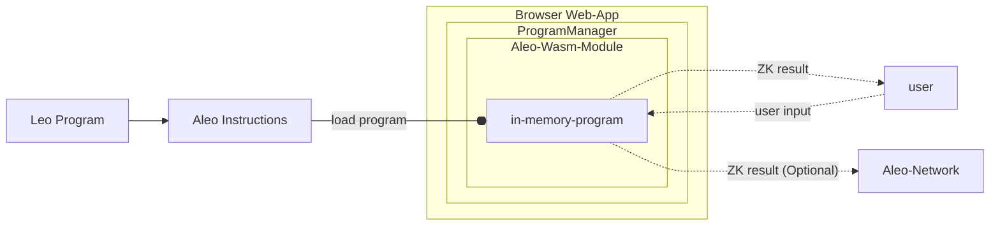

## Program Execution Model

The SDK provides the ability to execute Aleo Instructions programs entirely client-side within the browser.

The `ProgramManager` object encapsulates the functionality for executing programs and making zero knowledge proofs about
them. Under the hood it uses cryptographic code compiled from [snarkVM](../../guides/aleo/00_aleo_overview.md) into WebAssembly.
JavaScript bindings to this WebAssembly code allows execution of programs in zero knowledge fully within the browser
without requiring any external communication with the internet. Users interested in lower level details on how this is
achieved can visit the [aleo-wasm](https://github.com/ProvableHQ/sdk/tree/mainnet/wasm) crate.

The basic execution flow of a program is as follows:
1. A web app is loaded with an instance of the `ProgramManager` object
2. An Aleo program in `Aleo Instructions` format is loaded into the `ProgramManager` as a wasm object
3. The web app provides a user input form for the program
4. The user submits the inputs and the zero knowledge execution is performed client-side within WebAssembly
5. The result is returned to the user
6. (Optional) A fully encrypted zero knowledge transcript of the execution is optionally sent to the Aleo network

A diagrammatic representation of the program execution flow is shown below.


## Executing Programs

There are two main methods for building general execution transactions: `execute()` and `buildExecutionTransaction()`. Calling `execute()` will build and submit the transaction to the Aleo network, while `buildExecutionTransaction()` will only build the transaction and return it to the caller within Javascript.

Let's walk through an example:  

### Setup

Similar to the [Deploying Programs](./03_deploy_programs.md) guide, you'll need to initialize some fundamental objects if you haven't already done so:

```typescript
import { Account, AleoNetworkClient, initThreadPool, ProgramManager, AleoKeyProvider } from '@provablehq/sdk';

// If the threadpool has not been initialized, do so (this step can be skipped if it's been initialized elsewhere). 
await initThreadPool();

const account = new Account({ privateKey: 'APrivateKey1...'});
const networkClient = new AleoNetworkClient("https://api.explorer.provable.com/v1");

const keyProvider = new AleoKeyProvider();
keyProvider.useCache(true);

const programManager = new ProgramManager(networkClient, keyProvider);
programManager.setAccount(account);
```
If you're confused on any of the above code, head back to the previous guide for a more detailed explanation.

### Build the Transaction
In addition to the above setup, you'll likely want define a key search parameter to find the correct proving and verifying keys for the program if they are stored in a memory cache:
```typescript
const keySearchParams = { cacheKey: "betastaking.aleo:stake_public" };
```

Once everything's been intialized, we can build and submit the transaction, and await the results:
```typescript
// Execute the program using the options provided inline and get the transaction.
const tx = await programManager.buildExecutionTransaction({
    programName: "betastaking.aleo",
    functionName: "stake_public",
    fee: 0.10,
    privateFee: false, // Assuming a value for privateFee
    inputs: ["aleo17x23al8k9scqe0qqdppzcehlu8vm0ap0j5mukskdq56lsa25lv8qz5cz3g", "50000000u64"], // Example inputs matching the function definition
    keySearchParams: keySearchParams,
});

// Submit the program to the network.
const transaction_id = await programManager.networkClient.submitTransaction(tx);

// Generally the transaction will need 1-3 blocks (3-9 seconds) to be confirmed on the network. When that time has 
// elapsed the following function can be used to get the transaction details.
const transaction = await programManager.networkClient.getTransaction(transaction_id);
```

Alternatively, we can just call the `execute()` method to build and broadcast the transaction in one call:

```typescript
const transaction_id = await programManager.execute(
    programName: "betastaking.aleo",
    functionName: "stake_public",
    fee: 0.10,
    privateFee: false, // Assuming a value for privateFee
    inputs: ["aleo17x23al8k9scqe0qqdppzcehlu8vm0ap0j5mukskdq56lsa25lv8qz5cz3g", "50000000u64"], // Example inputs matching the function definition
    keySearchParams: keySearchParams,
);

const transaction = await programManager.networkClient.getTransaction(transaction_id);
```


## Local Program Execution

It is also possible to simply execute a program locally without sending a transaction to the Aleo network. This can be useful if a developer wants to use the SDK to use Aleo's zkSNARKs outside of the blockchain network or run a test execution of a program while developing. For this purpose the `ProgramManager` class has a method called `run()` that can be used to execute a program locally.

### Running Locally WITHOUT A Proof
When the developer simply wants see the output of a function without the computationally expensive operation of generating a proof, the `run()` method of `ProgramManager` can be used. It simply needs the program, the function name, and the inputs to the function.

When run in this fashion, the program will execute and return the outputs of the function without generating a proof. This can be useful for testing a function in development.

```typescript
import { Account, ProgramManager } from '@provablehq/sdk';

/// Create the source for the "hello world" program
const program = "program helloworld.aleo;\n\nfunction hello:\n    input r0 as u32.public;\n    input r1 as u32.private;\n    add r0 r1 into r2;\n    output r2 as u32.private;\n";
const programManager = new ProgramManager();

/// Create a temporary account for the execution of the program
const account = new Account();
programManager.setAccount(account);

/// Get the response and ensure that the program executed correctly
const executionResponse = await programManager.run(program, "hello", ["5u32", "5u32"]);
const result = executionResponse.getOutputs();
assert.deepStrictEqual(result, ['10u32']);
```


### Running Locally WITH A Proof
If the developer wants to generate a proof for a program execution without sending it to the Aleo network, the `run()` method can be used with the `proveExecution` parameter set to true. This will generate an `ExecutionResponse` object that includes the proof of the execution which can be verified offchain by the `verifyExecution()` method by anyone who has the function's proving and verifying keys.

:::note
This approach is will not work for any function that has an async future defined within it.
:::

```typescript
import { Account, AleoKeyProvider, ProgramManager, ProvingKey, VerifyingKey } from '@provablehq/sdk';

/// Initialize the key provider and network client.
const networkClient = new AleoNetworkClient("https://api.explorer.provable.com/v1");
const keyProvider = new AleoKeyProvider();
keyProvider.useCache(true);

/// Define the program.
const program = "program helloworld.aleo;\n\nfunction hello:\n    input r0 as u32.public;\n    input r1 as u32.private;\n    add r0 r1 into r2;\n    output r2 as u32.private;\n";

/// Create the proving and verifying keys for the program and store them in the key provider.
const provingKey = ProvingKey.fromString("...");
const verifyingKey = VerifyingKey.fromString("...");
keyProvider.cacheKeys("helloworld.aleo:main", [provingKey, verifyingKey]);

/// Create a program manager with the key provider.
const programManager = new ProgramManager(networkProvider, KeyProvider);

/// Create a temporary account for the execution of the program
const account = new Account();
programManager.setAccount(account);

/// Get the response and ensure that the program executed correctly
const executionResponse = await programManager.run(
  program: program, 
  function_name: "hello", 
  inputs: ["5u32", "5u32"], 
  proveExecution :true, 
  keySearchParams: {"cacheKey":"helloworld.aleo:main"},
  
);

/// Verify the proof of the execution
const proofIsValid = await programManager.verifyExecution(executionResponse);
```


