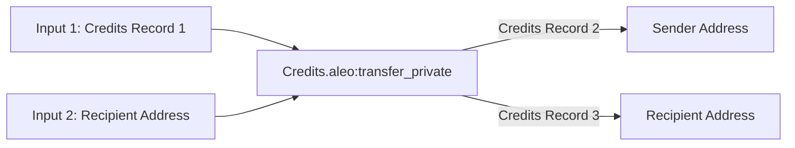

## Public State: Mappings
Mappings are simple key-value stores defined in a program. They are represented by a key and a value each of a specified
type. They are stored directly within the Aleo blockchain and can be publicly read by any participant in the Aleo network.

An example of a mapping usage is `account` mapping in the `credits.aleo` program.  This mapping stores all public Aleo Credits balances onchain.

```leo
mapping account:
    key owner as address.public;
    value microcredits as u64.public;
```


### Initializing & Updating Mappings
Updating mappings is done by executing a program function on the Aleo network which has a finalize block that updates the
program's mapping. For instance the `transfer_public` function in the `credits.aleo` program updates the `account`
mapping (and thus a user's balance) when called.

```leo
// The public interface called by users
function transfer_public:
    input r0 as address.public;
    input r1 as u64.public;
    finalize self.signer r0 r1;

// The finalize block run by nodes on the Aleo network which update a user's public balance
finalize transfer_public:
    input r0 as address.public;
    input r1 as address.public;
    input r2 as u64.public;
    get.or_use account[r0] 0u64 into r3;
    sub r3 r2 into r4;
    set r4 into account[r0];
    get.or_use account[r1] 0u64 into r5;
    add r5 r2 into r6;
    set r6 into account[r1];
```

From the perspective of the caller of the API, this is as simple as executing a normal Aleo function. For more information on how to do this with the SDK, check out the [Executing Programs](./04_execute_programs.md) guide or the [Transferring Credits](./05_transfer_credits.md) guide.

Given the inputs to a function with a finalize scope that updates a mapping are valid, the mapping will either be intialized or updated
by the Aleo network.  If function inputs are invalid, the network will return an error, but the fee paid for the transaction will still be
consumed. So it is important to ensure that the inputs to a function are valid before executing it.


### Reading Mappings
Any state within a program mapping is public and can be read by any participant in the Aleo network. The `AleoNetworkClient`
class provides the `getProgramMappingNames()` method to read the public mappings within a program and the `getProgramMappingValue()` method to
read the value of a specific key within a mapping.

```typescript
import { AleoNetworkClient } from '@provable/sdk';

const networkClient = new AleoNetworkClient("https://api.explorer.provable.com/v1");
const creditsMappings = networkClient.getProgramMappingNames("credits.aleo");
assert(creditsMappings === ["committee", "delegated", "metadata", "bonded", "unbonding", "account", "withdraw"]);

//<ADDRESS> = A valid Aleo account with zero balance
const publicCredits = networkClient.getProgramMappingValue("credits.aleo", "<ADDRESS>");
assert(publicCredits === "0u64");
```


## Private State: Records
Records in are analogous to concept of [UTXOs](https://en.wikipedia.org/wiki/Unspent_transaction_output). When a record is
created by a program, it can then be consumed later by the same program as an input to a function. Once a record is used
as input, it is considered consumed and cannot be used again. In many cases a new record will be created from the output
of the function. Records are private by default and are associated with a single Aleo program and a single private key
representing a user.  Check out the [Records](../../concepts/fundamentals/02_records.md) section in Fundamentals for more information.

### Finding Records
Finding records is similar to finding UTXOs in Bitcoin. Records are stored as outputs of transitions contained within execution transactions. To find records, implementors of web apps must:

1. Scan the Aleo network for transactions that include transitions that contain records.
2. Check any found records to see if the desired user is the owner of the record.
3. Check to see if the record is "spent" or "unspent" by checking if the record has appeared in any function inputs.
4. Optionally decrypt the record if the data within it is desired.

The `AleoNetworkClient` provides the `findRecords()` method for finding records. This method allows records to be searched for between specified block heights.

It also optionally allows users to specify:

- Whether to search exclusively for unspent records.
- One or more programs to find records for.
- A list of nonces (i.e. the unique ID of a record) to exclude from the search.

If `credits.aleo` records are being searched for, users can also optionally specify:
- A list of amounts to find.
- A maximum cumulative amount to find between all records.

```typescript
import { Account, AleoNetworkClient } from '@provablehq/sdk';

const account = new Account({ privateKey: 'APrivateKey1...'});
const networkClient = new AleoNetworkClient("https://api.explorer.provable.com/v1");
networkClient.setAccount(account);

// Find all records from an account within a block range.
const allRecords = networkClient.findRecords(
    4370000, // Start block height
    4371000, // End block height
    false, // Find both spent and unspent records.
    ["credits.aleo", "token_registry.aleo"], // Find records for the credits.aleo and token_registry.aleo programs.
);

// Find only unspent records from an account within a block range that can be used as inputs to new functions.
const unspentRecords = networkClient.findRecords(
    4370000, // Start block height
    4371000, // End block height
    true, // Find both spent and unspent records.
    ["credits.aleo", "token_registry.aleo"], // Find records for the credits.aleo and token_registry.aleo programs.
)

```
This method provides a linear search through the block range specified. It is most useful for finding records in smaller block ranges where the app invoking the method can expect to find desired records. For larger ranges of blocks this method may be infeasible to use.
<!-- 
### Implementing the `RecordProvider` interface.
In order to conveniently find records during execution, the implementations of `RecordProvider` can be used. This interface allows developers to implement an efficient search strategy for finding new records. A default implementation of the `RecordProvider` interface is provided by the `NetworkRecordProvider` class, but developers can use the `RecordProvider` interface to implement their own search strategies.

When a `RecordProvider` is provided within the constructor of a `ProgramManager` object and `RecordSearchParameters` are provided to a function that executes a function, and a private fee is specified, the `ProgramManager` will automatically search for an appropriate record to pay the fee.

A usage example of the `RecordProvider` is shown below using the `NetworkRecordProvider` implementation of the `RecordProvider` interface.

```typescript
import { Account, AleoNetworkClient, AleoKeyProvider, NetworkRecordProvider, ProgramManager } from '@provablehq/sdk';

const account = new Account({ privateKey: 'APrivateKey1...'});

// Create a new NetworkClient, KeyProvider, and RecordProvider using official Aleo implementations
const networkClient = new AleoNetworkClient("https://api.explorer.provable.com/v1");
networkClient.setAccount(account);

const keyProvider = new AleoKeyProvider();
keyProvider.useCache(true);

const recordProvider = new NetworkRecordProvider(account, networkClient);

// Initialize a program manager with the key provider to automatically fetch keys for executions
const programManager = new ProgramManager("https://api.explorer.provable.com/v1", keyProvider, recordProvider);
programManager.setAccount(account);

// Find a record for the amount to be transferred
let recordSearchParameters = {
    programs: ["credits.aleo"], // Find records for the credits.aleo program.
    amounts: [10_000_000], // Find the amount desired to be transferred.
    startHeight: 4370000, // Specify the start of a block range where unspent records are likely to be found.
    endHeight: 4371000, // Specify the end of a block height range where unspent records are likely to be found.
}
const record = await programManager.recordProvider.findRecords(
    true, // Find only unspent records.
    undefined, // No nonces need to be excluded because only one record is being searched for.
    recordSearchParameters,
);
// Record the nonce of the found record so it's not selected again.
const nonce = record.nonce();

// Find a record to pay the fee for the transaction
const feeRecordSearchParameters = {
    programs: ["credits.aleo"], // Find records for the credits.aleo program.
    amounts: [40_000], // Find the amount desired to be transferred.
    startHeight: 4370000, // Specify the start height.
    endHeight: 4371000, // Specify the end height.
    nonces: [nonce], // Exclude the nonce of the record found for the transfer.
}

const transaction = await programManager.buildExecutionTransaction({
  programName: "credits.aleo",
  functionName: "transfer_private",
  fee: 0.040,
  privateFee: true,
  inputs: [record, "10000000u64"],
  recordSearchParams: feeRecordSearchParameters, // Specify the record search parameters for the fee record.
});

const result = await programManager.networkClient.submitTransaction(transaction);
```
 -->
#### Optimizing Record Search
Using naive approaches such as scanning the entire Blockchain history can be a time-consuming process and degrade the experience of a web app. Fortunately, strategies can be used to optimize the process.

#### Searching for Records After the User Account Creation
If the user a web app has created an Aleo account after a known block, the search can be optimized to search for records by only scanning the records from the block height after which the account was created.

#### Searching for A Specific Program's Records
If the records you are searching for are from a specific program, you can optimize the search by only scanning the records for a specific program.

#### Storing Records Created by Your Web App
If your web app has created a transaction, you have access to the records produced by that transaction and can store them in a database for easy retrieval later.

### Decrypting Records
If a user receives a private record from a program execution, they can use the SDK to decrypt encrypted records with their view keys and view their contents. Only records that are owned by the user can be decrypted. Decryption of records that are not owned by the user will fail.

Record decryption and ownership verification can be done in the SDK using the following code:
```typescript
import { Account, RecordCiphertext, RecordPlaintext } from '@provablehq/sdk';

// Create an account from an existing private key
const account = Account.from_string({privateKey: "existingPrivateKey"});

// Record value received as a string from program output or found on the Aleo network
const record = "record1qyqsq4r7mcd3ystjvjqda0v2a6dxnyzg9mk2daqjh0wwh359h396k7c9qyxx66trwfhkxun9v35hguerqqpqzqzshsw8dphxlzn5frh8pknsm5zlvhhee79xnhfesu68nkw75dt2qgrye03xqm4zf5xg5n6nscmmzh7ztgptlrzxq95syrzeaqaqu3vpzqf03s6";

const recordCiphertext = RecordCiphertext.fromString(record);

// Check ownership of the record. If the account is the owner, decrypt the record
if (RecordCiphertext.is_owner(account.viewKey())) {
   // Decrypt the record with the account's view key
   const recordPlaintext = recordCiphertext.decrypt(account.viewKey());

   // View the record data
   console.log(recordPlaintext.toString());
}
```


### Using Records

Using the SDK, users can specify the exact record they would like to use as input to an function or to pay private fees with by using the `RecordPlaintext` type mentioned above.  Let's look at the `transfer_private` function from the `credits.aleo` function as a specific example of using records.

The `transfer_private` function can be graphically represented by the following graph:


This function consumes a private `credits` record as input and outputs two new private `credits` records as output (one that sends the credits to the recipient and one that sends the remaining credits to the sender).  Below you'll find what this flow would look like in the SDK:

#### User 1 Sends a Private Value Transfer to User 2
If you've read the [Transferring Credits](./05_transfer_credits.md) guide, the following should look familiar to you:
```typescript
// USER 1
import { Account, ProgramManager, AleoKeyProvider, NetworkRecordProvider, AleoNetworkClient } from '@provablehq/sdk';

// Create a new NetworkClient, KeyProvider, RecordProvider, and ProgramManager
const USER1 = new Account({privateKey: "APrivateKey1..."});
const networkClient = new AleoNetworkClient("https://api.explorer.provable.com/v1");
const keyProvider = new AleoKeyProvider();
const recordProvider = new NetworkRecordProvider(USER1, networkClient);
const programManager = new ProgramManager("https://api.explorer.provable.com/v1", keyProvider, recordProvider);
programManager.setAccount(USER1);

/// Send private transfer to user 2.  When the input record is not specified, the NetworkRecordProvider will automatically find a credits.aleo record with enough enough balance
const USER2_ADDRESS = "aleo1...";
const tx_id = await programManager.transfer(1, USER2_ADDRESS, "transfer_private", 0.2);
```

#### User 2 Sends a Private Value Transfer Back to User 1

When an execution such as `transfer_private` consumes or generates a record, the transaction is posted onchain showing an encrypted version of the record output.  Because the records are encrypted when they're posted on the network, they do not reveal any information about the party
who executed the program, nor the contents of the record. The only information that is revealed is the program ID, function name, encrypted function inputs, and the transaction ID of the program execution. No user except for the recipient of the record can see the contents of the record.

Consequently, if users would like to fetch their records from the network and use them as input to a function, they must first decrypt them into plaintext form using their private key or view key.  The code below demonstrates this:

```typescript
// USER 2
import { Account, ProgramManager, AleoKeyProvider, NetworkRecordProvider, AleoNetworkClient, RecordCiphertext } from '@provablehq/sdk';

// Create a new NetworkClient, KeyProvider, RecordProvider, and ProgramManager for User 2
const USER2 = new Account({privateKey: "APrivateKey1..."});
const networkClient2 = new AleoNetworkClient("https://api.explorer.provable.com/v1");
const keyProvider2 = new AleoKeyProvider();
const recordProvider2 = new NetworkRecordProvider(USER2, networkClient2);
const programManager2 = new ProgramManager("https://api.explorer.provable.com/v1", keyProvider2, recordProvider2);
programManager2.setAccount(USER2);

// Fetch the transaction from the network that User 1 sent
const transaction = await programManager2.networkClient.getTransaction(tx_id);
const record = transaction.execution.transitions[0].outputs[0].value;

// Decrypt the record with User 2's view key
const recordCiphertext = RecordCiphertext.fromString(record);
const recordPlaintext = recordCiphertext.decrypt(USER2.viewKey());

// Send a transfer to User 1 above using the record found
const USER1_ADDRESS = "aleo1...";
const tx_id2 = await programManager2.transfer(1, USER1_ADDRESS, "transfer_private", 0.2, undefined, recordPlaintext);
```


