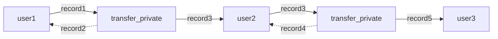

## Private State: Records
Records in are analogous to concept of [UTXOs](https://en.wikipedia.org/wiki/Unspent_transaction_output). When a record is
created by a program, it can then be consumed later by the same program as an input to a function. Once a record is used
as input, it is considered consumed and cannot be used again. In many cases a new record will be created from the output
of the function. Records are private by default and are associated with a single Aleo program and a single private key
representing a user.

### Record Usage Example: Private Value Transfers

A straightforward example of a usage of records in a program can be demonstrated by explaining the process of private
value transfers of official Aleo credits on the Aleo network.


Aleo credits are the official token in which all on-chain execution and deployment fees are paid. Credits can be public
or private. Private credits are represented by the `credits` record in the [credits.aleo](https://explorer.aleo.org/programs/credits.aleo)
program.


```leo
record credits:
    owner as address.private;
    microcredits as u64.private;
```

Credits records contain an `owner` field representing the address which owns the record and a `microcredits` field
representing the amount of microcredits in the record. 1 credit is equal to 1,000,000 microcredits.

An example of an Aleo function that both takes a record as input and outputs a record is the `transfer_private` function
of the `credits.aleo` program. This function takes a private `credits` record as input and outputs two new private `credits`
records as output (one that sends the credits to the recipient and one that sends the remaining credits to the sender).

The source code for the `transfer_private` is:
```aleo
function transfer_private:
    input r0 as credits.record;
    input r1 as address.private;
    input r2 as u64.private;
    sub r0.microcredits r2 into r3;
    cast r1 r2 into r4 as credits.record;
    cast r0.owner r3 into r5 as credits.record;
    output r4 as credits.record;
    output r5 as credits.record;
```

The `transfer_private` function can be graphically represented by the graph below. In the graph the first record "Record 1"
is consumed and can never be used again. From the data in Record 1, two more records are created. One containing
the intended amount for the recipient which is now owned by the recipient and another containing the remaining credits
which is sent back to the sender.


This chain of ownership is tracked by the Aleo Blockchain when users choose to submit their transactions to the Aleo
Network. This allows other users who receive records to receive the updated data and verify that this data was
provably generated by the intended program.

What this process allows is a private chain of state to be created between multiple users. In the context of value
transfers, a chain of state might look like the following:



The above state chain would be executed in the following way using the SDK:
#### Step 1 - User 1 sends a private value transfer to User 2
```typescript
// USER 1
import { Account, ProgramManager, AleoKeyProvider, NetworkRecordProvider, AleoNetworkClient } from '@provable/sdk';

// Create a new NetworkClient, KeyProvider, and RecordProvider
const account = Account.from_string({privateKey: "user1PrivateKey"});
const networkClient = new AleoNetworkClient("https://api.explorer.provable.com/v1");
const keyProvider = new AleoKeyProvider();
const recordProvider = new NetworkRecordProvider(account, networkClient);

// Initialize a program manager with the key provider to automatically fetch keys for executions
const USER_2_ADDRESS = "user2Address";
const programManager = new ProgramManager("https://api.explorer.provable.com/v1", keyProvider, recordProvider);
programManager.setAccount(account);

/// Send private transfer to user 2
const tx_id = await programManager.transfer(1, USER_2_ADDRESS, "transfer_private", 0.2);
```

#### Step 2 - User 2 receives the transaction ID and fetches the credits record they received from user 1 from the network. They then send it to user 3

```typescript
// USER 2
import { Account, ProgramManager, AleoKeyProvider, NetworkRecordProvider, AleoNetworkClient } from '@provable/sdk';

// Create a new NetworkClient, KeyProvider, and RecordProvider
const account = Account.from_string({privateKey: "user2PrivateKey"});
const networkClient = new AleoNetworkClient("https://api.explorer.provable.com/v1");
const keyProvider = new AleoKeyProvider();
const recordProvider_User2 = new NetworkRecordProvider(account, networkClient);

// Initialize a program manager with the key provider to automatically fetch keys for executions
const programManager = new ProgramManager("https://api.explorer.provable.com/v1", keyProvider, recordProvider);
programManager.setAccount(account);

// Fetch the transaction from the network that user 1 sent
const transaction = await programManager.networkClient.getTransaction(tx_id);
const record = <string>transaction.execution.transitions[0].outputs[0].value;

// Decrypt the record with the user's view key
const recordCiphertext = <RecordCiphertext>RecordCiphertext.fromString(record);
const recordPlaintext = <RecordPlaintext>recordCiphertext.decrypt(account.viewKey());

// Send a transfer to user 3 using the record found above
const USER_3_ADDRESS = "user3Address";
const tx_id = await programManager.transfer(1, USER_3_ADDRESS, "transfer_private", 0.2, undefined, recordPlaintext);
```

When an execution such as `transfer_private` consumes or generates a record is posted on the network and encrypted transcript
of the execution is posted, containing an encrypted version of the record output and a transaction ID.

Because the records are encrypted when they're posted on the network, they do not reveal any information about the party
who executed the program, nor the contents of the record. The only information that is revealed is the program ID,
function name, encrypted function inputs, and the transaction ID of the program execution. No user except for the recipient
of the record can see the contents of the record.

Below you can see what the exact data which is posted to the Aleo Network when `transfer_private` is run. Note that the
record, the amount transferred, and both the sender & recipient addresses are all encrypted.

<details>
<summary>transfer_private Execution Transcript</summary>

```json
  "transactions": [
    {
      "status": "accepted",
      "type": "execute",
      "index": 0,
      "transaction": {
        "type": "execute",
        "id": "at1s7dxunms8xhdzgaxrwf0yvq2dqgxtf4a3j8g878rhfr0zwhap5gqywsw8y",
        "execution": {
          "transitions": [
            {
              "id": "as1thy8fvkz0rkls5wnmfq5udrcvvzurq7mqk8pkhjf63htqjf9mugqp0mfhd",
              "program": "credits.aleo",
              "function": "transfer_private",
              "inputs": [
                {
                  "type": "record",
                  "id": "1406044754369042876058586523429806531093330762697573675195902502647806778955field",
                  "tag": "242626059121157295593694555515381893342956813170338731374395259242800138642field"
                },
                {
                  "type": "private",
                  "id": "1533599744296862879610225011439684001995294756698105572984689232395187168232field",
                  "value": "ciphertext1qgqgpu7m8p0rwjahwffyvm4g4n6903d6ufqty74z4504w4rn356hgp9jvpuvx8suu0pukr3sl7n8x65dz35nu4jdy4lgcguxldygufrfpyqd6xr5"
                },
                {
                  "type": "private",
                  "id": "4081557229261486898857101724786348855190759711760925564309233047223407640812field",
                  "value": "ciphertext1qyqxd9wue0qh8hs6dgevn7zleedfkzf7pft8ecked2xq3pw54pgqzyqr69sgx"
                }
              ],
              "outputs": [
                {
                  "type": "record",
                  "id": "1388064668770056715587596299070268626507043043686185311840561493640415146425field",
                  "checksum": "5376939704883651492329501631722578074516322228314928758786996843926470523116field",
                  "value": "record1qyqsq4r7mcd3ystjvjqda0v2a6dxnyzg9mk2daqjh0wwh359h396k7c9qyxx66trwfhkxun9v35hguerqqpqzqzshsw8dphxlzn5frh8pknsm5zlvhhee79xnhfesu68nkw75dt2qgrye03xqm4zf5xg5n6nscmmzh7ztgptlrzxq95syrzeaqaqu3vpzqf03s6"
                },
                {
                  "type": "record",
                  "id": "4635504195534945632234501197115926012056789160185660629718795843347495373207field",
                  "checksum": "3428805926164481449334365355155755448945974546383155334133384781819684465685field",
                  "value": "record1qyqsp2vsvvfulmk0q0tmxq7p9pffhfhha9h9pxsftujh57kkjuahx9s0qyxx66trwfhkxun9v35hguerqqpqzq8etfmzt2elj37hkf9fen2m2qes8564sr8k970zyud5eqmq7ztzq5r3095mkfdzqzz7yp6qfavqsl3t22t6dvgauqqt2xqk98zwmtusq5ck7fm"
                }
              ],
              "tpk": "5283803395323806407328334221689294196419052177553228331323093330938016699852group",
              "tcm": "4398026033398688325681745841147300822741685834906186660771751747897598751646field"
            }
          ],
```
</details>


#### Record Decryption

If a user receives a private record from a program execution, they can use the SDK to decrypt encrypted records with
their view keys and view their contents. Only records that are owned by the user can be decrypted. Decryption of records
that are not owned by the user will fail.

Record decryption and ownership verification can be done in the SDK using the following code:

```typescript
import { Account, RecordCiphertext, RecordPlaintext } from '@provable/sdk';

// Create an account from an existing private key
const account = Account.from_string({privateKey: "existingPrivateKey"});

// Record value received as a string from program output or found on the Aleo network
const record = "record1qyqsq4r7mcd3ystjvjqda0v2a6dxnyzg9mk2daqjh0wwh359h396k7c9qyxx66trwfhkxun9v35hguerqqpqzqzshsw8dphxlzn5frh8pknsm5zlvhhee79xnhfesu68nkw75dt2qgrye03xqm4zf5xg5n6nscmmzh7ztgptlrzxq95syrzeaqaqu3vpzqf03s6";

const recordCiphertext = RecordCiphertext.fromString(record);

// Check ownership of the record. If the account is the owner, decrypt the record
if (RecordCiphertext.is_owner(account.viewKey())) {
   // Decrypt the record with the account's view key
   const recordPlaintext = recordCiphertext.decrypt(account.viewKey());

   // View the record data
   console.log(recordPlaintext.toString());
}
```

## Public State: Mappings
Mappings are simple key value stores defined in a program. They are represented by a key and a value each of a specified
type. They are stored directly within the Aleo blockchain and can be publicly read by any participant in the Aleo network.

An example of a mapping usage is `account` mapping in the `credits.aleo` program.
```leo
mapping account:
    key owner as address.public;
    value microcredits as u64.public;
```

The `account` mapping is used to store public credits balances on the Aleo network. It takes a public address as a key
and a public u64 value representing the number of microcredits owned by the address.

Mappings within programs are identified by the `mapping` identifier. Any program where this keyword appears contains an
on-chain mapping. An example of a program that uses a mapping is shown below:
```aleo
program player_mapping_example.aleo

// The mapping identifier representing a score
mapping score:
    key player as address.public;
    value score as u64.public;
    
// The update score function    
function update_score:
    input r0 as address.public;
    input r1 as u64.public;

// The finalize code block will be executed by Aleo network nodes.
// When it runs it will update the value of the mapping.
finalize update_score:
    input r0 as address.public;
    input r1 as u64.public;
    get.or_use score[r0] 0u64 into r2;
    add r1 r2 into r3;
    set r3 into account[r0];
```

Note that the above function has a `finalize` identifier. This identifier is used to identify a portion of a function's
code that should be executed by nodes on the Aleo network. Program mappings are updated exclusively by code run by nodes
on the Aleo Network written in `finalize` blocks.

### Reading Mappings
Any state within a program mapping is public and can be read by any participant in the Aleo network. The `NetworkClient`
class provides the `getMapping` method to read the public mappings within a program and the `getMappingValue` method to
read the value of a specific key within a mapping.

```typescript
import {  AleoNetworkClient } from '@provable/sdk';

const networkClient = new AleoNetworkClient("https://api.explorer.provable.com/v1");
const creditsMappings = networkClient.getMappings("credits.aleo");
assert(creditsMappings === ["account"]);

const publicCredits = networkClient.getMapping("credits.aleo", "[a valid aleo account with zero balance]");
assert(publicCredits === "0u64");
```

### Initializing & Updating Mappings
Updating mappings is done by executing a program function on the Aleo network which has a finalize block that updates the
program's mapping. For instance the `transfer_public` function in the `credits.aleo` program updates the `account`
mapping (and thus a user's balance) when called.

```aleo
// The public interface called by users
function transfer_public:
    input r0 as address.public;
    input r1 as u64.public;
    finalize self.signer r0 r1;

// The finalize block run by nodes on the Aleo network which update a user's public balance
finalize transfer_public:
    input r0 as address.public;
    input r1 as address.public;
    input r2 as u64.public;
    get.or_use account[r0] 0u64 into r3;
    sub r3 r2 into r4;
    set r4 into account[r0];
    get.or_use account[r1] 0u64 into r5;
    add r5 r2 into r6;
    set r6 into account[r1];
```

From the perspective of the caller of the API, this is as simple as executing a normal Aleo function. Given the inputs
to a function with a finalize scope that updates a mapping are valid, the mapping will either be intialized or updated
by the Aleo network. All the user of the SDK must do is ensure that the inputs to the function are valid.

If function inputs are Invalid, the Network will return an error, but the fee paid for the transaction will still be
consumed. So it is important to ensure that the inputs to a function are valid before executing it.

A simple example of a mapping update can be shown by simply executing the 'transfer_public` as shown below.

```typescript
import { Account, ProgramManager, AleoKeyProvider, NetworkRecordProvider, AleoNetworkClient } from '@provable/sdk';

// Create a new NetworkClient, KeyProvider, and RecordProvider
const account = Account.from_string({privateKey: "user1PrivateKey"});
const networkClient = new AleoNetworkClient("https://api.explorer.provable.com/v1");
const keyProvider = new AleoKeyProvider();
const recordProvider = new NetworkRecordProvider(account, networkClient);

// Initialize a program manager with the key provider to automatically fetch keys for executions
const RECIPIENT_ADDRESS = "user1Address";
const programManager = new ProgramManager("https://api.explorer.provable.com/v1", keyProvider, recordProvider);
programManager.setAccount(account);

// Update or initialize a public balance
const tx_id = await programManager.transfer(1, RECIPIENT_ADDRESS, "transfer_private_to_public", 0.2);
```

