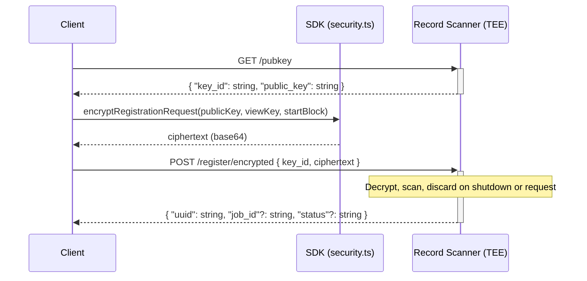

# Record Scanning Service (RSS)

This guide explains the **Record Scanning Service (RSS)** and how to use it to discover and query records that belong to your Aleo account.

# Contents

- [Overview](#overview)
- [Credentials and authentication](#credentials-and-authentication)
- [Flow (encrypted registration)](#flow-encrypted-registration)
- [Key Routes](#key-routes-record-scanner)
- [Using the Record Scanner via the Provable SDK](#using-the-record-scanner-via-the-provable-sdk)
- [Using custom JavaScript](#using-custom-javascript-record-scanner)
- [Reference Implementation](#reference-implementation)
- [Quick reference](#quick-reference)
- [Best practices](#best-practices)

---

# Overview

The Aleo network uses UTXO style struct data structures called `Records` to share encrypted information between parties.
Records can represent arbitrary information (depending on the context of the program it's defined in) such as transfers
of encrypted funds from one user to another or encrypted identity verification.

As an example, Aleo uses the `credits` record in the credits.aleo program to represent private transfers of value between
one user and another.

```
record credits:
   owner as address.private;
   microcredits as u64.private;
```

When a record is generated by a function, it appears on the Aleo blockchain in encrypted form and is only decryptable by
the owner of the record. Further, like UTXOs, a record can only be used once as an input and thereafter it is
considered used/spent by the Aleo chain. Any inputs also appear on-chain as encrypted data.

Because all records are encrypted, a user must find their records by scanning the inputs and outputs on the entire chain
attempting to decrypt these inputs/outputs with their private ViewKey.

The record scanner provides a service that indexes the Aleo ledger and indexes records which belong to specific Aleo accounts.
Users provide their ViewKey in encrypted form to a record scanner within an enclave and that key is used to find all
records for a user. Neither the scanner service nor any other outside party except for the ViewKey holder is able to
perceive the ViewKey due to the trusted execution environment.

Upon registration of an Aleo account, the record scanner identifies all records associated with that account and
provides the owner of that account with all records they currently own allowing them to keep track of things like
private balances.

---

# Usage Guide

This guide shows how to access the record scanning service with JS/TS either using the Provable SDK or
custom TS/JS code.

## Credentials and authentication

The Record Scanning Service (RSS) is hosted at `https://api.provable.com/scanner/{network}` (e.g. `https://api.provable.com/scanner/mainnet` or `https://api.provable.com/scanner/testnet`).

To authenticate to the service you need:

- **API key** and **consumer ID** — Obtain these by registering a consumer (e.g. `POST https://api.provable.com/consumers` or see your API base). See [Provable API documentation](https://docs.provable.com/docs/api/services/get-auth-register) for details.
- **JWT** — Used for authenticated endpoints. The Record Scanner SDK refreshes the JWT by calling `POST https://api.provable.com/jwts/{consumerId}` with header `X-Provable-API-Key: <apiKey>` when `apiKey` and `consumerId` are set. You can also obtain and cache the JWT yourself and pass it via `setJwtData({ jwt, expiration })`; `expiration` must be in **milliseconds** (Unix timestamp × 1000).

The **Record scanner** endpoints may accept the API key in a header (e.g. `X-Provable-API-Key`) or an issued JWT.

### Base URLs

The SDK appends the network (`mainnet` or `testnet`) to the scanner base URL you provide. Use the scanner base without the network segment. For example, use `url: "https://api.provable.com/scanner"` so the SDK uses:
* Mainnet: `https://api.provable.com/scanner/mainnet`
* Testnet: `https://api.provable.com/scanner/testnet`

## Flow (encrypted registration)

When using the record scanning service, users must first register their encrypted view key to the record scanner TEE via
the following flow.

0. Client must obtain an API key or JWT from the Provable API.
1. Client requests an ephemeral X25519 public key from the scanner: `GET {scannerBase}/pubkey`.
2. Client encrypts the view key and start block (e.g. with [encryptRegistrationRequest](https://github.com/ProvableHQ/sdk/blob/mainnet/sdk/src/security.ts#L51)) and sends: `POST {scannerBase}/register/encrypted` with `{ key_id, ciphertext }`.
3. Scanner decrypts in a secure environment, indexes records for that view key, and returns a `uuid` (and optional `job_id`, `status`). The client uses `uuid` for subsequent queries (e.g. owned records).



## Key Routes

All paths are relative to the scanner base URL (e.g. `https://api.provable.com/scanner/mainnet` or your scanner host + network).

The following key routes are available on the record scanner.

| Path | Method | Purpose                                                                     | Request body                                   | Response |
|------|--------|-----------------------------------------------------------------------------|------------------------------------------------|----------|
| `/pubkey` | GET | Ephemeral public key to encrypt the ViewKey prior to encrypted registration | —                                              | `{ "key_id": string, "public_key": string }` |
| `/register/encrypted` | POST | Register view key (encrypted)                                               | `{ "key_id": string, "ciphertext": string }`   | `{ "uuid": string, "job_id"?: string, "status"?: string }` |
| `/records/owned` | POST | Get owned records for a UUID                                                | `{ "uuid": string, "unspent"?: boolean, ... }` | Array of owned records (see SDK `OwnedRecord`) |

If the scanner returns **422** on `/records/owned`, the UUID may no longer be valid; re-register (e.g. via `/register/encrypted`) and retry.

---

### Using the Record Scanner via the Provable SDK

1. Create a `RecordScanner` with the scanner base URL (e.g. `"https://api.provable.com/scanner"`). The SDK appends the network (e.g. `/mainnet`).
2. Optionally set an API key: `recordScanner.setApiKey("your-api-key")` and `recordScanner.setConsumerId("your-consumer-id")` for JWT refresh, or set a JWT directly: `recordScanner.setJwtData({ jwt: "...", expiration: 1810941101000 })` (expiration in **milliseconds**).
3. Register with the **encrypted** flow: `registerEncrypted(viewKey, startBlock)`. The result contains `uuid`; the scanner stores it for later calls.
4. Query owned records with `findRecords(filter)` or `owned(filter)`, where `filter` includes `uuid` (and e.g. `unspent: true`, `filter: { program, record }`).

**Example: register and find records with the SDK**

```ts
import { Account, RecordScanner } from "@provablehq/sdk/mainnet.js";

const account = new Account({ privateKey: "APrivateKey1zkp..." });
const recordScanner = new RecordScanner({
  url: "https://api.provable.com/scanner",
});
await recordScanner.setApiKey(process.env.RECORD_SCANNER_API_KEY);
await recordScanner.setConsumerId(process.env.RECORD_SCANNER_CONSUMER_ID);

// Encrypted registration (recommended)
const regResult = await recordScanner.registerEncrypted(account.viewKey(), 0);
if (!regResult.ok) {
  throw new Error(regResult.error?.message ?? `Registration failed: ${regResult.status}`);
}
const uuid = regResult.data.uuid;

// Find unspent credits records
const records = await recordScanner.findRecords({
  uuid,
  unspent: true,
  filter: { program: "credits.aleo", record: "credits" },
});
```

---

### Using custom JavaScript

If you prefer not to use the SDK for HTTP, you can call the same endpoints with `fetch` and use the SDK only for encryption.

**Step 1: Get ephemeral public key**

```ts
const scannerBase = "https://api.provable.com/scanner/mainnet"; // or .../scanner/testnet
const headers: Record<string, string> = { "Content-Type": "application/json" };
if (apiKey) headers["X-Provable-API-Key"] = apiKey;

const pubkeyRes = await fetch(`${scannerBase}/pubkey`, { method: "GET", headers });
if (!pubkeyRes.ok) throw new Error(`Pubkey failed: ${await pubkeyRes.text()}`);
const pubkey = await pubkeyRes.json(); // { key_id, public_key }
```

**Step 2: Encrypt registration and POST**

```ts
import { encryptRegistrationRequest } from "@provablehq/sdk/mainnet.js";
import { Account } from "@provablehq/sdk/mainnet.js";

const account = new Account({ privateKey: "APrivateKey1zkp..." });
const viewKey = account.viewKey();
const startBlock = 0;

const ciphertext = encryptRegistrationRequest(pubkey.public_key, viewKey, startBlock);

const registerRes = await fetch(`${scannerBase}/register/encrypted`, {
  method: "POST",
  headers,
  body: JSON.stringify({ key_id: pubkey.key_id, ciphertext }),
});
if (!registerRes.ok) throw new Error(`Register failed: ${await registerRes.text()}`);

const data = await registerRes.json();
const uuid = data.uuid; // Use this for /records/owned
```

**Step 3: Get owned records**

```ts
const ownedRes = await fetch(`${scannerBase}/records/owned`, {
  method: "POST",
  headers,
  body: JSON.stringify({ uuid, unspent: true }),
});
if (!ownedRes.ok) {
  if (ownedRes.status === 422) {
    // Re-register and retry once
  }
  throw new Error(`Owned records failed: ${await ownedRes.text()}`);
}
const ownedRecords = await ownedRes.json();
```

**Full custom example: encrypted registration and owned records**

```ts
import { encryptRegistrationRequest } from "@provablehq/sdk/mainnet.js";
import { ViewKey } from "@provablehq/sdk/mainnet.js";

async function registerViewKeyEncrypted(
  scannerBase: string,
  viewKey: ViewKey,
  startBlock: number,
  apiKey?: string
): Promise<{ uuid: string; job_id?: string; status?: string }> {
  const headers: Record<string, string> = { "Content-Type": "application/json" };
  if (apiKey) headers["X-Provable-API-Key"] = apiKey;

  const pubkeyRes = await fetch(`${scannerBase}/pubkey`, { method: "GET", headers });
  if (!pubkeyRes.ok) throw new Error(`Pubkey failed: ${await pubkeyRes.text()}`);
  const pubkey = await pubkeyRes.json();

  const ciphertext = encryptRegistrationRequest(pubkey.public_key, viewKey, startBlock);

  const registerRes = await fetch(`${scannerBase}/register/encrypted`, {
    method: "POST",
    headers,
    body: JSON.stringify({ key_id: pubkey.key_id, ciphertext }),
  });
  if (!registerRes.ok) throw new Error(`Register failed: ${await registerRes.text()}`);

  return registerRes.json();
}

async function getOwnedRecords(
  scannerBase: string,
  uuid: string,
  apiKey?: string
): Promise<OwnedRecord[]> {
  const headers: Record<string, string> = { "Content-Type": "application/json" };
  if (apiKey) headers["X-Provable-API-Key"] = apiKey;

  const res = await fetch(`${scannerBase}/records/owned`, {
    method: "POST",
    headers,
    body: JSON.stringify({ uuid, unspent: true }),
  });

  if (res.status === 422) {
    throw new Error("UUID not valid; re-register with registerViewKeyEncrypted and retry.");
  }
  if (!res.ok) throw new Error(`Owned records failed: ${await res.text()}`);

  const data = await res.json();
  return Array.isArray(data) ? data : data?.data ?? [];
}

// Usage
const account = new Account({ privateKey: "APrivateKey1zkp..." });
const result = await registerViewKeyEncrypted(
  "https://api.provable.com/scanner/mainnet",
  account.viewKey(),
  0,
  process.env.RECORD_SCANNER_API_KEY
);
const records = await getOwnedRecords(
  "https://api.provable.com/scanner/mainnet",
  result.uuid,
  process.env.RECORD_SCANNER_API_KEY
);
```

You can define `OwnedRecord` to match the scanner response shape, or import it from the SDK if available.

### Reference Implementation

[A full implementation of the Record Scanner can be viewed here](https://github.com/ProvableHQ/sdk/blob/mainnet/sdk/src/record-scanner.ts) for usage in one's own SDK.

---

## Quick reference

| Step | GET | POST | Encrypt (SDK) |
|------|-----|------|----------------|
| Register (encrypted) | `/pubkey` | `/register/encrypted` with `{ key_id, ciphertext }` | `encryptRegistrationRequest(publicKey, viewKey, startBlock)` |
| Query records | — | `/records/owned` with `{ uuid, unspent?, ... }` | — |

- **One key per request:** Use the `key_id` from the same GET response in the corresponding POST. For retries, fetch a new key from `/pubkey`.
- **Encryption:** Use the SDK's `encryptRegistrationRequest` (from `@provablehq/sdk`); ciphertext is base64. The same wire format can be implemented with libsodium if you do not use the SDK.

---

## Best practices

1. **Prefer encrypted flow** for production so your view key is only decrypted inside the service's secure environment.
2. **Register before querying:** Complete registration (encrypted or not) and store the returned `uuid` before calling `/records/owned`. On 422 from `/records/owned`, re-register and retry once.
3. **Record scanner with ProgramManager:** You can pass a `RecordScanner` (or any `RecordProvider`) into `ProgramManager`. The manager will then use it to resolve fee records (and inputs) when building executions or proving requests, so you do not have to fetch fee records manually. See the [Delegated Proving](../delegate-proving/00_delegate_proving.md) guide for proving workflows.
